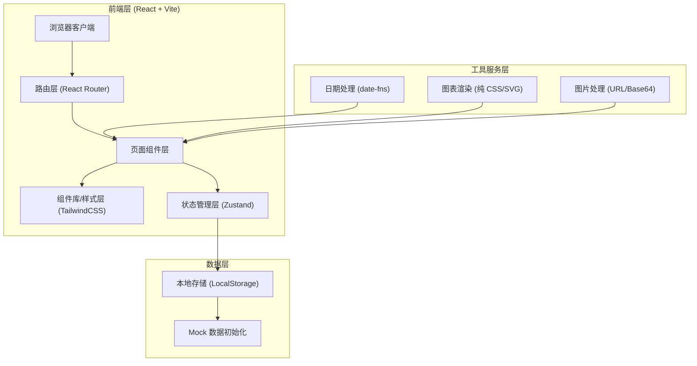
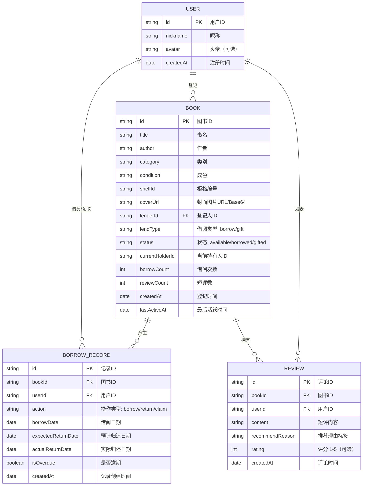

## 1. 架构设计



## 2. 技术描述

- **前端框架**: React@18 + TypeScript@5
- **构建工具**: Vite@5
- **样式方案**: TailwindCSS@3（自定义主题配置）
- **路由方案**: React Router DOM@6
- **状态管理**: Zustand@4（轻量级，持久化到 LocalStorage）
- **日期处理**: date-fns@3
- **图标库**: lucide-react（线性图标，契合设计风格）
- **后端服务**: 无后端，纯前端应用，数据持久化使用 LocalStorage
- **数据初始化**: 内置丰富 Mock 数据，首次访问自动填充示例图书
- **图片处理**: 封面图片使用 FileReader 转 Base64 存储，支持 URL 图片

## 3. 路由定义

| 路由路径 | 页面名称 | 用途说明 |
|----------|----------|----------|
| `/` | 首页（书柜） | 书柜网格展示、分组切换、搜索筛选 |
| `/register` | 图书登记页 | 填写图书信息、上传封面、提交登记 |
| `/book/:id` | 图书详情页 | 查看详情、借阅/领取操作、短评区、流转记录 |
| `/statistics` | 统计页 | 总览卡片、类别排行、逾期排行 |
| `/profile` | 用户中心 | 我的登记、我的借阅、逾期提醒、用户信息 |

## 4. 数据模型

### 4.1 数据模型定义



### 4.2 TypeScript 类型定义

```typescript
// 用户
interface User {
  id: string;
  nickname: string;
  avatar?: string;
  createdAt: string;
}

// 图书成色
type BookCondition = '全新' | '九成新' | '八成新' | '七成新' | '有磨损';

// 借阅类型
type LendType = 'borrow' | 'gift';

// 图书状态
type BookStatus = 'available' | 'borrowed' | 'gifted';

// 图书类别
type BookCategory = '文学小说' | '科技编程' | '历史传记' | '心理成长' | '艺术设计' | '商业管理' | '生活休闲' | '儿童绘本' | '其他';

// 图书
interface Book {
  id: string;
  title: string;
  author: string;
  category: BookCategory;
  condition: BookCondition;
  shelfId: string;
  coverUrl: string;
  lenderId: string;
  lendType: LendType;
  status: BookStatus;
  currentHolderId?: string;
  borrowCount: number;
  reviewCount: number;
  createdAt: string;
  lastActiveAt: string;
}

// 流转记录
interface BorrowRecord {
  id: string;
  bookId: string;
  userId: string;
  action: 'borrow' | 'return' | 'claim';
  borrowDate?: string;
  expectedReturnDate?: string;
  actualReturnDate?: string;
  isOverdue: boolean;
  createdAt: string;
}

// 短评
interface Review {
  id: string;
  bookId: string;
  userId: string;
  content: string;
  recommendReason?: string;
  rating?: number;
  createdAt: string;
}

// 应用状态
interface AppState {
  currentUser: User | null;
  users: User[];
  books: Book[];
  borrowRecords: BorrowRecord[];
  reviews: Review[];
}
```

## 5. 目录结构设计

```
src/
├── assets/                # 静态资源
│   └── images/            # 示例封面、木纹纹理等
├── components/            # 公共组件
│   ├── layout/            # 布局组件（Header、Sidebar、Navigation）
│   ├── bookshelf/         # 书柜相关组件（BookCell、BookSpine、GroupTabs）
│   ├── forms/             # 表单组件（FormInput、FileUpload、CategorySelect）
│   ├── stats/             # 统计组件（StatCard、BarChart、RankingTable）
│   └── common/            # 通用组件（Modal、Badge、Timeline、EmptyState）
├── pages/                 # 页面组件
│   ├── Home.tsx           # 首页书柜
│   ├── RegisterBook.tsx   # 图书登记
│   ├── BookDetail.tsx     # 图书详情
│   ├── Statistics.tsx     # 统计页面
│   └── Profile.tsx        # 用户中心
├── store/                 # 状态管理
│   └── useAppStore.ts     # Zustand store 定义
├── data/                  # Mock 数据
│   └── mockData.ts        # 示例图书、用户、评论数据
├── utils/                 # 工具函数
│   ├── dateUtils.ts       # 日期处理
│   ├── bookUtils.ts       # 图书状态计算
│   ├── statsUtils.ts      # 统计计算
│   └── storage.ts         # LocalStorage 封装
├── types/                 # 类型定义
│   └── index.ts           # 所有 TypeScript 类型
├── styles/                # 全局样式
│   └── index.css          # Tailwind + 自定义样式
├── App.tsx                # 应用入口（路由配置）
└── main.tsx               # React 挂载入口
```

## 6. 关键功能实现说明

### 6.1 书柜分组逻辑
- **新放入**: `createdAt` 在 7 天内且 `status === 'available'`
- **热门**: `borrowCount + reviewCount` 排序前 30%
- **待归还**: `status === 'borrowed'` 且有未归还记录
- **长期闲置**: `status === 'available'` 且 `lastActiveAt` 超过 30 天

### 6.2 逾期检测逻辑
- 遍历所有 `status === 'borrowed'` 的图书
- 检查对应 `BorrowRecord.expectedReturnDate`
- 若小于当前日期且无 `actualReturnDate`，标记 `isOverdue = true`
- 逾期天数 = 当前日期 - expectedReturnDate

### 6.3 状态流转
- 登记新书: `status = 'available'`, 新增 Book + 一条 borrowRecord(action='register')
- 借阅: `status = 'borrowed'`, `currentHolderId = userId`, 新增 borrowRecord
- 归还: `status = 'available'`, `currentHolderId = undefined`, 更新记录 + 新增 return 记录
- 领取带走: `status = 'gifted'`, 新增 claim 记录

### 6.4 数据持久化
- 使用 Zustand `persist` middleware，将 store 状态序列化到 LocalStorage
- Key: `bookShelfAppState`
- 首次访问检测: LocalStorage 无数据时加载 mockData.ts 初始化
