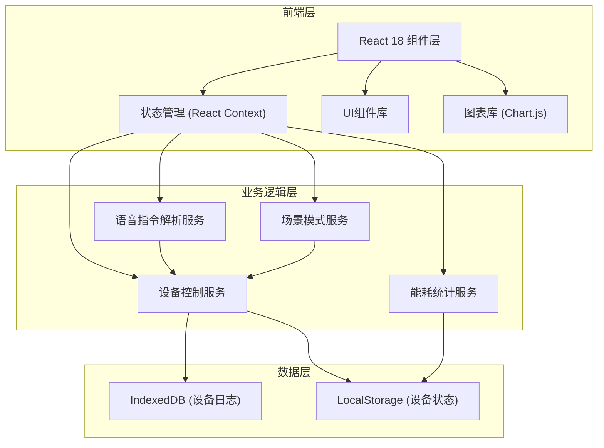

## 1. 架构设计



## 2. 技术描述

- **前端框架**: React@18 + TypeScript
- **构建工具**: Vite@5
- **样式方案**: TailwindCSS@3 + 自定义CSS变量
- **状态管理**: React Context + useReducer
- **图表库**: chart.js@4 + react-chartjs-2
- **图标库**: lucide-react
- **数据存储**: IndexedDB (日志) + LocalStorage (状态)
- **动画**: CSS Transitions + framer-motion

## 3. 项目结构

```
src/
├── components/
│   ├── HouseLayout/        # 房屋布局组件
│   ├── DeviceModal/        # 设备控制弹窗
│   ├── VoiceControl/       # 语音控制组件
│   ├── SceneMode/          # 场景模式组件
│   ├── EnergyStats/        # 能耗统计组件
│   ├── DeviceLog/          # 设备日志组件
│   ├── Toast/              # Toast提示组件
│   └── common/             # 通用组件
├── context/
│   └── SmartHomeContext.tsx # 全局状态管理
├── services/
│   ├── deviceService.ts     # 设备控制服务
│   ├── voiceService.ts      # 语音指令解析
│   ├── sceneService.ts      # 场景模式服务
│   ├── energyService.ts     # 能耗统计服务
│   └── dbService.ts         # IndexedDB服务
├── types/
│   └── index.ts             # TypeScript类型定义
├── data/
│   └── initialData.ts       # 初始数据
├── hooks/
│   └── useSmartHome.ts      # 自定义Hooks
├── App.tsx
├── main.tsx
└── index.css
```

## 4. 类型定义

```typescript
// 设备类型
type DeviceType = 'light' | 'ac' | 'curtain' | 'speaker' | 'humidifier' | 'camera';

// 房间类型
type RoomType = 'living' | 'bedroom' | 'kitchen' | 'bathroom';

// 设备状态
interface Device {
  id: string;
  name: string;
  type: DeviceType;
  room: RoomType;
  isOn: boolean;
  // 灯
  brightness?: number;
  color?: string;
  // 空调
  temperature?: number;
  mode?: 'cool' | 'heat' | 'auto' | 'fan';
  // 窗帘
  openPercent?: number;
  // 音响
  volume?: number;
  // 加湿器
  humidity?: number;
  targetHumidity?: number;
  // 摄像头
  isRecording?: boolean;
}

// 场景模式
interface Scene {
  id: string;
  name: string;
  icon: string;
  description: string;
  deviceConfigs: Partial<Device>[];
}

// 设备日志
interface DeviceLog {
  id: string;
  deviceId: string;
  deviceName: string;
  room: RoomType;
  action: string;
  timestamp: number;
  details?: Record<string, any>;
}

// 能耗数据
interface EnergyData {
  date: string;
  total: number;
  byDevice: Record<string, number>;
}
```

## 5. 核心功能实现思路

### 5.1 设备状态管理
- 使用React Context统一管理所有设备状态
- 设备状态变更时自动同步到LocalStorage
- 状态变更时触发日志记录

### 5.2 语音指令解析
- 基于关键词匹配的简易解析器
- 支持的指令模式："打开/关闭 + 房间 + 设备"、"调节 + 设备 + 参数"
- 解析失败时返回友好提示

### 5.3 IndexedDB封装
- 使用Promise封装IndexedDB操作
- 存储设备操作日志，支持按时间范围查询
- 初始化时自动创建数据库和表结构

### 5.4 能耗统计
- 根据设备类型和使用时长模拟能耗数据
- 每日自动生成统计数据
- 使用Chart.js渲染折线图和柱状图

## 6. 数据模型（IndexedDB）

### 6.1 数据库设计
```
数据库名: smartHomeDB
版本: 1

对象仓库:
- deviceLogs (keyPath: id, 索引: timestamp, deviceId, room)
```

### 6.2 初始数据
- 4个房间，每个房间预置3-4个设备
- 4种场景模式的预设配置
- 近7天的模拟能耗数据
