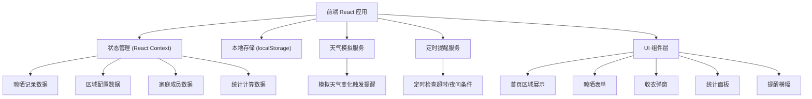
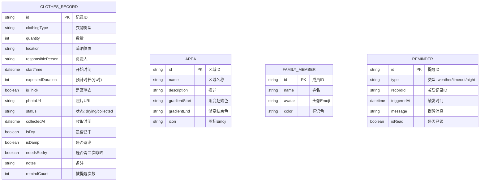

## 1. 架构设计



## 2. 技术描述

- **前端框架**：React@18 + TypeScript
- **构建工具**：Vite@5
- **样式方案**：TailwindCSS@3 + CSS 动画
- **图标方案**：Emoji 图标 + Lucide React（辅助）
- **状态管理**：React Context + useReducer
- **数据持久化**：localStorage（本地存储所有数据）
- **后端服务**：无（纯前端应用，模拟天气服务）
- **日期处理**：date-fns
- **图表组件**：recharts（统计图表）

## 3. 路由定义

| 路由 | 用途 |
|------|------|
| `/` | 首页 - 按区域展示晾晒衣物、提醒横幅、快捷操作 |
| `/add` | 添加晾晒记录表单 |
| `/stats` | 统计面板 - 返潮统计、忘收排行、厚衣管理 |
| `/history` | 历史记录 - 查看所有晾晒历史 |

## 4. 数据模型

### 4.1 数据模型定义



### 4.2 TypeScript 类型定义

```typescript
type ClothingType = 'top' | 'pants' | 'underwear' | 'bedding' | 'other';
type RecordStatus = 'drying' | 'collected';
type ReminderType = 'weather' | 'timeout' | 'night';
type WeatherCondition = 'sunny' | 'cloudy' | 'rainy' | 'foggy' | 'night';

interface ClothesRecord {
  id: string;
  clothingType: ClothingType;
  clothingTypeLabel: string;
  quantity: number;
  location: string;
  locationId: string;
  responsiblePerson: string;
  responsiblePersonId: string;
  startTime: string;
  expectedDuration: number;
  isThick: boolean;
  photoUrl?: string;
  status: RecordStatus;
  collectedAt?: string;
  isDry?: boolean;
  isDamp?: boolean;
  needsRedry?: boolean;
  notes?: string;
  remindCount: number;
}

interface Area {
  id: string;
  name: string;
  description: string;
  gradientStart: string;
  gradientEnd: string;
  icon: string;
}

interface FamilyMember {
  id: string;
  name: string;
  avatar: string;
  color: string;
}

interface Reminder {
  id: string;
  type: ReminderType;
  recordId?: string;
  triggeredAt: string;
  message: string;
  isRead: boolean;
}

interface WeatherInfo {
  condition: WeatherCondition;
  temperature: number;
  humidity: number;
  forecast: string;
}

interface StatsData {
  weeklyDampCount: number;
  monthlyDampCount: number;
  forgottenByPerson: { personId: string; personName: string; count: number }[];
  thickClothesPending: ClothesRecord[];
  areaDampDistribution: { areaId: string; areaName: string; count: number }[];
  weeklyTrend: { date: string; dampCount: number; dryCount: number }[];
}
```

### 4.3 初始数据

```typescript
// 默认区域配置
const defaultAreas: Area[] = [
  {
    id: 'south-balcony',
    name: '南阳台',
    description: '阳光充足，适合晾晒',
    gradientStart: '#FFF7E6',
    gradientEnd: '#FFE4B5',
    icon: '☀️'
  },
  {
    id: 'north-balcony',
    name: '北阳台',
    description: '阴凉通风，适合阴干',
    gradientStart: '#E6F3FF',
    gradientEnd: '#B5D8FF',
    icon: '💨'
  },
  {
    id: 'master-balcony',
    name: '主卧阳台',
    description: '私密空间，内衣专属',
    gradientStart: '#F5F0FF',
    gradientEnd: '#E0D0FF',
    icon: '🛏️'
  }
];

// 默认家庭成员
const defaultMembers: FamilyMember[] = [
  { id: 'dad', name: '爸爸', avatar: '👨', color: '#4A90D9' },
  { id: 'mom', name: '妈妈', avatar: '👩', color: '#F5A623' },
  { id: 'xiaoming', name: '小明', avatar: '👦', color: '#7ED321' },
  { id: 'xiaohong', name: '小红', avatar: '👧', color: '#D94A90' }
];

// 衣物类型配置
const clothingTypes = [
  { value: 'top', label: '上衣', icon: '👕' },
  { value: 'pants', label: '裤子', icon: '👖' },
  { value: 'underwear', label: '内衣', icon: '🩲' },
  { value: 'bedding', label: '床品', icon: '🛏️' },
  { value: 'other', label: '其他', icon: '🧦' }
];
```

## 5. 核心模块说明

### 5.1 提醒服务模块
- **天气模拟服务**：每 30 分钟随机切换天气状态，下雨或起雾时触发提醒
- **超时检查**：每分钟检查晾晒记录，超过预计时长 30 分钟触发提醒
- **夜间检查**：每天 19:00 后检查是否有未收衣物，触发夜间提醒
- **通知方式**：页面横幅提醒 + 浏览器 Notification API（需授权）

### 5.2 统计计算模块
- **返潮统计**：按周/月统计返潮次数，生成趋势数据
- **忘收排行**：统计每位成员被提醒次数，生成排行榜
- **厚衣管理**：筛选当前晾晒中的厚衣，计算建议收取时间

### 5.3 动画效果模块
- **衣物摆动动画**：CSS keyframes 实现微风摆动效果
- **雨滴动画**：CSS 动画实现下雨时的雨滴飘落效果
- **页面过渡**：React Transition Group 实现页面切换动画
