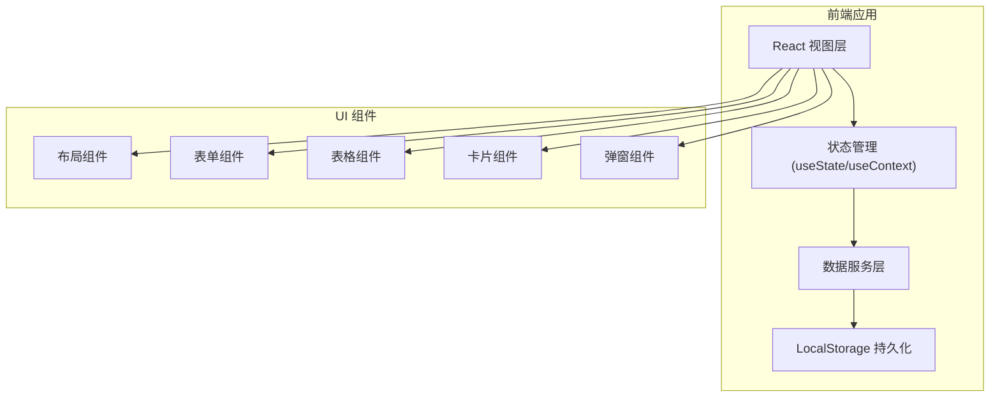
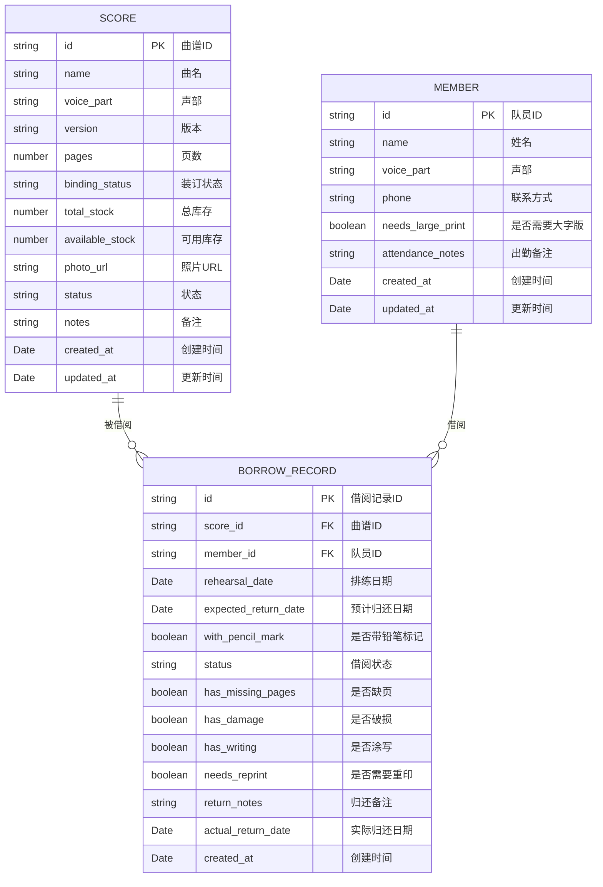

## 1. 架构设计

这是一个纯前端单页应用（SPA），使用浏览器 LocalStorage 进行数据持久化，无需后端服务。



## 2. 技术描述

- **前端框架**：React@18 + TypeScript
- **构建工具**：Vite@5
- **样式方案**：TailwindCSS@3
- **路由管理**：React Router v6
- **图标库**：Lucide React
- **数据持久化**：浏览器 LocalStorage
- **状态管理**：React Context + useReducer

## 3. 目录结构

```
src/
├── assets/              # 静态资源
├── components/          # 通用组件
│   ├── Layout/         # 布局组件
│   ├── ui/             # 基础 UI 组件
│   └── ...
├── pages/              # 页面组件
│   ├── Dashboard/      # 看板首页
│   ├── Scores/         # 曲谱档案
│   ├── Members/        # 队员档案
│   └── Borrow/         # 借阅管理
├── store/              # 状态管理
│   ├── ScoreContext.tsx
│   ├── MemberContext.tsx
│   └── BorrowContext.tsx
├── types/              # TypeScript 类型定义
│   └── index.ts
├── utils/              # 工具函数
│   ├── storage.ts
│   └── mockData.ts
├── App.tsx
├── main.tsx
└── index.css
```

## 4. 路由定义

| 路由路径 | 页面名称 | 说明 |
|----------|----------|------|
| / | 看板首页 | 数据总览和快捷操作 |
| /scores | 曲谱档案 | 曲谱列表管理 |
| /scores/new | 新增曲谱 | 新增曲谱表单 |
| /scores/:id | 曲谱详情 | 曲谱详情和借阅历史 |
| /members | 队员档案 | 队员列表管理 |
| /members/new | 新增队员 | 新增队员表单 |
| /members/:id | 队员详情 | 队员详情和借阅历史 |
| /borrow | 借阅管理 | 借阅/归还/记录标签页 |

## 5. 数据模型

### 5.1 ER 图



### 5.2 数据实体说明

#### 曲谱 (Score)
- **声部枚举**：女高音、女低音、男高音、男低音、混声
- **装订状态枚举**：已装订、未装订、半装订
- **状态枚举**：正常、破损、待重印

#### 队员 (Member)
- **声部枚举**：女高音、女低音、男高音、男低音

#### 借阅记录 (BorrowRecord)
- **状态枚举**：借阅中、已归还、逾期
- 归还时检查项：缺页、破损、涂写、是否需要重印

## 6. 核心功能模块设计

### 6.1 数据存储层

使用 LocalStorage 存储，数据结构：
- `chorus_scores`: 曲谱列表数组
- `chorus_members`: 队员列表数组
- `chorus_borrow_records`: 借阅记录数组

每个模块提供 CRUD 操作方法。

### 6.2 状态管理层

使用 React Context 管理全局状态：
- ScoreContext：曲谱数据及操作方法
- MemberContext：队员数据及操作方法
- BorrowContext：借阅记录及操作方法

### 6.3 组件层

通用组件：
- Layout：侧边栏 + 主内容区布局
- DataTable：数据表格组件
- Modal：弹窗组件
- Button：按钮组件
- Input/Select/DatePicker：表单组件
- Card：卡片组件
- Badge：状态标签组件
