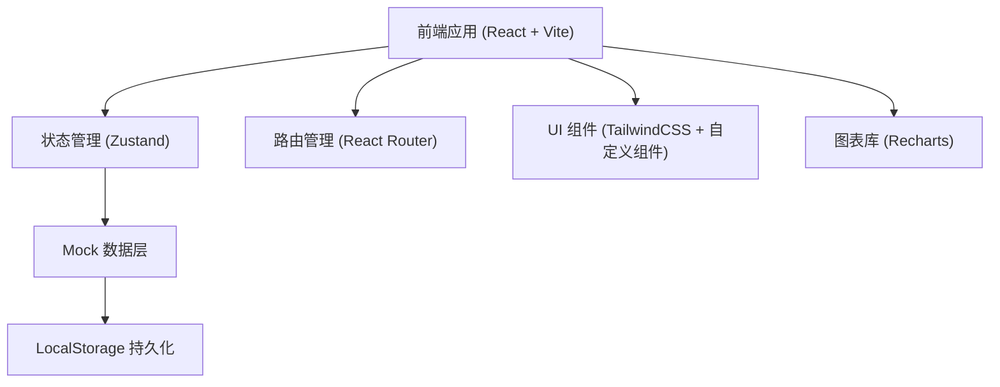
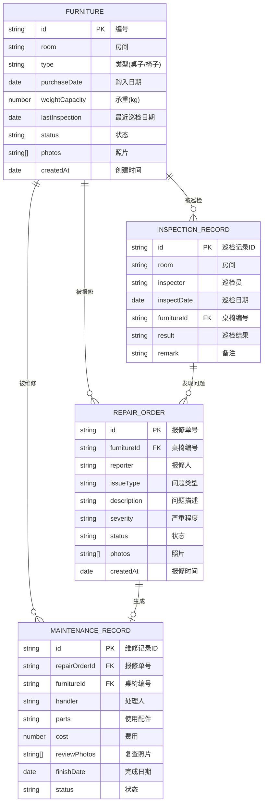

## 1. 架构设计



本系统为纯前端单页应用，使用 Mock 数据模拟后端接口，数据通过 LocalStorage 持久化存储。架构简洁高效，适合社区内部部署使用。

## 2. 技术描述

- **前端框架**：React@18 + TypeScript
- **构建工具**：Vite@5
- **样式方案**：TailwindCSS@3
- **路由管理**：React Router v6
- **状态管理**：Zustand
- **图表组件**：Recharts
- **图标库**：Lucide React
- **数据存储**：LocalStorage (Mock 数据持久化)

## 3. 路由定义

| 路由路径 | 页面名称 | 说明 |
|----------|----------|------|
| /dashboard | 数据看板 | 首页，展示统计数据和图表 |
| /furniture | 桌椅档案 | 桌椅列表和档案管理 |
| /furniture/:id | 桌椅详情 | 单桌椅详细信息和历史记录 |
| /repair | 报修管理 | 报修单列表和处理 |
| /repair/new | 提交报修 | 新建报修单 |
| /inspection | 巡检管理 | 巡检任务和记录 |
| /inspection/:roomId | 房间巡检 | 按房间逐件巡检 |
| /maintenance | 维修管理 | 维修任务和记录 |
| /maintenance/:id | 维修详情 | 维修单详情和处理 |

## 4. 数据模型

### 4.1 数据模型定义



### 4.2 数据枚举值

**桌椅状态 (FurnitureStatus):**
- `normal` - 正常使用
- `pending_repair` - 待修
- `under_maintenance` - 维修中
- `out_of_service` - 停用

**问题类型 (IssueType):**
- `wobble` - 晃动
- `crack` - 裂纹
- `uneven_legs` - 椅脚不平
- `peeling` - 桌面起皮
- `drawer_stuck` - 抽屉卡住
- `backrest_loose` - 靠背松动

**严重程度 (Severity):**
- `low` - 轻微
- `medium` - 一般
- `high` - 严重

**报修单状态 (RepairStatus):**
- `pending` - 待处理
- `processing` - 处理中
- `assigned` - 已派单
- `completed` - 已完成
- `closed` - 已关闭

**维修状态 (MaintenanceStatus):**
- `pending` - 待维修
- `in_progress` - 维修中
- `completed` - 已完成
- `verified` - 已验收

### 4.3 初始 Mock 数据

系统预置以下数据用于演示：
- 4个房间（活动室A、活动室B、棋牌室C、棋牌室D）
- 24套桌椅（每房间6套，含桌子和椅子）
- 8条报修记录（不同状态和类型）
- 12条巡检记录
- 6条维修记录
- 3个高峰使用时段数据

## 5. 目录结构

```
src/
├── assets/          # 静态资源
├── components/      # 通用组件
│   ├── Layout/      # 布局组件
│   ├── Card/        # 卡片组件
│   ├── Table/       # 表格组件
│   ├── Modal/       # 弹窗组件
│   └── StatusBadge/ # 状态标签组件
├── pages/           # 页面组件
│   ├── Dashboard/   # 数据看板
│   ├── Furniture/   # 桌椅档案
│   ├── Repair/      # 报修管理
│   ├── Inspection/  # 巡检管理
│   └── Maintenance/ # 维修管理
├── store/           # 状态管理
│   ├── furnitureStore.ts
│   ├── repairStore.ts
│   ├── inspectionStore.ts
│   └── maintenanceStore.ts
├── types/           # TypeScript 类型定义
├── utils/           # 工具函数
├── mock/            # Mock 数据
├── App.tsx          # 根组件
├── main.tsx         # 入口文件
└── index.css        # 全局样式
```

## 6. 核心功能实现方案

### 6.1 状态管理
使用 Zustand 管理全局状态，按业务模块拆分为多个 store：
- furnitureStore: 桌椅档案 CRUD、状态更新
- repairStore: 报修单管理、状态流转
- inspectionStore: 巡检任务、巡检记录
- maintenanceStore: 维修记录、配件管理

### 6.2 数据持久化
使用 localStorage 存储所有业务数据，应用启动时从 localStorage 加载，数据变更时自动保存。首次访问时使用 mock 数据初始化。

### 6.3 自动停用机制
当报修单严重程度为"严重"或巡检标记为"停用"时，自动更新对应桌椅状态为 `out_of_service`，并在列表和详情页显示红色"停用"标记和维修提示。

### 6.4 统计计算
数据看板的统计指标通过前端计算得出：
- 完好率 = 正常桌椅数 / 总桌椅数
- 重复故障 = 同一桌椅报修次数 ≥ 2
- 各房间完好率 = 房间内正常桌椅 / 房间总桌椅
- 高峰使用时段 = 按小时统计报修数量分布
