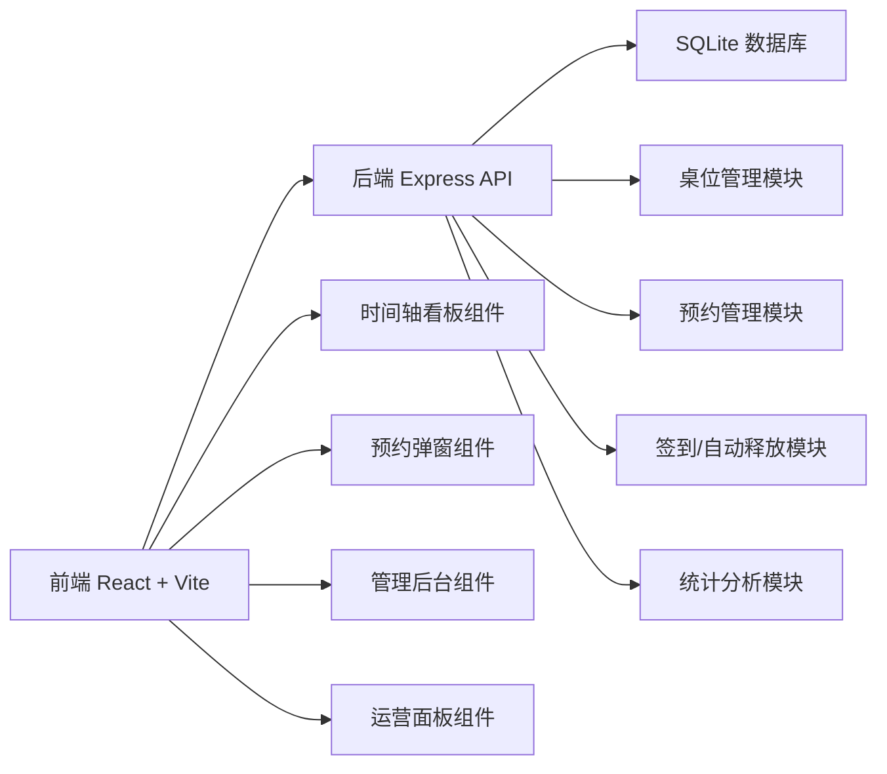
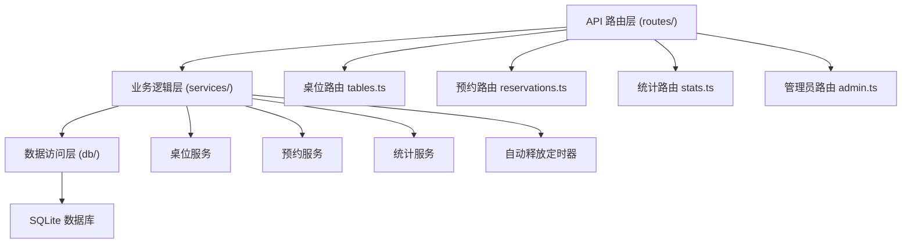
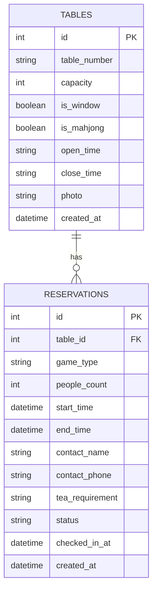

## 1. 架构设计



## 2. 技术描述

- **前端**：React@18 + TypeScript + TailwindCSS@3 + Zustand + React Router
- **初始化工具**：vite-init
- **后端**：Express@4 + TypeScript
- **数据库**：SQLite（文件型，无需额外服务，适合小型社区场景）
- **图标库**：lucide-react
- **状态管理**：zustand

## 3. 路由定义

| 路由 | 页面 | 说明 |
|------|------|------|
| / | 看板首页 | 时间轴展示所有桌位今日预约 |
| /admin | 管理员登录 | 管理员密码登录 |
| /admin/tables | 桌位管理 | 桌位增删改查 |
| /admin/stats | 运营面板 | 数据统计和分析 |

## 4. API 定义

### 4.1 桌位相关

```typescript
interface Table {
  id: number;
  tableNumber: string;
  capacity: number;
  isWindow: boolean;
  isMahjong: boolean;
  openTime: string;     // "08:00"
  closeTime: string;    // "22:00"
  photo?: string;       // base64 或图片URL
  createdAt: string;
}

// GET /api/tables - 获取所有桌位
// POST /api/tables - 创建桌位
// PUT /api/tables/:id - 更新桌位
// DELETE /api/tables/:id - 删除桌位
```

### 4.2 预约相关

```typescript
interface Reservation {
  id: number;
  tableId: number;
  gameType: string;     // 麻将/扑克/象棋等
  peopleCount: number;
  startTime: string;    // ISO datetime
  endTime: string;      // ISO datetime
  contactName: string;
  contactPhone: string;
  teaRequirement: string;
  status: 'pending' | 'checked_in' | 'completed' | 'no_show' | 'cancelled';
  checkedInAt?: string;
  createdAt: string;
}

// GET /api/reservations?date=YYYY-MM-DD - 获取某日所有预约
// POST /api/reservations - 创建预约
// PUT /api/reservations/:id/checkin - 签到
// PUT /api/reservations/:id/cancel - 取消预约
// DELETE /api/reservations/:id - 删除预约
```

### 4.3 统计相关

```typescript
interface StatsData {
  todayReservations: number;
  checkInRate: number;
  noShowCount: number;
  peakHours: { hour: number; count: number }[];
  popularTables: { tableId: number; tableNumber: string; count: number }[];
  noShowRecords: { name: string; phone: string; count: number }[];
}

// GET /api/stats - 获取运营统计数据
// GET /api/stats/peak-hours - 获取高峰时段数据
// GET /api/stats/popular-tables - 获取热门桌位排行
```

### 4.4 管理员登录

```typescript
// POST /api/admin/login - 管理员登录
// 简单密码验证，返回成功状态
```

## 5. 后端架构



## 6. 数据模型

### 6.1 ER 图



### 6.2 DDL 语句

```sql
-- 桌位表
CREATE TABLE IF NOT EXISTS tables (
  id INTEGER PRIMARY KEY AUTOINCREMENT,
  table_number TEXT NOT NULL UNIQUE,
  capacity INTEGER NOT NULL,
  is_window INTEGER DEFAULT 0,
  is_mahjong INTEGER DEFAULT 0,
  open_time TEXT NOT NULL DEFAULT '08:00',
  close_time TEXT NOT NULL DEFAULT '22:00',
  photo TEXT,
  created_at DATETIME DEFAULT CURRENT_TIMESTAMP
);

-- 预约表
CREATE TABLE IF NOT EXISTS reservations (
  id INTEGER PRIMARY KEY AUTOINCREMENT,
  table_id INTEGER NOT NULL,
  game_type TEXT NOT NULL,
  people_count INTEGER NOT NULL,
  start_time DATETIME NOT NULL,
  end_time DATETIME NOT NULL,
  contact_name TEXT NOT NULL,
  contact_phone TEXT NOT NULL,
  tea_requirement TEXT DEFAULT '',
  status TEXT NOT NULL DEFAULT 'pending',
  checked_in_at DATETIME,
  created_at DATETIME DEFAULT CURRENT_TIMESTAMP,
  FOREIGN KEY (table_id) REFERENCES tables(id)
);

-- 索引
CREATE INDEX IF NOT EXISTS idx_reservations_table_id ON reservations(table_id);
CREATE INDEX IF NOT EXISTS idx_reservations_start_time ON reservations(start_time);
CREATE INDEX IF NOT EXISTS idx_reservations_status ON reservations(status);

-- 初始数据 - 示例桌位
INSERT INTO tables (table_number, capacity, is_window, is_mahjong, open_time, close_time) VALUES
('A01', 4, 1, 1, '08:00', '22:00'),
('A02', 4, 1, 1, '08:00', '22:00'),
('A03', 4, 0, 1, '08:00', '22:00'),
('B01', 6, 1, 0, '09:00', '21:00'),
('B02', 2, 0, 0, '08:00', '22:00');
```

## 7. 自动释放机制

- 后端启动定时任务，每分钟检查一次
- 查找状态为 pending 且 开始时间 + 宽限分钟(15) < 当前时间 的预约
- 将这些预约状态更新为 no_show
- 桌位自动释放，可被新预约占用
