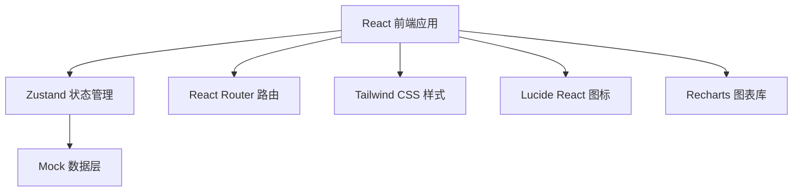
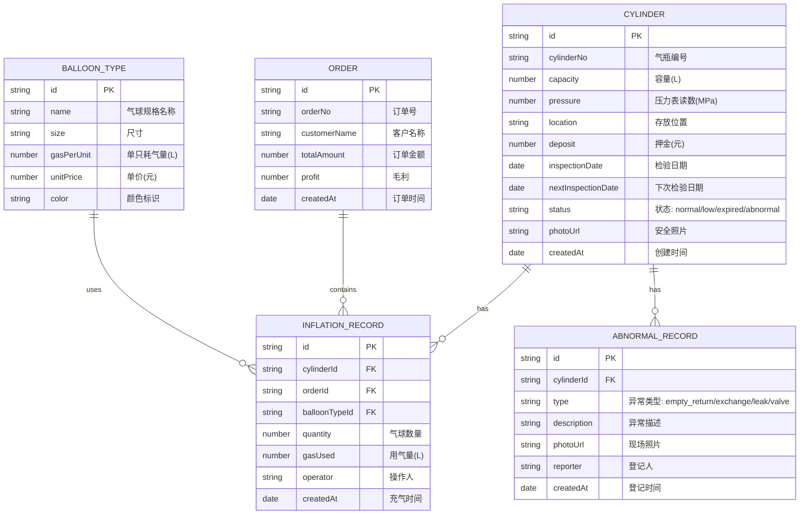

## 1. 架构设计



## 2. 技术描述
- **前端框架**：React@18 + TypeScript + Vite
- **状态管理**：Zustand
- **路由**：react-router-dom
- **样式**：Tailwind CSS@3
- **图标**：lucide-react
- **图表**：recharts
- **数据**：前端 Mock 数据 + LocalStorage 持久化
- **构建工具**：Vite

## 3. 路由定义
| 路由 | 页面名称 | 说明 |
|-------|---------|------|
| / | 气瓶管理页 | 首页，展示所有气瓶列表 |
| /cylinders | 气瓶管理页 | 气瓶列表、筛选、详情 |
| /inflation | 充气操作页 | 充气表单、气瓶选择、确认提交 |
| /abnormal | 异常登记页 | 四大类异常登记、历史记录 |
| /statistics | 统计分析页 | 用气量、毛利、异常排行 |

## 4. 数据模型

### 4.1 数据模型定义



### 4.2 状态枚举
- **气瓶状态**：`normal`(正常) / `low`(低压) / `expired`(过期) / `abnormal`(异常)
- **异常类型**：`empty_return`(空瓶归还) / `exchange`(换瓶) / `leak`(漏气) / `valve`(阀门异常)

## 5. 目录结构

```
src/
├── components/          # 通用组件
│   ├── Layout/         # 布局组件
│   ├── CylinderCard/   # 气瓶卡片
│   ├── StatusBadge/    # 状态标签
│   └── Modal/          # 弹窗组件
├── pages/              # 页面组件
│   ├── Cylinders/      # 气瓶管理页
│   ├── Inflation/      # 充气操作页
│   ├── Abnormal/       # 异常登记页
│   └── Statistics/     # 统计分析页
├── store/              # Zustand 状态
│   ├── useCylinderStore.ts
│   ├── useOrderStore.ts
│   └── useStatsStore.ts
├── types/              # TypeScript 类型
│   └── index.ts
├── data/               # Mock 数据
│   └── mockData.ts
├── utils/              # 工具函数
│   ├── date.ts
│   └── calculator.ts
├── App.tsx
├── main.tsx
└── index.css
```

## 6. 核心业务逻辑

### 6.1 低压判断逻辑
- 低压阈值：容量的 20%
- 计算公式：`当前压力 / 额定压力 < 0.2` 则标记为低压

### 6.2 检验期判断逻辑
- 检验周期：默认 1 年
- 过期判断：`当前日期 > 下次检验日期` 则标记为过期
- 临期提醒：距下次检验日期不足 30 天时显示黄色预警

### 6.3 用气量计算逻辑
- 公式：`总用气量 = 单只耗气量 × 数量`
- 支持不同气球规格预设不同单只耗气量

### 6.4 毛利计算逻辑
- 公式：`毛利 = 订单金额 - 氦气成本`
- 氦气成本：`用气量 × 单位气价`
