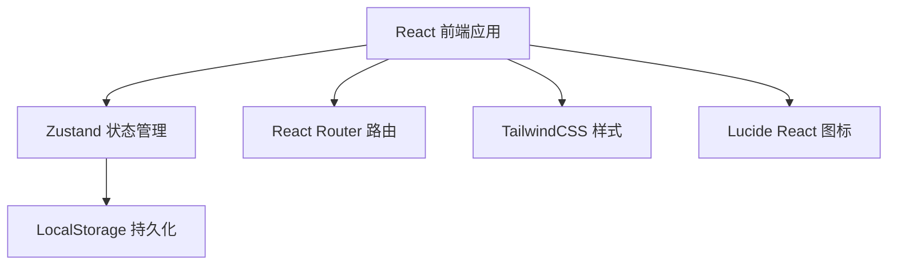
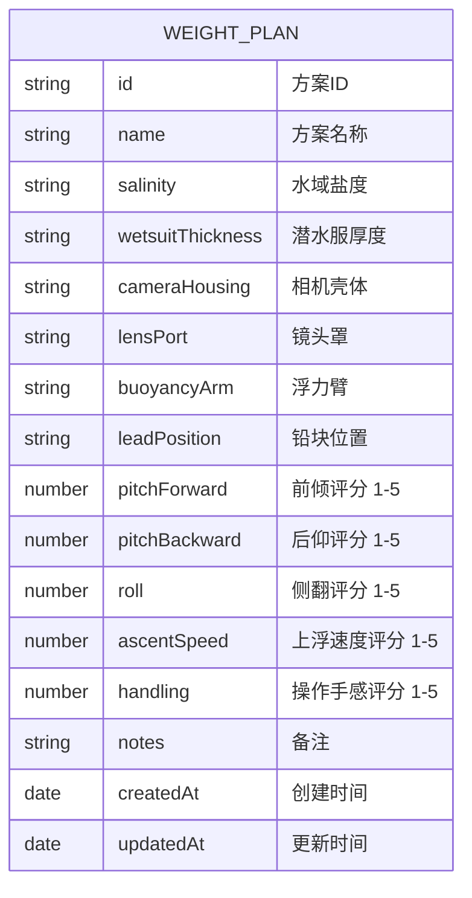

## 1. 架构设计



## 2. 技术描述

- **前端框架**：React@18 + TypeScript
- **构建工具**：Vite@5
- **样式方案**：TailwindCSS@3
- **状态管理**：Zustand
- **路由管理**：React Router DOM@6
- **图标库**：Lucide React
- **数据持久化**：LocalStorage
- **后端**：无（纯前端应用，数据存储在浏览器本地）

## 3. 路由定义

| 路由 | 页面 | 用途 |
|------|------|------|
| / | 方案列表页 | 展示所有配重方案，支持搜索和快速操作 |
| /new | 新建方案页 | 创建新的配重记录 |
| /edit/:id | 编辑方案页 | 修改已有配重方案 |
| /detail/:id | 方案详情页 | 查看完整配重方案信息 |

## 4. 数据模型

### 4.1 数据模型定义



### 4.2 TypeScript 类型定义

```typescript
interface WeightPlan {
  id: string;
  name: string;
  salinity: string;
  wetsuitThickness: string;
  cameraHousing: string;
  lensPort: string;
  buoyancyArm: string;
  leadPosition: string;
  pitchForward: number;
  pitchBackward: number;
  roll: number;
  ascentSpeed: number;
  handling: number;
  notes: string;
  createdAt: string;
  updatedAt: string;
}
```

## 5. 项目结构

```
src/
├── components/         # 可复用组件
│   ├── PlanCard.tsx   # 方案卡片组件
│   ├── RatingInput.tsx # 评分输入组件
│   ├── FormField.tsx  # 表单字段组件
│   └── Bubbles.tsx    # 气泡背景装饰
├── pages/             # 页面组件
│   ├── PlanList.tsx   # 方案列表页
│   ├── PlanForm.tsx   # 新建/编辑页
│   └── PlanDetail.tsx # 方案详情页
├── store/             # 状态管理
│   └── usePlanStore.ts # 配重方案 store
├── types/             # 类型定义
│   └── index.ts
├── utils/             # 工具函数
│   └── storage.ts     # 本地存储工具
├── App.tsx
├── main.tsx
└── index.css
```

## 6. 核心功能实现要点

1. **状态管理**：使用 Zustand 管理配重方案列表，结合 localStorage 实现数据持久化
2. **方案复用**：点击复用按钮时，复制选中方案的配置作为新方案的默认值
3. **评分系统**：使用 1-5 分制，五星视觉展示，支持点击和键盘操作
4. **搜索筛选**：根据方案名称、盐度、相机型号等关键词搜索
5. **响应式布局**：使用 Tailwind 响应式类，适配桌面端和移动端
