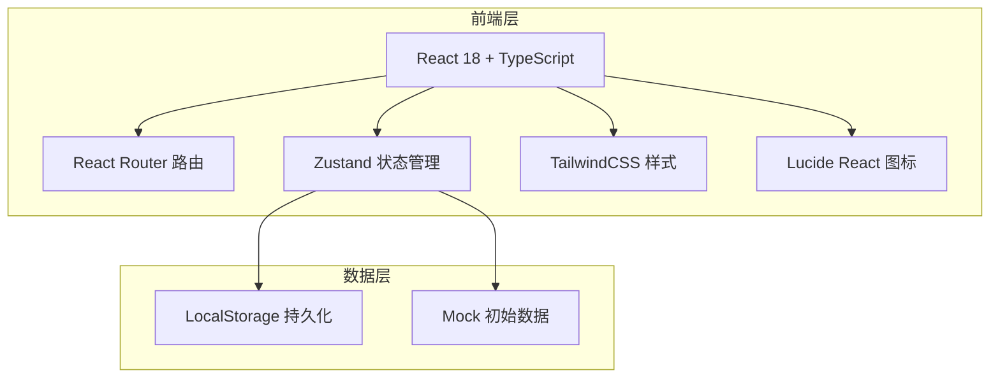
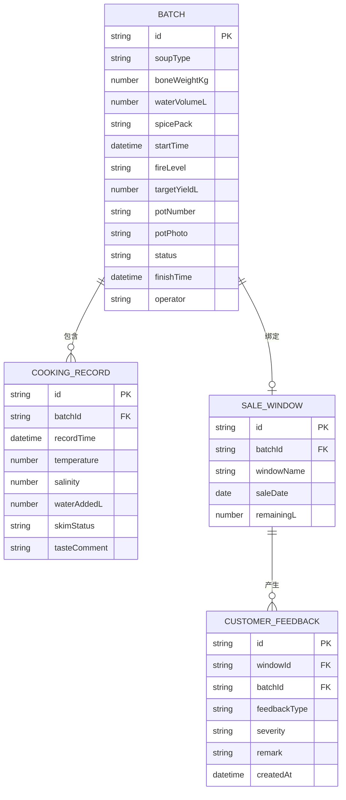

## 1. 架构设计



## 2. 技术描述
- 前端：React@18 + TypeScript + Vite
- 样式：TailwindCSS@3
- 状态管理：Zustand
- 路由：React Router DOM
- 图标：Lucide React
- 图表：纯 SVG 自实现折线图/进度图
- 数据持久化：LocalStorage（前端Demo，无后端）
- 初始化工具：vite-init

## 3. 路由定义
| 路由 | 页面用途 |
|------|----------|
| /dashboard | 品质看板首页（默认页） |
| /batches | 批次管理列表 |
| /batches/new | 新建熬制批次 |
| /batches/:id | 批次详情 + 熬制监控 |
| /feedback | 顾客反馈与追溯 |

## 4. 数据模型

### 4.1 ER图



### 4.2 类型定义

```typescript
type SoupType = 'pork-bone' | 'beef-bone' | 'chicken' | 'seafood' | 'vegetarian';
type FireLevel = 'low' | 'medium' | 'high' | 'simmer';
type BatchStatus = 'preparing' | 'cooking' | 'finished' | 'sold';
type FeedbackType = 'too-salty' | 'too-light' | 'oily' | 'other';
type Severity = 'mild' | 'moderate' | 'serious';
type SkimStatus = 'not-done' | 'partial' | 'thorough';

interface Batch {
  id: string;
  soupType: SoupType;
  boneWeightKg: number;
  waterVolumeL: number;
  spicePack: string;
  startTime: string;
  fireLevel: FireLevel;
  targetYieldL: number;
  potNumber: string;
  potPhoto?: string;
  status: BatchStatus;
  finishTime?: string;
  operator: string;
  cookingRecords: CookingRecord[];
  saleWindow?: SaleWindow;
}

interface CookingRecord {
  id: string;
  batchId: string;
  recordTime: string;
  temperature: number;
  salinity: number;
  waterAddedL: number;
  skimStatus: SkimStatus;
  tasteComment: string;
}

interface SaleWindow {
  id: string;
  batchId: string;
  windowName: string;
  saleDate: string;
  remainingL: number;
}

interface CustomerFeedback {
  id: string;
  windowId?: string;
  batchId: string;
  feedbackType: FeedbackType;
  severity: Severity;
  remark: string;
  createdAt: string;
}
```

## 5. 项目目录结构

```
src/
├── components/
│   ├── layout/
│   │   ├── Sidebar.tsx
│   │   └── Layout.tsx
│   ├── dashboard/
│   │   ├── CookingPotsCard.tsx
│   │   ├── SoupStockCard.tsx
│   │   ├── FeedbackAlertCard.tsx
│   │   └── StabilityChart.tsx
│   ├── batch/
│   │   ├── BatchForm.tsx
│   │   ├── BatchList.tsx
│   │   ├── BatchDetail.tsx
│   │   └── CookingMonitor.tsx
│   ├── feedback/
│   │   ├── FeedbackForm.tsx
│   │   └── TraceChain.tsx
│   └── common/
│       ├── StatusBadge.tsx
│       ├── ProgressBar.tsx
│       └── StatCard.tsx
├── pages/
│   ├── Dashboard.tsx
│   ├── BatchList.tsx
│   ├── BatchNew.tsx
│   ├── BatchDetail.tsx
│   └── Feedback.tsx
├── store/
│   └── useBatchStore.ts
├── types/
│   └── index.ts
├── utils/
│   ├── mockData.ts
│   ├── helpers.ts
│   └── soupConfig.ts
├── App.tsx
├── main.tsx
└── index.css
```
