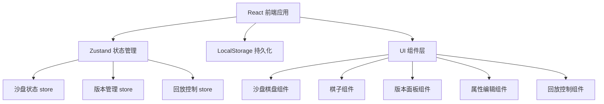
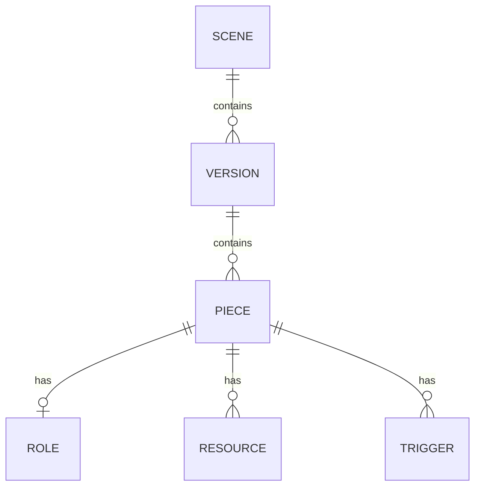

## 1. 架构设计

纯前端单页应用，数据存储在浏览器 localStorage 中，无需后端服务。



## 2. 技术描述

- **前端框架**：React@18 + TypeScript
- **构建工具**：Vite@5
- **样式方案**：TailwindCSS@3
- **状态管理**：Zustand@4
- **图标库**：lucide-react
- **数据持久化**：localStorage
- **初始化模板**：react-ts

## 3. 路由定义

| 路由 | 用途 |
|------|------|
| / | 沙盘版本管理主页面 |

## 4. 数据模型

### 4.1 数据模型定义



### 4.2 TypeScript 类型定义

```typescript
// 角色定义
interface Role {
  id: string;
  name: string;
  color: string;
  symbol: string;
  description: string;
}

// 资源定义
interface Resource {
  id: string;
  name: string;
  amount: number;
  unit: string;
}

// 触发条件
interface Trigger {
  id: string;
  name: string;
  condition: string;
  effect: string;
}

// 棋子
interface Piece {
  id: string;
  name: string;
  roleId: string;
  x: number;
  y: number;
  resources: Resource[];
  triggers: Trigger[];
  notes: string;
}

// 版本
interface Version {
  id: string;
  name: string;
  description: string;
  createdAt: number;
  pieces: Piece[];
  stepNumber: number;
}

// 场景
interface Scene {
  id: string;
  name: string;
  roles: Role[];
  versions: Version[];
  currentVersionId: string | null;
}

// 回放状态
interface PlaybackState {
  isPlaying: boolean;
  currentStep: number;
  speed: number;
  versionOrder: string[];
}

// 对比状态
interface CompareState {
  isComparing: boolean;
  leftVersionId: string | null;
  rightVersionId: string | null;
}

// 差异类型
type DiffType = 'added' | 'removed' | 'moved' | 'role_changed' | 'resource_changed' | 'trigger_changed';

interface PieceDiff {
  pieceId: string;
  type: DiffType;
  oldValue?: any;
  newValue?: any;
}
```

### 4.3 核心模块划分

| 模块 | 文件路径 | 职责 |
|------|----------|------|
| 沙盘状态管理 | src/store/useSandboxStore.ts | 管理棋子、角色、当前版本状态 |
| 版本管理 | src/store/useVersionStore.ts | 版本增删改查、版本切换、版本对比 |
| 回放控制 | src/store/usePlaybackStore.ts | 回放播放控制、速度调节、步骤管理 |
| 差异计算 | src/utils/diffCalculator.ts | 计算两个版本间的棋子差异 |
| 本地存储 | src/utils/storage.ts | localStorage 读写封装 |
| 沙盘棋盘 | src/components/SandboxBoard.tsx | 棋盘渲染、棋子拖拽、坐标系统 |
| 棋子组件 | src/components/GamePiece.tsx | 单个棋子渲染、选中状态 |
| 版本列表面板 | src/components/VersionPanel.tsx | 版本列表、版本操作 |
| 属性编辑面板 | src/components/PropertyPanel.tsx | 角色、资源、触发条件编辑 |
| 对比视图 | src/components/CompareView.tsx | 双版本并排对比、差异标记 |
| 回放控制条 | src/components/PlaybackBar.tsx | 播放控制、进度条 |
| 主页面 | src/pages/Home.tsx | 整体布局、模块组装 |

### 4.4 初始 Mock 数据

应用启动时预置一个示例场景，包含 3 个版本和多个棋子，用于演示核心功能。
