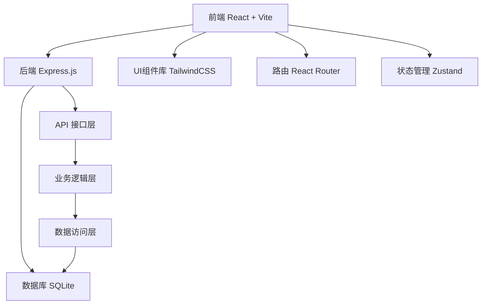
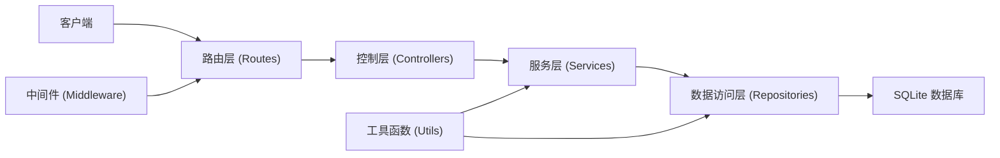
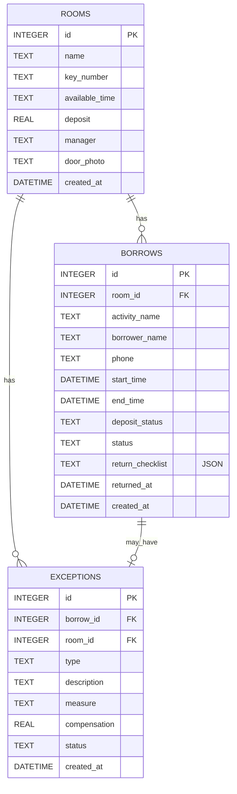

## 1. 架构设计

本系统采用前后端分离架构，前端使用React构建单页应用，后端使用Express提供RESTful API，数据存储使用SQLite轻量数据库。系统整体分层清晰，便于维护和扩展。



## 2. 技术说明

- **前端**：React@18 + TypeScript + TailwindCSS@3 + Vite@5
- **初始化工具**：Vite 官方模板
- **路由**：react-router-dom@6
- **状态管理**：zustand
- **图标**：lucide-react
- **后端**：Express@4 + TypeScript
- **数据库**：SQLite + better-sqlite3
- **日期处理**：date-fns
- **文件上传**：multer（门牌照片存储）

## 3. 路由定义

| 路由路径 | 页面名称 | 说明 |
|----------|----------|------|
| /dashboard | 数据看板 | 首页，展示房间状态统计和逾期提醒 |
| /rooms | 房间管理 | 房间和钥匙信息的增删改查 |
| /rooms/new | 新增房间 | 新建房间表单 |
| /rooms/:id/edit | 编辑房间 | 编辑房间信息 |
| /borrows | 借用记录 | 所有借用记录列表和筛选 |
| /borrows/new | 借用登记 | 新建借用单 |
| /exceptions | 异常处理 | 异常记录列表 |
| /exceptions/new | 异常登记 | 新建异常记录 |

## 4. API 定义

### 4.1 房间管理 API

| 方法 | 路径 | 说明 | 请求体 | 响应 |
|------|------|------|--------|------|
| GET | /api/rooms | 获取房间列表 | - | Room[] |
| GET | /api/rooms/:id | 获取房间详情 | - | Room |
| POST | /api/rooms | 新增房间 | RoomForm | Room |
| PUT | /api/rooms/:id | 更新房间 | RoomForm | Room |
| DELETE | /api/rooms/:id | 删除房间 | - | { success: boolean } |

### 4.2 借用记录 API

| 方法 | 路径 | 说明 | 请求体 | 响应 |
|------|------|------|--------|------|
| GET | /api/borrows | 获取借用记录列表（支持status筛选） | - | Borrow[] |
| GET | /api/borrows/:id | 获取借用详情 | - | Borrow |
| POST | /api/borrows | 新建借用 | BorrowForm | Borrow |
| PUT | /api/borrows/:id/return | 归还登记 | ReturnForm | Borrow |
| GET | /api/borrows/overdue | 获取逾期记录 | - | Borrow[] |

### 4.3 异常处理 API

| 方法 | 路径 | 说明 | 请求体 | 响应 |
|------|------|------|--------|------|
| GET | /api/exceptions | 获取异常记录列表 | - | Exception[] |
| GET | /api/exceptions/:id | 获取异常详情 | - | Exception |
| POST | /api/exceptions | 新增异常记录 | ExceptionForm | Exception |
| PUT | /api/exceptions/:id | 更新异常记录 | ExceptionForm | Exception |

### 4.4 统计看板 API

| 方法 | 路径 | 说明 | 响应 |
|------|------|------|------|
| GET | /api/stats/dashboard | 获取看板统计数据 | DashboardStats |

### 4.5 TypeScript 类型定义

```typescript
// 房间
interface Room {
  id: number;
  name: string;           // 房间名
  keyNumber: string;      // 钥匙编号
  availableTime: string;  // 可借时段，如 "08:00-20:00"
  deposit: number;        // 押金金额
  manager: string;        // 管理员姓名
  doorPhoto: string;      // 门牌照片URL
  createdAt: string;
}

interface RoomForm {
  name: string;
  keyNumber: string;
  availableTime: string;
  deposit: number;
  manager: string;
  doorPhoto?: File | string;
}

// 借用记录
interface Borrow {
  id: number;
  roomId: number;
  roomName: string;
  activityName: string;   // 活动名称
  borrowerName: string;   // 借用人
  phone: string;          // 电话
  startTime: string;      // 开始时间 ISO格式
  endTime: string;        // 结束时间 ISO格式
  depositStatus: 'paid' | 'unpaid' | 'refunded'; // 押金状态
  status: 'borrowed' | 'returned' | 'overdue';   // 借用状态
  returnChecklist?: {     // 归还检查清单
    door: boolean;
    window: boolean;
    light: boolean;
    aircon: boolean;
  };
  returnedAt?: string;    // 实际归还时间
  createdAt: string;
}

interface BorrowForm {
  roomId: number;
  activityName: string;
  borrowerName: string;
  phone: string;
  startTime: string;
  endTime: string;
  depositStatus: 'paid' | 'unpaid';
}

interface ReturnForm {
  doorChecked: boolean;
  windowChecked: boolean;
  lightChecked: boolean;
  airconChecked: boolean;
  depositStatus?: 'refunded';
}

// 异常记录
interface Exception {
  id: number;
  borrowId: number;
  roomId: number;
  roomName: string;
  type: 'key_lost' | 'room_damage' | 'other'; // 异常类型
  description: string;    // 异常描述
  measure: string;        // 处理措施
  compensation: number;   // 赔偿金额
  status: 'pending' | 'processing' | 'resolved';
  createdAt: string;
}

interface ExceptionForm {
  borrowId?: number;
  roomId: number;
  type: 'key_lost' | 'room_damage' | 'other';
  description: string;
  measure: string;
  compensation: number;
  status: 'pending' | 'processing' | 'resolved';
}

// 看板统计
interface DashboardStats {
  totalRooms: number;
  totalBorrowed: number;
  totalOverdue: number;
  weeklyUsage: number;
  roomStats: RoomStat[];
  overdueRecords: Borrow[];
}

interface RoomStat {
  roomId: number;
  roomName: string;
  keyNumber: string;
  borrowed: number;
  pendingReturn: number;
  overdue: number;
  weeklyUsage: number;
}
```

## 5. 服务端架构图



## 6. 数据模型

### 6.1 数据模型ER图



### 6.2 DDL 语句

```sql
-- 房间表
CREATE TABLE rooms (
  id INTEGER PRIMARY KEY AUTOINCREMENT,
  name TEXT NOT NULL,
  key_number TEXT NOT NULL UNIQUE,
  available_time TEXT NOT NULL,
  deposit REAL NOT NULL DEFAULT 0,
  manager TEXT NOT NULL,
  door_photo TEXT,
  created_at DATETIME NOT NULL DEFAULT CURRENT_TIMESTAMP
);

-- 借用记录表
CREATE TABLE borrows (
  id INTEGER PRIMARY KEY AUTOINCREMENT,
  room_id INTEGER NOT NULL,
  activity_name TEXT NOT NULL,
  borrower_name TEXT NOT NULL,
  phone TEXT NOT NULL,
  start_time DATETIME NOT NULL,
  end_time DATETIME NOT NULL,
  deposit_status TEXT NOT NULL DEFAULT 'unpaid',
  status TEXT NOT NULL DEFAULT 'borrowed',
  return_checklist TEXT,
  returned_at DATETIME,
  created_at DATETIME NOT NULL DEFAULT CURRENT_TIMESTAMP,
  FOREIGN KEY (room_id) REFERENCES rooms(id)
);

-- 异常记录表
CREATE TABLE exceptions (
  id INTEGER PRIMARY KEY AUTOINCREMENT,
  borrow_id INTEGER,
  room_id INTEGER NOT NULL,
  type TEXT NOT NULL,
  description TEXT NOT NULL,
  measure TEXT,
  compensation REAL NOT NULL DEFAULT 0,
  status TEXT NOT NULL DEFAULT 'pending',
  created_at DATETIME NOT NULL DEFAULT CURRENT_TIMESTAMP,
  FOREIGN KEY (borrow_id) REFERENCES borrows(id),
  FOREIGN KEY (room_id) REFERENCES rooms(id)
);

-- 索引
CREATE INDEX idx_borrows_room_id ON borrows(room_id);
CREATE INDEX idx_borrows_status ON borrows(status);
CREATE INDEX idx_exceptions_room_id ON exceptions(room_id);
CREATE INDEX idx_exceptions_borrow_id ON exceptions(borrow_id);

-- 初始数据
INSERT INTO rooms (name, key_number, available_time, deposit, manager, door_photo) VALUES
('多功能活动室', 'KEY-001', '08:00-21:00', 100, '张管理员', '/images/room1.jpg'),
('合唱室', 'KEY-002', '09:00-20:00', 50, '李管理员', '/images/room2.jpg'),
('书法教室', 'KEY-003', '08:30-18:30', 80, '王管理员', '/images/room3.jpg');
```
