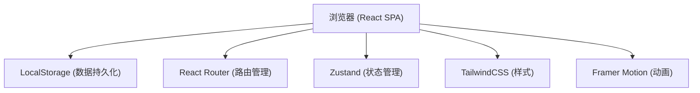
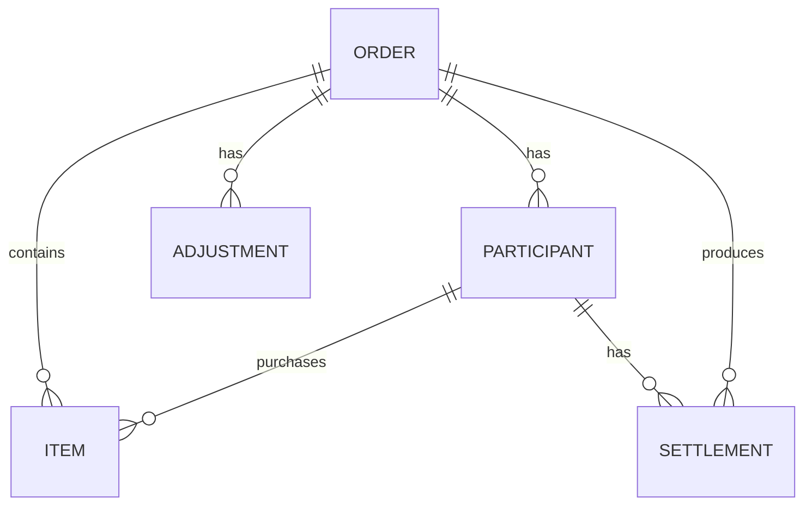

## 1. 架构设计


## 2. 技术描述
- **前端**：React@18 + TypeScript + Vite
- **状态管理**：Zustand（轻量、无provider包裹、支持persist）
- **路由**：React Router v6
- **样式**：TailwindCSS@3
- **动画**：Framer Motion
- **图标**：Lucide React
- **数据持久化**：LocalStorage（纯前端，无需后端）
- **构建工具**：Vite

## 3. 数据模型

### 3.1 实体关系图


### 3.2 类型定义

```typescript
// 参与人
interface Participant {
  id: string;
  name: string;
  avatar?: string;
}

// 商品
interface Item {
  id: string;
  orderId: string;
  name: string;
  buyerId: string; // 购买人ID
  price: number; // 外币价格
  quantity: number;
  weight: number; // 重量(kg)
  isReturned: boolean; // 是否单独退货
  screenshot?: string; // 截图base64
  remark?: string;
}

// 调整项
interface Adjustment {
  id: string;
  orderId: string;
  type: 'out_of_stock' | 'refund' | 'additional_tax' | 'other';
  amount: number;
  description: string;
  targetParticipantId?: string; // 指定某人承担，null则全员分摊
  createdAt: number;
}

// 结算记录
interface Settlement {
  orderId: string;
  participantId: string;
  itemsTotal: number; // 商品金额合计（人民币）
  shippingShare: number; // 运费分摊
  taxShare: number; // 税费分摊
  adjustmentShare: number; // 调整项分摊
  totalPayable: number; // 应付总额
  amountPaid: number; // 已付金额
  refundDue: number; // 待退金额
  isPickedUp: boolean; // 是否已取货
  isPaid: boolean; // 是否已付清
}

// 订单
interface Order {
  id: string;
  platform: string; // 平台名称
  exchangeRate: number; // 汇率
  trackingNumber: string; // 转运单号
  totalShipping: number; // 总运费
  totalTax: number; // 总税费
  participants: Participant[];
  items: Item[];
  adjustments: Adjustment[];
  allocationMethod: 'by_amount' | 'by_weight'; // 分摊方式
  status: 'draft' | 'active' | 'completed';
  createdAt: number;
  updatedAt: number;
}
```

## 4. 核心算法

### 4.1 费用分摊计算

```typescript
// 计算每人分摊的运费和税费
function calculateAllocation(
  items: Item[],
  participants: Participant[],
  totalShipping: number,
  totalTax: number,
  method: 'by_amount' | 'by_weight',
  exchangeRate: number
): Map<string, { shipping: number; tax: number }> {
  const allocation = new Map();
  
  participants.forEach(p => {
    allocation.set(p.id, { shipping: 0, tax: 0 });
  });

  // 计算总权重
  let totalWeight = 0;
  let totalAmount = 0;
  
  items.forEach(item => {
    if (item.isReturned) return; // 退货商品不分摊
    const amountRMB = item.price * item.quantity * exchangeRate;
    totalWeight += item.weight * item.quantity;
    totalAmount += amountRMB;
  });

  // 按人计算权重
  items.forEach(item => {
    if (item.isReturned) return;
    const amountRMB = item.price * item.quantity * exchangeRate;
    const itemWeight = item.weight * item.quantity;
    
    const share = method === 'by_amount' 
      ? amountRMB / totalAmount
      : itemWeight / totalWeight;
    
    const current = allocation.get(item.buyerId)!;
    current.shipping += totalShipping * share;
    current.tax += totalTax * share;
  });

  return allocation;
}
```

### 4.2 调整项分摊

```typescript
// 调整项分摊逻辑
function calculateAdjustmentShare(
  adjustment: Adjustment,
  participants: Participant[]
): Map<string, number> {
  const share = new Map();
  
  if (adjustment.targetParticipantId) {
    // 指定某人承担
    participants.forEach(p => {
      share.set(p.id, p.id === adjustment.targetParticipantId ? adjustment.amount : 0);
    });
  } else {
    // 全员平摊
    const perPerson = adjustment.amount / participants.length;
    participants.forEach(p => {
      share.set(p.id, perPerson);
    });
  }
  
  return share;
}
```

## 5. 路由定义
| 路由 | 页面 | 说明 |
|-------|------|------|
| `/` | 订单列表 | 展示所有订单，支持新建 |
| `/order/:id` | 订单详情 | 订单编辑、商品管理、分摊计算、结算 |
| `/history` | 历史记录 | 未结清人员追踪 |

## 6. 项目结构
```
src/
├── types/              # 类型定义
│   └── index.ts
├── store/              # 状态管理
│   └── useOrderStore.ts
├── utils/              # 工具函数
│   ├── calculator.ts   # 分摊计算
│   └── storage.ts      # 本地存储
├── components/         # 组件
│   ├── layout/         # 布局组件
│   ├── order/          # 订单相关
│   ├── item/           # 商品相关
│   └── settlement/     # 结算相关
├── pages/              # 页面
│   ├── OrderList.tsx
│   ├── OrderDetail.tsx
│   └── History.tsx
├── hooks/              # 自定义hooks
├── App.tsx
├── main.tsx
└── index.css
```
