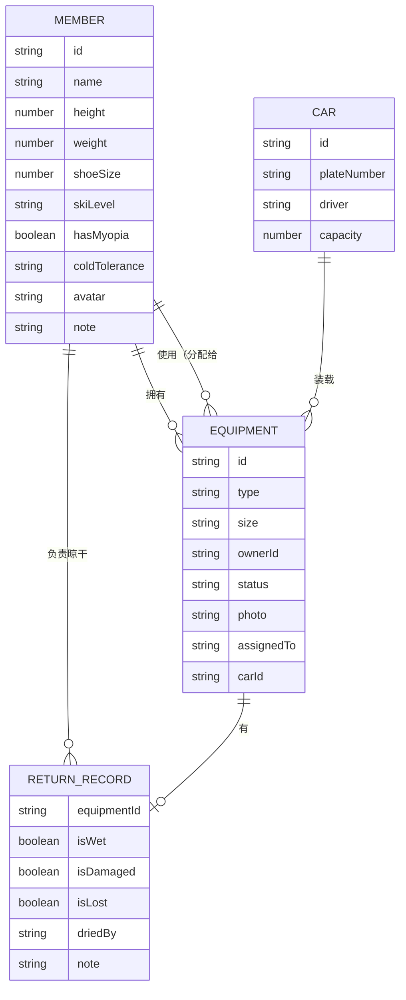

## 1. 架构设计

```mermaid
graph TD
    subgraph "前端 (React + TypeScript)
        A["页面层 (Pages)"]
        B["组件层 (Components)"]
        C["状态管理 (Zustand)"]
        D["工具函数 (Utils)"]
    end
    
    subgraph "数据层"
        E["LocalStorage 持久化"]
        F["Mock 初始数据"]
    end
    
    A --> B
    A --> C
    B --> C
    C --> E
    C --> F
```

## 2. 技术描述

- **前端框架**：React@18 + TypeScript
- **构建工具**：Vite@5
- **样式方案**：TailwindCSS@3
- **状态管理**：Zustand
- **路由方案**：react-router-dom@6
- **图标库**：lucide-react
- **数据持久化**：LocalStorage（本地存储，无需后端）
- **初始化工具**：vite-init

## 3. 路由定义

| 路由 | 页面 | 用途 |
|------|------|------|
| / | 成员管理 | 录入和管理团队成员信息 |
| /equipment | 装备清单 | 浏览和管理所有滑雪装备 |
| /assignment | 智能分配 | 装备匹配与异常提示 |
| /packing | 装箱清单 | 按车辆分配装备 |
| /return | 归还确认 | 装备状态检查与晾干分配 |

## 4. 数据模型

### 4.1 数据模型 ER 图



### 4.2 类型定义

```typescript
// 成员
interface Member {
  id: string;
  name: string;
  height: number;      // cm
  weight: number;      // kg
  shoeSize: number;    // 鞋码（欧码）
  skiLevel: 'beginner' | 'intermediate' | 'advanced' | 'expert';
  hasMyopia: boolean;   // 是否近视
  coldTolerance: 'low' | 'medium' | 'high'; // 怕冷程度
  avatar?: string;
  note?: string;
}

// 装备类型
type EquipmentType = 'snowboard' | 'shoes' | 'helmet' | 'goggles' | 'gloves' | 'protector';

// 装备状态
type EquipmentStatus = 'good' | 'worn' | 'damaged';

// 装备
interface Equipment {
  id: string;
  type: EquipmentType;
  size: string;          // 尺码（雪板长度cm / 鞋码 / 头盔尺码等
  name?: string;       // 装备名称/品牌
  ownerId: string;   // 拥有者 memberId
  status: EquipmentStatus;
  photo?: string;     // 照片 URL
  assignedTo?: string; // 分配给哪位成员使用
  carId?: string;     // 装在哪辆车上
  hasMyopiaLens?: boolean; // 护目镜是否带近视镜片
}

// 车辆
interface Car {
  id: string;
  plateNumber: string;  // 车牌号
  driver: string;      // 司机姓名
  capacity: number;     // 容量（可装装备数）
}

// 归还记录
interface ReturnRecord {
  equipmentId: string;
  isWet: boolean;
  isDamaged: boolean;
  isLost: boolean;
  driedBy?: string;    // 负责晾干的成员Id
  note?: string;
}

// 分配异常类型
type WarningType = 
  | 'shoe_size_mismatch'
  | 'board_length_unsuitable'
  | 'myopia_without_lens'
  | 'critical_gear_missing';

interface AssignmentWarning {
  type: WarningType;
  memberId: string;
  equipmentId?: string;
  message: string;
  severity: 'warning' | 'error';
}
```

## 5. 核心算法

### 5.1 装备匹配规则

- **雪板长度匹配**：身高 - 15cm ~ 身高 - 20cm 为合适范围（初级 + 5cm，高手 - 5cm
- **雪鞋匹配**：鞋码误差 ±0.5 码内为合适
- **头盔匹配**：根据头围估算（身高相关）
- **护目镜近视检查**：近视成员必须分配的护目镜需带近视镜片
- **关键装备检查**：每人必须有雪板、雪鞋、头盔、护目镜

### 5.2 状态管理

使用 Zustand 管理全局状态：
- members: Member[]
- equipment: Equipment[]
- cars: Car[]
- returnRecords: ReturnRecord[]
- 各种操作方法（增删改查）
- 自动持久化到 LocalStorage
