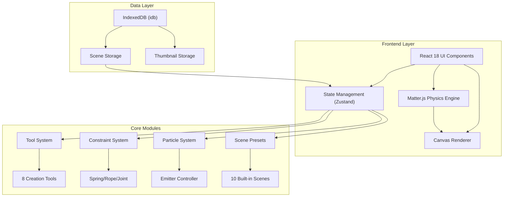
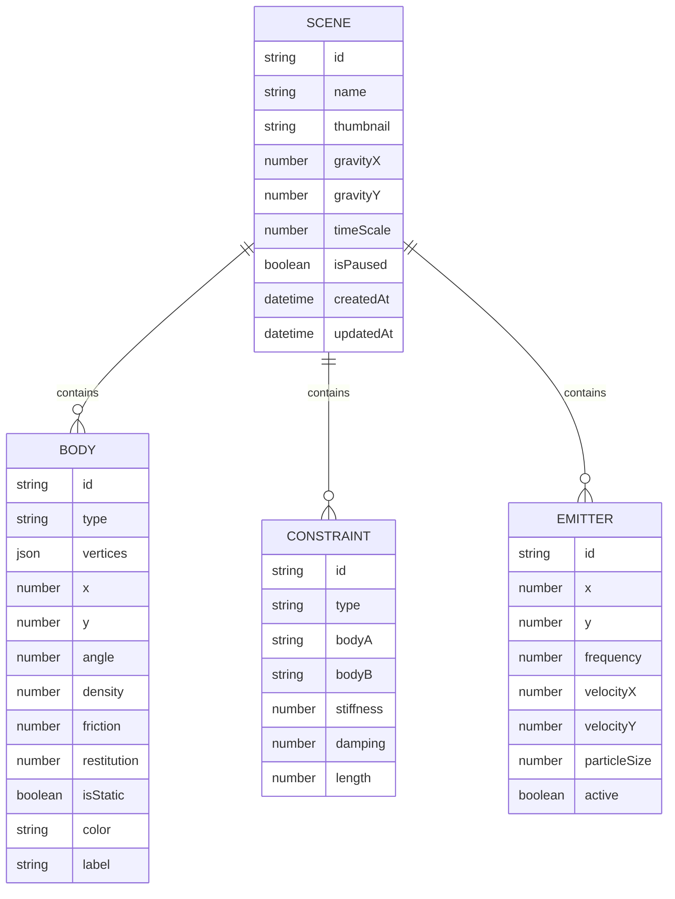

## 1. Architecture Design



## 2. Technology Description
- **Frontend**: React@18 + TypeScript + Vite
- **Physics Engine**: matter-js@0.19.0
- **State Management**: zustand@4
- **Styling**: tailwindcss@3 + framer-motion
- **Database**: idb@7 (IndexedDB wrapper)
- **Icons**: lucide-react

## 3. Route Definitions
| Route | Purpose |
|-------|---------|
| / | 主应用页面，包含所有功能 |

## 4. Data Model

### 4.1 Data Model Definition


### 4.2 Store Structure
```typescript
interface PhysicsState {
  engine: Engine | null;
  render: Render | null;
  bodies: Body[];
  constraints: Constraint[];
  selectedBody: Body | null;
  activeTool: ToolType;
  gravity: { x: number; y: number };
  timeScale: number;
  isPaused: boolean;
  zoom: number;
  pan: { x: number; y: number };
  emitters: Emitter[];
  scenes: Scene[];
  currentScene: Scene | null;
}
```

## 5. Project Structure
```
src/
├── components/
│   ├── Toolbar/           # 左侧工具栏
│   ├── PropertyPanel/     # 右侧属性面板
│   ├── ControlBar/        # 顶部控制栏
│   ├── Canvas/            # 画布组件
│   ├── SceneSelector/     # 场景选择器
│   └── StatsPanel/        # 性能面板
├── hooks/
│   ├── usePhysics.ts      # 物理引擎Hook
│   ├── useTools.ts        # 工具系统Hook
│   └── useScene.ts        # 场景管理Hook
├── store/
│   └── physicsStore.ts    # Zustand状态管理
├── physics/
│   ├── engine.ts          # Matter.js初始化
│   ├── tools/             # 8种工具实现
│   ├── constraints.ts     # 约束系统
│   └── presets/           # 10个预设场景
├── utils/
│   ├── indexedDB.ts       # IndexedDB工具
│   ├── export.ts          # 导入导出工具
│   └── canvas.ts          # Canvas工具函数
├── types/
│   └── index.ts           # 类型定义
└── App.tsx
```
