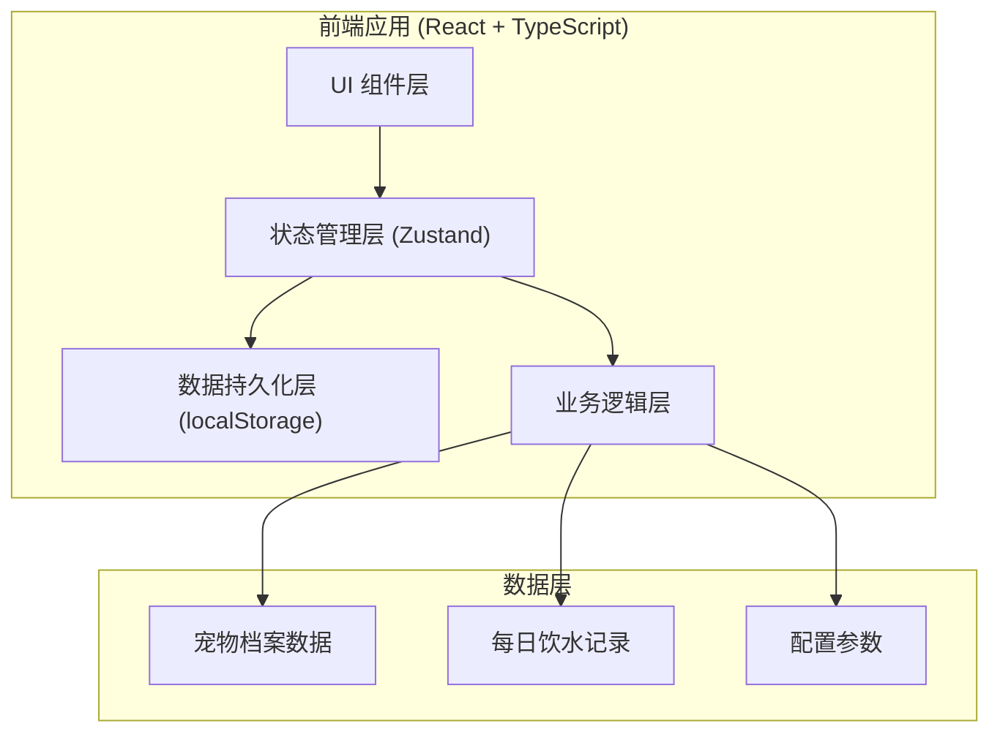
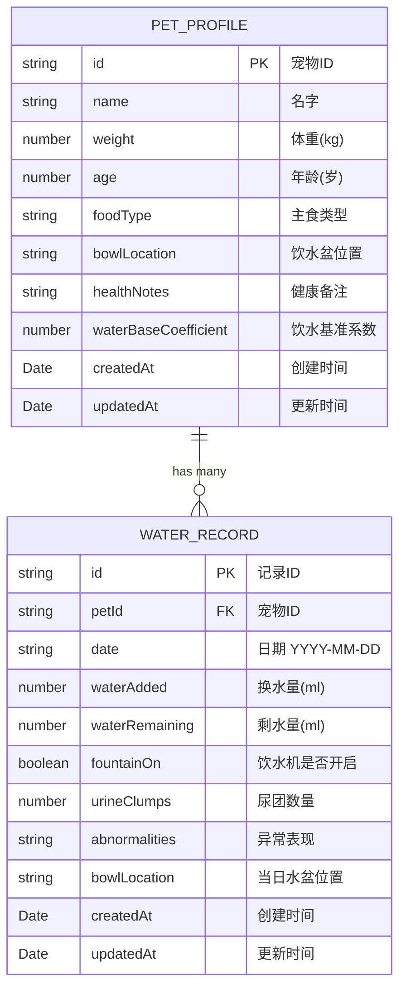

## 1. 架构设计



## 2. 技术描述

- **前端框架**：React 18 + TypeScript
- **构建工具**：Vite
- **样式方案**：Tailwind CSS 3
- **状态管理**：Zustand
- **图表库**：recharts
- **图标库**：lucide-react
- **数据存储**：localStorage（纯前端，无需后端）
- **日期处理**：date-fns
- **初始化方式**：vite-init react-ts 模板

## 3. 路由定义

| 路由 | 页面 | 用途 |
|------|------|------|
| / | 仪表盘页 | 今日状态、宠物档案、七天趋势、最近记录 |
| /record | 记录页 | 添加/编辑每日饮水记录 |
| /profile | 档案页 | 编辑宠物档案、调整饮水基准 |
| /trends | 趋势页 | 详细趋势分析、水盆位置对比 |

## 4. 数据模型

### 4.1 数据模型定义



### 4.2 状态标签计算规则

- **正常**：实际饮水量在参考值的 80% - 120% 之间
- **偏少**：实际饮水量低于参考值的 80%
- **偏多**：实际饮水量高于参考值的 120%
- **连续异常**：连续 3 天及以上出现偏少或偏多状态

### 4.3 参考饮水量计算公式

```
参考饮水量(ml) = 体重(kg) × 50ml × 基准系数
```
- 默认基准系数：1.0
- 主人可在 0.7 - 1.5 之间调整

## 5. 目录结构

```
src/
├── components/          # 公共组件
│   ├── StatusBadge.tsx      # 状态标签
│   ├── WaterChart.tsx       # 饮水趋势图
│   ├── RecordCard.tsx       # 记录卡片
│   ├── PetCard.tsx          # 宠物信息卡片
│   ├── StatCard.tsx         # 统计卡片
│   └── NavBar.tsx           # 导航栏
├── pages/               # 页面组件
│   ├── Dashboard.tsx        # 仪表盘
│   ├── RecordPage.tsx       # 记录页
│   ├── ProfilePage.tsx      # 档案页
│   └── TrendsPage.tsx       # 趋势页
├── store/               # 状态管理
│   └── usePetStore.ts       # 宠物数据 store
├── hooks/               # 自定义 hooks
│   ├── useWaterStatus.ts    # 饮水状态计算
│   └── useTrendAnalysis.ts  # 趋势分析
├── utils/               # 工具函数
│   ├── date.ts              # 日期处理
│   └── waterCalculator.ts   # 饮水量计算
├── types/               # 类型定义
│   └── index.ts             # 类型定义文件
├── App.tsx              # 应用入口
├── main.tsx             # React 入口
└── index.css            # 全局样式
```
