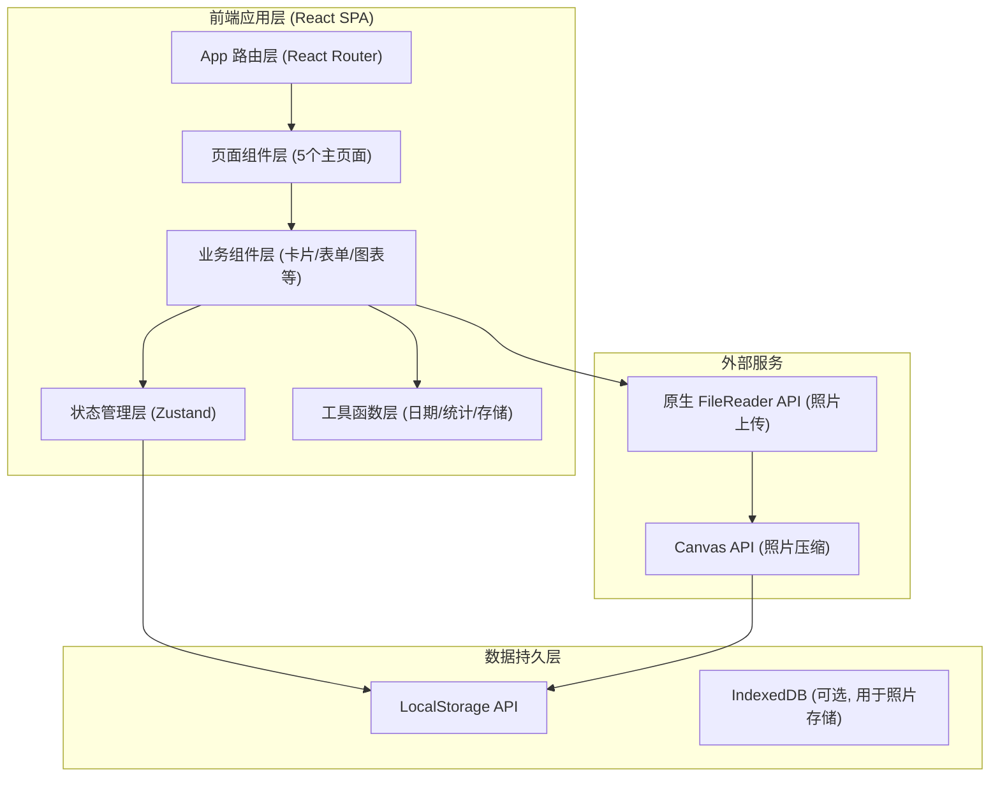
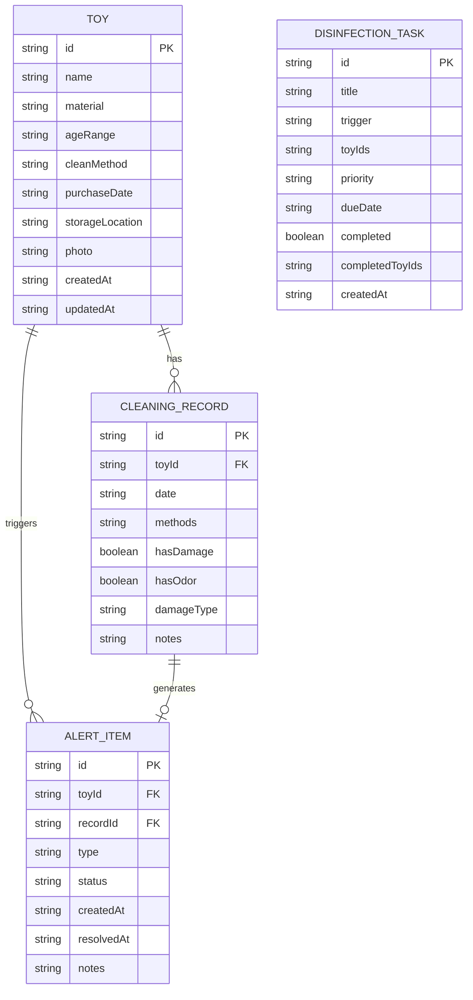

## 1. 架构设计



## 2. 技术描述
- 前端框架：React@18 + TypeScript@5 + Vite@5
- 样式方案：TailwindCSS@3 + PostCSS + Autoprefixer
- 路由管理：React Router DOM@6
- 状态管理：Zustand@4（轻量级，支持LocalStorage持久化中间件）
- UI组件：Lucide React（图标库）+ Recharts@2（图表库）
- 初始化工具：npm create vite@latest
- 后端：无后端，纯前端应用
- 数据库：浏览器 LocalStorage（主数据） + Base64 字符串存储照片

## 3. 路由定义
| 路由路径 | 页面组件 | 页面用途 |
|----------|----------|----------|
| `/` | DashboardPage | 首页仪表盘：统计概览、待消毒、异常预警、清洁频率、收纳箱任务 |
| `/toys` | ToysPage | 玩具档案：玩具列表、搜索筛选、新增入口 |
| `/toys/:id` | ToyDetailPage | 玩具详情：完整档案、清洁历史时间线、异常记录 |
| `/toys/new` | ToyFormPage | 新增玩具：表单录入 |
| `/toys/:id/edit` | ToyFormPage | 编辑玩具：表单编辑 |
| `/cleaning` | CleaningPage | 清洁记录中心：记录列表、筛选、新增记录入口 |
| `/cleaning/new` | CleaningFormPage | 新增清洁记录 |
| `/tasks` | TasksPage | 智能消毒任务：任务列表、场景触发按钮 |
| `/alerts` | AlertsPage | 异常预警中心：所有异常玩具、处理状态管理 |

## 4. 状态管理设计（Store）

### 4.1 Zustand Store 切片
```typescript
// 核心数据类型
interface Toy {
  id: string;
  name: string;
  material: 'wood' | 'plastic' | 'silicone' | 'plush' | 'rubber' | 'metal' | 'cloth' | 'other';
  ageRange: string; // 如 "0-6个月", "1-3岁"
  cleanMethod: 'water' | 'wipe' | 'uv' | 'water_wipe' | 'special';
  purchaseDate: string; // ISO date
  storageLocation: string; // 收纳位置
  photo: string | null; // base64 data URL
  createdAt: string;
  updatedAt: string;
}

interface CleaningRecord {
  id: string;
  toyId: string;
  date: string;
  methods: Array<'water' | 'wipe' | 'uv' | 'dry'>;
  hasDamage: boolean;
  hasOdor: boolean;
  damageType?: 'peeling' | 'loose' | 'mold' | 'crack' | 'other';
  notes?: string;
}

interface DisinfectionTask {
  id: string;
  title: string;
  trigger: 'manual' | 'teething' | 'flu' | 'visitor';
  toyIds: string[];
  priority: 'normal' | 'urgent' | 'critical';
  dueDate: string;
  completed: boolean;
  completedToyIds: string[];
  createdAt: string;
}

interface AlertItem {
  id: string;
  toyId: string;
  type: 'peeling' | 'loose' | 'mold';
  recordId: string;
  status: 'pending' | 'resolved' | 'disabled';
  createdAt: string;
  resolvedAt?: string;
  notes?: string;
}
```

### 4.2 Store Actions
- `toys`: addToy, updateToy, deleteToy, getToyById
- `cleaningRecords`: addCleaningRecord, getRecordsByToyId
- `tasks`: createTask, generateTaskByTrigger, completeTaskItem, completeTask
- `alerts`: createAlert (自动从cleaning record触发), updateAlertStatus
- `statistics`: getStats (计算待消毒数、异常数、清洁频率等)

## 5. 数据模型 ER 图



## 6. 初始 Mock 数据

应用启动时若 LocalStorage 为空，自动注入以下示例数据，保证首次打开即可体验完整功能：
- 8个示例玩具（含不同材质：积木/牙胶/毛绒/塑料等）
- 15条清洁历史记录（含1-2条异常记录用于演示预警）
- 2个待处理消毒任务（1个普通+1个流感季紧急）
- 3条异常预警（掉漆/松动/发霉各1条）

## 7. 核心业务算法

### 7.1 待消毒判定逻辑
```
上次清洁距今天数 > 该材质推荐周期（毛绒7天/塑料3天/硅胶2天/木质5天）→ 标记为待消毒
优先级：入口期内牙胶类（<3天）> 毛绒玩具（>7天）> 其他材质
```

### 7.2 场景任务生成规则
- **入口期**：筛选 ageRange 包含 "0-1岁" 且 cleanMethod 包含 water/water_wipe 的玩具
- **流感季**：筛选 ALL 玩具，priority=critical，dueDate=今天
- **小朋友来访后**：筛选近7天被使用过的（假设清洁记录反向推断）或所有公共区域玩具
