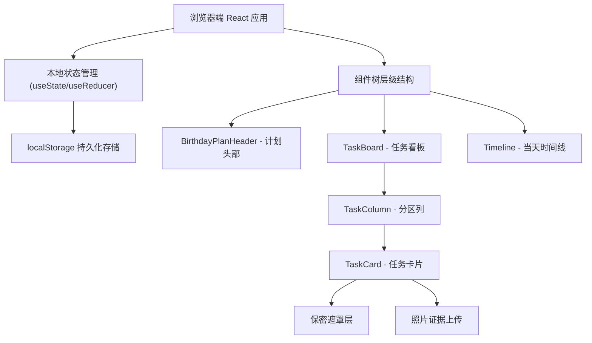
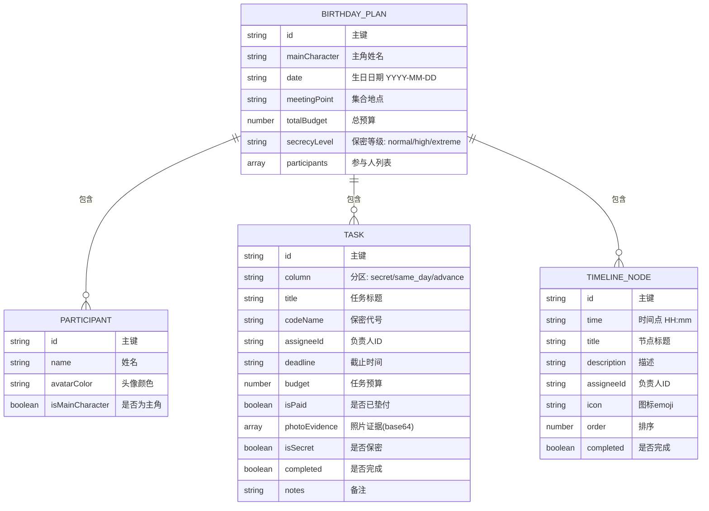

## 1. 架构设计



## 2. 技术说明
- **前端框架**：React@18 + TypeScript
- **构建工具**：Vite@5
- **样式方案**：TailwindCSS@3 + 自定义CSS变量主题
- **状态管理**：React Hooks (useState, useEffect, useReducer)
- **数据持久化**：localStorage（无后端，纯前端存储）
- **拖拽功能**：原生HTML5 Drag and Drop API（或@dnd-kit轻量级方案）
- **图标**：Lucide React 图标库 + 生日emoji
- **初始化工具**：npm create vite@latest

## 3. 路由定义
| 路由 | 用途 |
|-------|---------|
| / | 主页面，包含所有功能模块（单页应用，无需额外路由） |

## 4. 数据模型

### 4.1 数据模型定义



### 4.2 TypeScript 类型定义

```typescript
interface Participant {
  id: string;
  name: string;
  avatarColor: string;
  isMainCharacter: boolean;
}

type TaskColumn = 'secret' | 'same_day' | 'advance';
type SecrecyLevel = 'normal' | 'high' | 'extreme';

interface Task {
  id: string;
  column: TaskColumn;
  title: string;
  codeName: string;
  assigneeId: string | null;
  deadline: string;
  budget: number;
  isPaid: boolean;
  photoEvidence: string[];
  isSecret: boolean;
  completed: boolean;
  notes: string;
}

interface TimelineNode {
  id: string;
  time: string;
  title: string;
  description: string;
  assigneeId: string | null;
  icon: string;
  order: number;
  completed: boolean;
}

interface BirthdayPlan {
  id: string;
  mainCharacter: string;
  date: string;
  meetingPoint: string;
  totalBudget: number;
  secrecyLevel: SecrecyLevel;
  participants: Participant[];
  tasks: Task[];
  timeline: TimelineNode[];
}
```

## 5. 组件结构

```
App.tsx (根组件 + 全局状态)
├── components/
│   ├── BirthdayPlanHeader.tsx    (计划头部信息表单)
│   ├── ParticipantList.tsx       (参与人管理)
│   ├── TaskBoard.tsx             (任务看板容器)
│   ├── TaskColumn.tsx            (单分区列)
│   ├── TaskCard.tsx              (任务卡片)
│   ├── TaskModal.tsx             (任务新增/编辑弹窗)
│   ├── SecretMask.tsx            (保密遮罩)
│   ├── PhotoUploader.tsx         (照片上传)
│   ├── Timeline.tsx              (时间线容器)
│   └── TimelineItem.tsx          (时间线节点)
├── hooks/
│   └── useLocalStorage.ts        (本地存储Hook)
├── utils/
│   ├── codeNameGenerator.ts      (代号生成器)
│   └── colors.ts                 (头像色板)
├── types/
│   └── index.ts                  (TypeScript类型)
└── data/
    └── mockData.ts               (默认示例数据)
```

## 6. 核心功能实现要点

### 6.1 保密代号生成
- 预设代号词库：形容词（勇敢的/神秘的/快乐的）+ 名词（企鹅/浣熊/独角兽/阿尔法/彗星）
- 组合示例："神秘企鹅计划"、"快乐独角兽行动"
- 每个保密任务分配唯一代号，避免重复

### 6.2 照片上传
- 使用 `<input type="file" accept="image/*">` 本地选择
- 通过 FileReader 转为 base64 存入 localStorage
- 限制单张大小 < 2MB，避免存储溢出

### 6.3 任务拖拽
- 使用原生 Drag & Drop API 或 @dnd-kit/core
- 支持跨分区移动任务卡片
- 拖拽后即时更新 column 字段并持久化

### 6.4 本地存储
- 数据结构统一存入 localStorage key: `birthday_plan_data`
- useEffect 监听数据变化自动同步
- 首次访问加载示例数据引导用户
