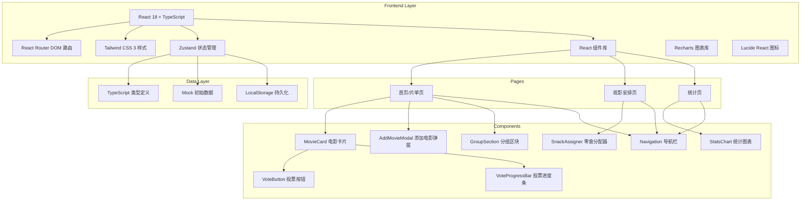
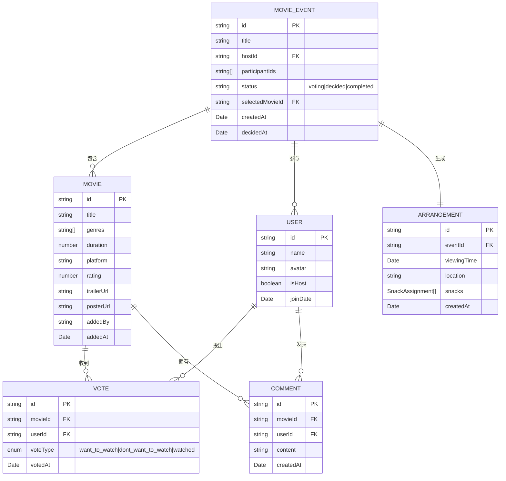

## 1. 架构设计



## 2. 技术说明
- **前端框架**：React@18 + TypeScript@5 + Vite@5
- **样式方案**：TailwindCSS@3 + 自定义CSS变量（主题色系统）
- **路由管理**：React Router DOM@6
- **状态管理**：Zustand@4（轻量级、不可变更新）
- **图表可视化**：Recharts@2（柱状图/饼图/折线图/热力图）
- **图标库**：Lucide React（统一图标风格）
- **后端**：无后端，纯前端Mock数据 + LocalStorage持久化
- **数据存储**：浏览器 LocalStorage API，JSON序列化存储

## 3. 路由定义
| 路由路径 | 页面组件 | 用途说明 |
|----------|----------|----------|
| `/` | MovieListPage | 首页/片单投票页，分组展示所有电影和投票功能 |
| `/arrangement` | ArrangementPage | 观影安排页，展示选定电影和活动安排 |
| `/stats` | StatsPage | 统计页，展示投票统计和数据分析 |

## 4. 数据模型

### 4.1 TypeScript 类型定义



### 4.2 Zustand Store 结构

```typescript
interface MovieStore {
  // 状态
  currentEvent: MovieEvent | null
  movies: Movie[]
  users: User[]
  votes: Vote[]
  comments: Comment[]
  arrangement: Arrangement | null
  selectedTab: 'all' | 'top' | 'controversial' | 'short' | 'latenight'
  
  // 电影操作
  addMovie: (movie: Omit<Movie, 'id' | 'addedAt'>) => void
  removeMovie: (movieId: string) => void
  
  // 投票操作
  castVote: (movieId: string, userId: string, voteType: VoteType) => void
  addComment: (movieId: string, userId: string, content: string) => void
  
  // 活动操作
  decideMovie: (movieId: string) => void
  generateArrangement: () => void
  updateArrangement: (patch: Partial<Arrangement>) => void
  
  // Tab 切换
  setSelectedTab: (tab: string) => void
  
  // 辅助计算
  getMovieVotes: (movieId: string) => VoteResult
  getFilteredMovies: () => Movie[]
  getStats: () => Statistics
}
```

## 5. 目录结构

```
src/
├── types/                  # TypeScript 类型定义
│   └── index.ts           # Movie/User/Vote/Comment/Event 等类型
├── store/                  # Zustand 状态管理
│   └── useMovieStore.ts   # 核心 Store + 操作方法
├── data/                   # Mock 数据
│   └── mockData.ts        # 初始电影、用户、投票数据
├── utils/                  # 工具函数
│   ├── voteUtils.ts       # 投票统计/分组算法
│   ├── statsUtils.ts      # 统计计算函数
│   └── arrangementUtils.ts# 安排生成逻辑
├── components/             # 可复用组件
│   ├── Navigation.tsx
│   ├── MovieCard.tsx
│   ├── VoteButton.tsx
│   ├── VoteProgressBar.tsx
│   ├── GroupSection.tsx
│   ├── AddMovieModal.tsx
│   ├── SnackAssigner.tsx
│   ├── StatsCard.tsx
│   └── EmptyState.tsx
├── pages/                  # 页面组件
│   ├── MovieListPage.tsx
│   ├── ArrangementPage.tsx
│   └── StatsPage.tsx
├── App.tsx                # 根组件 + 路由配置
├── main.tsx               # 入口文件
└── index.css              # Tailwind 引入 + 全局样式/主题
```

## 6. 核心算法逻辑

### 6.1 投票分组算法
```typescript
// 最高票：按想看票数降序，取前3
const topVoted = movies.sort((a, b) => getVotes(b).want - getVotes(a).want).slice(0, 3);

// 争议大：想看与不想看票数差值的绝对值 ≤ 2
const controversial = movies.filter(m => {
  const v = getVotes(m);
  return Math.abs(v.want - v.dontWant) <= 2 && (v.want > 0 || v.dontWant > 0);
});

// 短片优先：时长 ≤ 100 分钟
const shortFilms = movies.filter(m => m.duration <= 100);

// 适合深夜：类型包含悬疑/恐怖/惊悚 或 时长 ≥ 130 分钟
const lateNight = movies.filter(m => 
  m.genres.some(g => ['悬疑', '恐怖', '惊悚'].includes(g)) || m.duration >= 130
);
```

### 6.2 推荐定片算法
```typescript
// 综合评分 = 想看*2 + 看过*1 - 不想看*1.5 - 争议度惩罚
const score = wantVotes * 2 + watchedVotes * 1 - dontWantVotes * 1.5 
  - (controversial ? 1 : 0);
```

### 6.3 零食随机分配算法
```typescript
// 零食列表随机分配给参与者，确保不重复
const snacks = ['🍿 薯片', '🥤 饮料', '🍰 甜品', '🍓 水果'];
const shuffled = [...participants].sort(() => Math.random() - 0.5);
return snacks.map((s, i) => ({ snack: s, owner: shuffled[i % shuffled.length] }));
```
