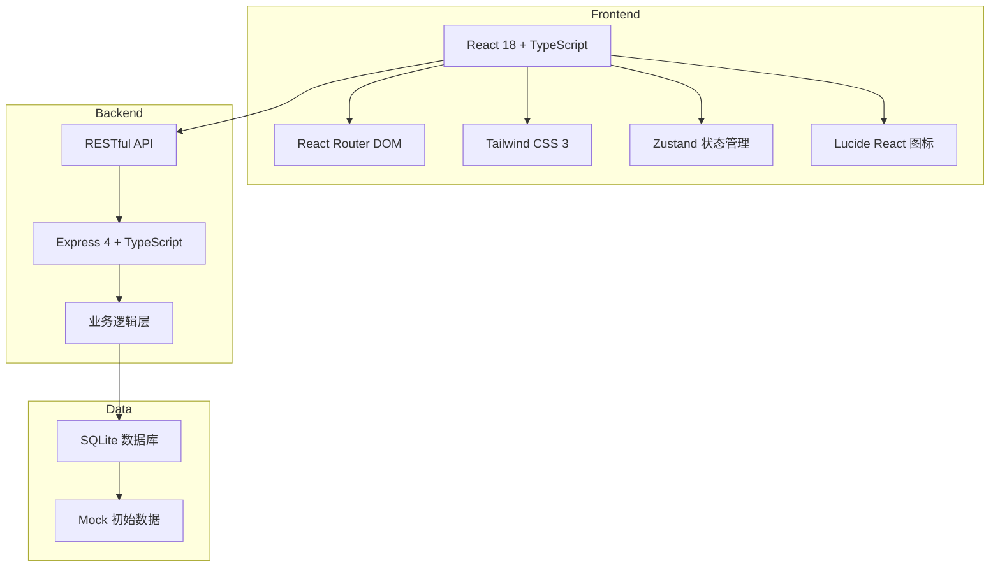
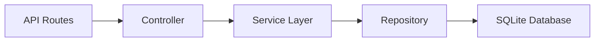
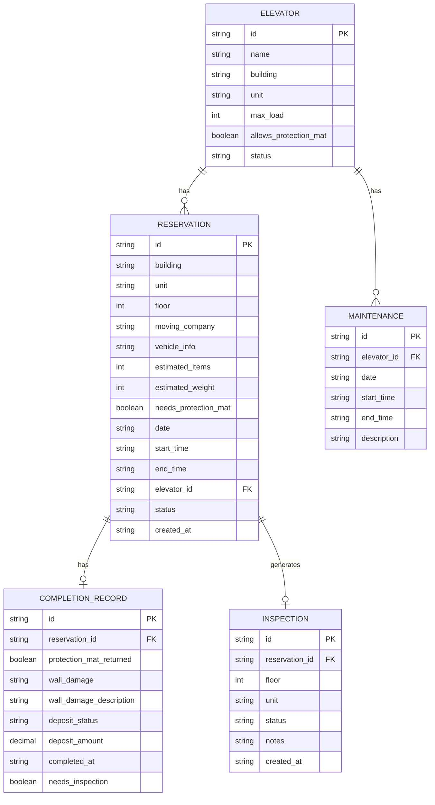

## 1. 架构设计



## 2. 技术描述

- **前端**：React 18 + TypeScript + Tailwind CSS 3 + Vite
- **后端**：Express 4 + TypeScript
- **数据库**：SQLite（本地文件存储，开发便捷）
- **状态管理**：Zustand
- **路由**：React Router DOM
- **图标**：lucide-react
- **初始化工具**：vite-init

## 3. 路由定义

| Route | 页面 | 用途 |
|-------|-----|------|
| `/` | 住户预约页 | 提交搬家预约申请 |
| `/elevators` | 电梯档案页 | 电梯信息管理 |
| `/dashboard` | 物业看板页 | 今日排期、冲突、巡检管理 |
| `/complete` | 搬家完成页 | 记录完成情况、押金状态 |

## 4. API 定义

### 4.1 类型定义

```typescript
// 电梯
interface Elevator {
  id: string;
  name: string;
  building: string;
  unit: string;
  maxLoad: number; // kg
  availableTimeSlots: TimeSlot[];
  maintenanceSchedule: Maintenance[];
  allowsProtectionMat: boolean;
  status: 'active' | 'maintenance' | 'disabled';
}

// 预约
interface Reservation {
  id: string;
  building: string;
  unit: string;
  floor: number;
  movingCompany: string;
  vehicleInfo: string;
  estimatedItems: number;
  estimatedWeight: number;
  needsProtectionMat: boolean;
  timeSlot: TimeSlot;
  elevatorId: string;
  status: 'pending' | 'approved' | 'conflict' | 'completed' | 'cancelled';
  createdAt: string;
}

// 完成记录
interface CompletionRecord {
  id: string;
  reservationId: string;
  protectionMatReturned: boolean;
  wallDamage: 'none' | 'minor' | 'major';
  wallDamageDescription?: string;
  depositStatus: 'collected' | 'refunded' | 'deducted';
  depositAmount?: number;
  completedAt: string;
  needsInspection: boolean;
}

// 巡检记录
interface Inspection {
  id: string;
  reservationId: string;
  floor: number;
  unit: string;
  status: 'pending' | 'completed';
  notes?: string;
  createdAt: string;
}

// 时间段
interface TimeSlot {
  date: string;
  startTime: string;
  endTime: string;
}

// 检修安排
interface Maintenance {
  id: string;
  date: string;
  startTime: string;
  endTime: string;
  description: string;
}
```

### 4.2 API 接口

| Method | Path | 描述 |
|--------|------|------|
| GET | `/api/elevators` | 获取电梯列表 |
| GET | `/api/elevators/:id` | 获取电梯详情 |
| POST | `/api/elevators` | 新增电梯 |
| PUT | `/api/elevators/:id` | 更新电梯信息 |
| DELETE | `/api/elevators/:id` | 删除电梯 |
| GET | `/api/reservations` | 获取预约列表 |
| GET | `/api/reservations/today` | 获取今日预约 |
| POST | `/api/reservations` | 创建预约 |
| GET | `/api/reservations/check-conflict` | 检测预约冲突 |
| PUT | `/api/reservations/:id/status` | 更新预约状态 |
| POST | `/api/completion` | 提交完成记录 |
| GET | `/api/completion/:reservationId` | 获取完成记录 |
| GET | `/api/inspections` | 获取巡检列表 |
| PUT | `/api/inspections/:id` | 更新巡检状态 |

## 5. 服务器架构



## 6. 数据模型

### 6.1 ER 图



### 6.2 DDL 语句

```sql
-- 电梯表
CREATE TABLE elevators (
  id TEXT PRIMARY KEY,
  name TEXT NOT NULL,
  building TEXT NOT NULL,
  unit TEXT NOT NULL,
  max_load INTEGER NOT NULL,
  allows_protection_mat INTEGER NOT NULL DEFAULT 1,
  status TEXT NOT NULL DEFAULT 'active',
  created_at TEXT DEFAULT CURRENT_TIMESTAMP
);

-- 预约表
CREATE TABLE reservations (
  id TEXT PRIMARY KEY,
  building TEXT NOT NULL,
  unit TEXT NOT NULL,
  floor INTEGER NOT NULL,
  moving_company TEXT NOT NULL,
  vehicle_info TEXT NOT NULL,
  estimated_items INTEGER NOT NULL,
  estimated_weight INTEGER NOT NULL,
  needs_protection_mat INTEGER NOT NULL DEFAULT 0,
  date TEXT NOT NULL,
  start_time TEXT NOT NULL,
  end_time TEXT NOT NULL,
  elevator_id TEXT NOT NULL,
  status TEXT NOT NULL DEFAULT 'pending',
  created_at TEXT DEFAULT CURRENT_TIMESTAMP,
  FOREIGN KEY (elevator_id) REFERENCES elevators(id)
);

-- 检修表
CREATE TABLE maintenance (
  id TEXT PRIMARY KEY,
  elevator_id TEXT NOT NULL,
  date TEXT NOT NULL,
  start_time TEXT NOT NULL,
  end_time TEXT NOT NULL,
  description TEXT,
  FOREIGN KEY (elevator_id) REFERENCES elevators(id)
);

-- 完成记录表
CREATE TABLE completion_records (
  id TEXT PRIMARY KEY,
  reservation_id TEXT NOT NULL,
  protection_mat_returned INTEGER NOT NULL DEFAULT 0,
  wall_damage TEXT NOT NULL DEFAULT 'none',
  wall_damage_description TEXT,
  deposit_status TEXT NOT NULL DEFAULT 'collected',
  deposit_amount REAL,
  completed_at TEXT DEFAULT CURRENT_TIMESTAMP,
  needs_inspection INTEGER NOT NULL DEFAULT 0,
  FOREIGN KEY (reservation_id) REFERENCES reservations(id)
);

-- 巡检表
CREATE TABLE inspections (
  id TEXT PRIMARY KEY,
  reservation_id TEXT NOT NULL,
  floor INTEGER NOT NULL,
  unit TEXT NOT NULL,
  status TEXT NOT NULL DEFAULT 'pending',
  notes TEXT,
  created_at TEXT DEFAULT CURRENT_TIMESTAMP,
  FOREIGN KEY (reservation_id) REFERENCES reservations(id)
);

-- 索引
CREATE INDEX idx_reservations_date ON reservations(date);
CREATE INDEX idx_reservations_elevator_date ON reservations(elevator_id, date);
CREATE INDEX idx_inspections_status ON inspections(status);
```

### 6.3 初始数据

```sql
-- 初始电梯数据
INSERT INTO elevators (id, name, building, unit, max_load, allows_protection_mat, status) VALUES
('elev-001', '1栋A单元货梯', '1栋', 'A单元', 1000, 1, 'active'),
('elev-002', '1栋B单元货梯', '1栋', 'B单元', 1000, 1, 'active'),
('elev-003', '2栋A单元货梯', '2栋', 'A单元', 1200, 1, 'active'),
('elev-004', '2栋B单元货梯', '2栋', 'B单元', 1200, 0, 'active'),
('elev-005', '3栋货梯', '3栋', '综合', 1500, 1, 'maintenance');

-- 初始检修安排
INSERT INTO maintenance (id, elevator_id, date, start_time, end_time, description) VALUES
('maint-001', 'elev-005', '2024-06-20', '09:00', '12:00', '年度检修'),
('maint-002', 'elev-001', '2024-06-25', '14:00', '16:00', '例行保养');
```
