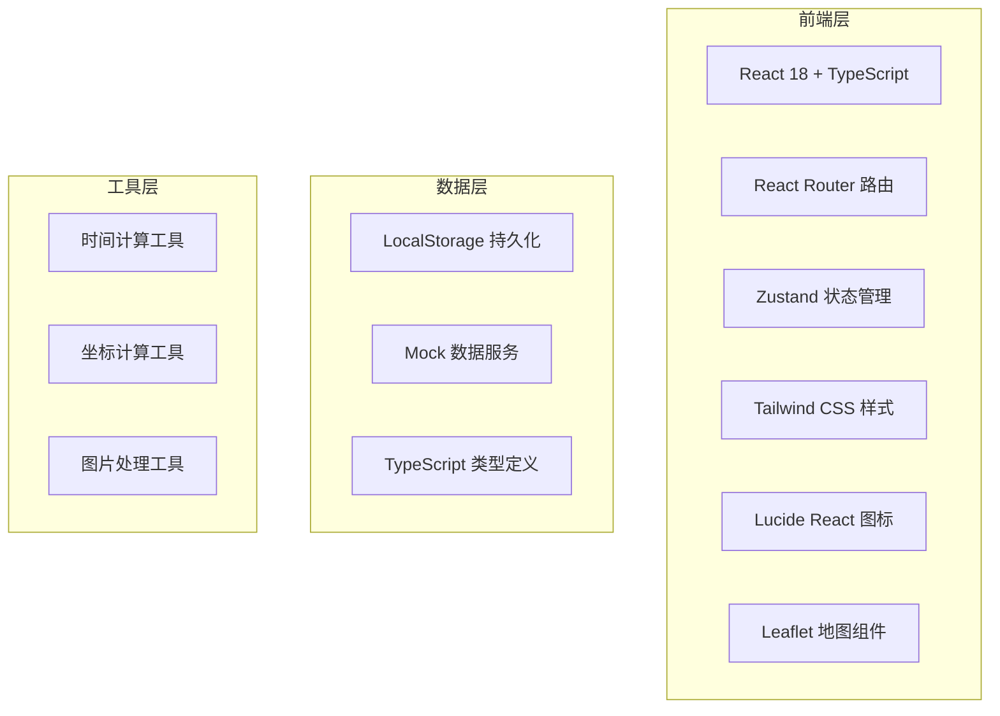
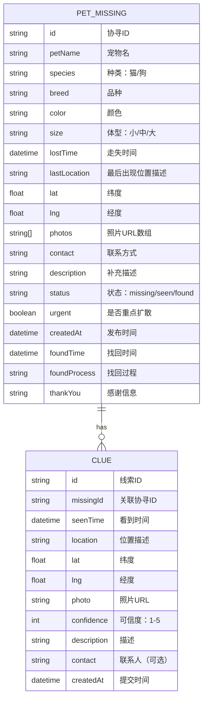

## 1. 架构设计



## 2. 技术说明

- **前端框架**：React 18 + TypeScript
- **构建工具**：Vite 5
- **路由**：react-router-dom 6
- **状态管理**：zustand 4
- **样式**：tailwindcss 3
- **地图**：leaflet + react-leaflet
- **图标**：lucide-react
- **数据持久化**：localStorage（无需后端，纯前端演示）
- **初始化模板**：react-ts（纯前端项目）

## 3. 路由定义

| 路由 | 页面 | 功能 |
|------|------|------|
| `/` | 首页 | 分组展示协寻列表 |
| `/publish` | 发布协寻 | 填写宠物和走失信息 |
| `/detail/:id` | 协寻详情 | 查看详情、地图、提交线索 |
| `/statistics` | 统计 | 数据看板和趋势图表 |
| `/found/:id` | 找回记录 | 标记找回、填写感谢 |

## 4. 数据模型

### 4.1 数据模型定义



### 4.2 TypeScript 类型定义

```typescript
// 宠物种类
type PetSpecies = 'cat' | 'dog';

// 体型
type PetSize = 'small' | 'medium' | 'large';

// 协寻状态
type MissingStatus = 'missing' | 'seen' | 'found';

// 协寻信息
interface PetMissing {
  id: string;
  petName: string;
  species: PetSpecies;
  breed: string;
  color: string;
  size: PetSize;
  lostTime: string;
  lastLocation: string;
  lat: number;
  lng: number;
  photos: string[];
  contact: string;
  description: string;
  status: MissingStatus;
  urgent: boolean;
  createdAt: string;
  foundTime?: string;
  foundProcess?: string;
  thankYou?: string;
}

// 线索信息
interface Clue {
  id: string;
  missingId: string;
  seenTime: string;
  location: string;
  lat: number;
  lng: number;
  photo?: string;
  confidence: number;
  description: string;
  contact?: string;
  createdAt: string;
}

// 统计数据
interface Statistics {
  totalMissing: number;
  totalFound: number;
  recoveryRate: number;
  averageRecoveryTime: number;
  topAreas: { area: string; count: number }[];
  dailyTrend: { date: string; missing: number; found: number }[];
}
```

## 5. 项目目录结构

```
src/
├── components/          # 公共组件
│   ├── Layout.tsx       # 页面布局
│   ├── Navbar.tsx       # 顶部导航
│   ├── PetCard.tsx      # 协寻卡片
│   ├── ClueCard.tsx     # 线索卡片
│   ├── MapView.tsx      # 地图组件
│   ├── PhotoUpload.tsx  # 照片上传
│   ├── StatusBadge.tsx  # 状态标签
│   └── SafetyAlert.tsx  # 安全提醒
├── pages/               # 页面组件
│   ├── Home.tsx         # 首页
│   ├── Publish.tsx      # 发布协寻
│   ├── Detail.tsx       # 协寻详情
│   ├── Statistics.tsx   # 统计页
│   └── FoundRecord.tsx  # 找回记录
├── store/               # 状态管理
│   └── usePetStore.ts   # 宠物协寻状态
├── types/               # 类型定义
│   └── index.ts
├── utils/               # 工具函数
│   ├── time.ts          # 时间处理
│   ├── location.ts      # 位置处理
│   └── storage.ts       # 本地存储
├── data/                # Mock 数据
│   └── mockData.ts
├── App.tsx
├── main.tsx
└── index.css
```

## 6. 核心功能实现要点

### 6.1 地图颜色透明度计算
根据走失时间或线索时间与当前时间的差值，动态计算标记点的透明度：
- 1小时内：100% 不透明
- 24小时内：每小时递减 4%
- 超过24小时：最低 10% 透明度

### 6.2 协寻分组逻辑
- **刚走失**：24小时内发布，状态为 missing
- **疑似看到**：有新线索（24小时内），状态为 seen
- **已找回**：status 为 found
- **重点扩散**：urgent 为 true，或走失超过72小时仍未找回

### 6.3 本地存储策略
使用 localStorage 存储协寻和线索数据，key 为 `pet-missing-data` 和 `clue-data`。
