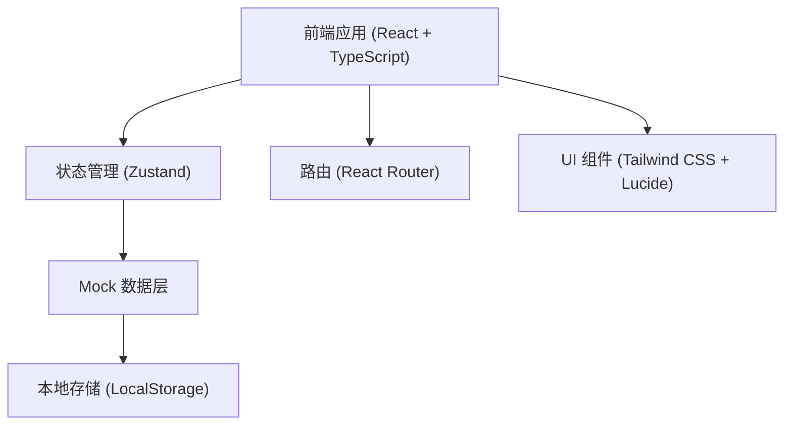
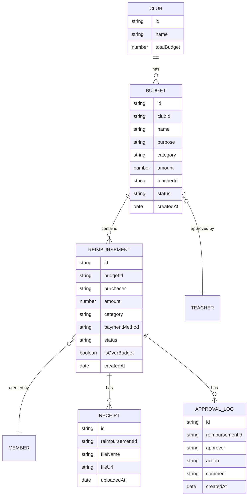

## 1. 架构设计



## 2. 技术说明

- **前端框架**：React 18 + TypeScript
- **构建工具**：Vite
- **样式方案**：Tailwind CSS 3
- **状态管理**：Zustand
- **路由方案**：React Router DOM
- **图标库**：Lucide React
- **数据持久化**：LocalStorage + Mock 数据
- **图表库**：纯 CSS/HTML 实现（轻量级进度条、条形图）

## 3. 路由定义

| 路由路径 | 页面名称 | 说明 |
|----------|----------|------|
| /dashboard | 仪表板 | 首页，数据概览和待办事项 |
| /budgets | 活动预算列表 | 展示所有活动预算 |
| /budgets/new | 新建活动预算 | 创建新的活动预算 |
| /budgets/:id | 预算详情 | 查看预算详情和关联报销 |
| /reimbursements | 报销单列表 | 展示所有报销单 |
| /reimbursements/new | 新建报销单 | 创建新的报销单 |
| /reimbursements/:id | 报销单详情 | 查看报销单详情和审批 |
| /statistics | 统计分析 | 社团额度、超支项目、未报销统计 |

## 4. 数据模型

### 4.1 实体关系图



### 4.2 状态枚举

**预算状态 (BudgetStatus)**
- `pending_teacher` - 待老师审批
- `active` - 已生效
- `rejected` - 已驳回

**报销单状态 (ReimbursementStatus)**
- `draft` - 待提交（草稿）
- `pending_teacher` - 待老师审批（超预算）
- `pending_finance` - 待财务
- `paid` - 已打款
- `rejected` - 已驳回

### 4.3 数据类型定义

```typescript
interface Club {
  id: string;
  name: string;
  totalBudget: number;
  usedBudget: number;
}

interface Budget {
  id: string;
  clubId: string;
  clubName: string;
  name: string;
  purpose: string;
  category: string;
  amount: number;
  usedAmount: number;
  teacherId: string;
  teacherName: string;
  status: BudgetStatus;
  createdAt: string;
}

interface Reimbursement {
  id: string;
  budgetId: string;
  budgetName: string;
  clubId: string;
  clubName: string;
  purchaser: string;
  amount: number;
  category: string;
  paymentMethod: string;
  status: ReimbursementStatus;
  isOverBudget: boolean;
  receiptUrl: string;
  receiptName: string;
  description: string;
  createdAt: string;
  approvalLogs: ApprovalLog[];
}

interface ApprovalLog {
  id: string;
  approver: string;
  role: string;
  action: 'approve' | 'reject' | 'submit';
  comment: string;
  createdAt: string;
}
```

## 5. 目录结构

```
src/
├── components/          # 公共组件
│   ├── Layout/         # 布局组件
│   ├── StatusBadge/    # 状态标签
│   ├── DataCard/       # 数据卡片
│   ├── Modal/          # 弹窗组件
│   └── Button/         # 按钮组件
├── pages/              # 页面组件
│   ├── Dashboard/      # 仪表板
│   ├── BudgetList/     # 预算列表
│   ├── BudgetDetail/   # 预算详情
│   ├── BudgetNew/      # 新建预算
│   ├── ReimbursementList/    # 报销单列表
│   ├── ReimbursementDetail/  # 报销单详情
│   ├── ReimbursementNew/     # 新建报销
│   └── Statistics/     # 统计分析
├── store/              # 状态管理
│   └── useStore.ts     # Zustand store
├── data/               # Mock 数据
│   └── mockData.ts
├── types/              # TypeScript 类型
│   └── index.ts
├── utils/              # 工具函数
│   ├── format.ts       # 格式化函数
│   └── helpers.ts      # 辅助函数
├── App.tsx             # 根组件
├── main.tsx            # 入口文件
└── index.css           # 全局样式
```

## 6. 核心功能实现要点

### 6.1 预算校验逻辑

- 新建报销单时必须选择已生效的活动预算
- 票据照片为必填项，无票据不能提交
- 提交时自动计算预算剩余额度
- 超预算自动进入老师二次审批流程

### 6.2 状态流转控制

```typescript
// 状态流转矩阵
const statusFlow = {
  draft: ['pending_teacher', 'pending_finance'],
  pending_teacher: ['pending_finance', 'draft'],
  pending_finance: ['paid', 'draft'],
  paid: [],
};
```

### 6.3 统计计算逻辑

- 社团剩余额度 = 社团总预算 - 已报销金额
- 超支项目 = 报销金额 > 预算金额的项目
- 长期未报销 = 创建时间超过 30 天且状态为待提交/待审批的单据
