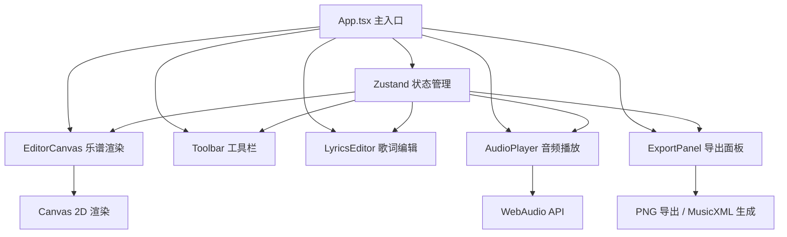

## 1. 架构设计



## 2. 技术选型

- **前端框架**: React 18 + TypeScript
- **构建工具**: Vite
- **样式方案**: Tailwind CSS 3
- **状态管理**: Zustand
- **乐谱渲染**: HTML5 Canvas 2D
- **音频播放**: Web Audio API
- **图标库**: Lucide React
- **无后端**: 纯前端应用，数据存储在本地状态

## 3. 路由定义

| 路由 | 用途 |
|------|------|
| / | 主编辑器页面 |

## 4. 数据模型

### 4.1 核心类型定义

```typescript
// 音符时值类型
type NoteDuration = 'whole' | 'half' | 'quarter' | 'eighth' | 'sixteenth';

// 音高类型 (1-7 代表 do-si)
type PitchNumber = 1 | 2 | 3 | 4 | 5 | 6 | 7;

// 八度偏移 (-1 低八度, 0 中央, 1 高八度)
type OctaveShift = -1 | 0 | 1;

// 半音变化
type Accidental = 'none' | 'sharp' | 'flat';

// 声部类型
type VoiceType = 'melody' | 'harmony';

// 单个音符
interface Note {
  id: string;
  pitch: PitchNumber | null; // null 表示休止符
  duration: NoteDuration;
  octave: OctaveShift;
  accidental: Accidental;
  voice: VoiceType;
  lyrics: string;
  position: number; // 在小节中的位置索引
}

// 小节
interface Measure {
  id: string;
  notes: Note[];
  timeSignature: { numerator: number; denominator: number };
}

// 乐谱
interface Score {
  id: string;
  title: string;
  bpm: number;
  key: string;
  timeSignature: { numerator: number; denominator: number };
  measures: Measure[];
  activeVoice: VoiceType;
  selectedNoteId: string | null;
  currentDuration: NoteDuration;
  isPlaying: boolean;
  currentPlayPosition: number;
}
```

### 4.2 状态管理

使用 Zustand 管理全局乐谱状态：

```typescript
interface ScoreState {
  score: Score;
  setBpm: (bpm: number) => void;
  setCurrentDuration: (duration: NoteDuration) => void;
  addNote: (pitch: PitchNumber | null) => void;
  removeNote: (noteId: string) => void;
  updateNote: (noteId: string, updates: Partial<Note>) => void;
  setActiveVoice: (voice: VoiceType) => void;
  setSelectedNote: (noteId: string | null) => void;
  togglePlay: () => void;
  setPlayPosition: (position: number) => void;
  exportPNG: () => void;
  exportMusicXML: () => void;
}
```

## 5. 核心模块说明

### 5.1 EditorCanvas 组件
- 使用 Canvas 2D API 绘制简谱
- 横向排列音符，支持自动换行
- 绘制八度点、时值横线、升降半音符号
- 支持多声部分层显示（主旋律蓝色，和声绿色）
- 播放时高亮当前音符，支持滚动同步

### 5.2 AudioPlayer 模块
- 使用 Web Audio API 生成音符声音
- 根据 BPM 计算音符持续时间
- 支持播放、暂停、停止控制
- 播放位置与画布滚动同步

### 5.3 键盘快捷键处理
- 数字键 1-7: 输入对应音高
- 空格键: 输入休止符
- 上箭头: 升高八度或升半音
- 下箭头: 降低八度或降半音
- Delete/Backspace: 删除选中音符

### 5.4 导出模块
- PNG 导出: Canvas toDataURL
- MusicXML: 根据乐谱数据生成标准 MusicXML 格式字符串并下载

## 6. 目录结构

```
src/
├── components/
│   ├── EditorCanvas.tsx    # 乐谱渲染画布
│   ├── Toolbar.tsx         # 顶部工具栏
│   ├── LyricsEditor.tsx    # 歌词编辑器
│   ├── VoiceSwitcher.tsx   # 声部切换器
│   ├── PlayControls.tsx    # 播放控制
│   └── ExportPanel.tsx     # 导出面板
├── hooks/
│   ├── useAudioPlayer.ts   # 音频播放 Hook
│   └── useKeyboardInput.ts # 键盘输入 Hook
├── store/
│   └── useScoreStore.ts    # Zustand 状态管理
├── utils/
│   ├── musicUtils.ts       # 音乐理论工具函数
│   ├── renderUtils.ts      # 渲染工具函数
│   └── exportUtils.ts      # 导出工具函数
├── types/
│   └── score.ts            # 类型定义
├── App.tsx
└── main.tsx
```
