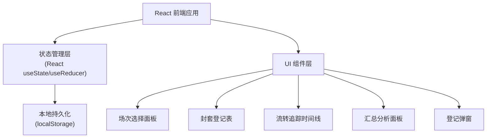
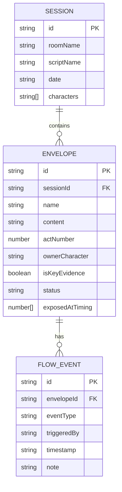

## 1. 架构设计



## 2. 技术说明

- **前端框架**: React@18 + TypeScript + Vite
- **样式方案**: TailwindCSS@3
- **状态管理**: React Hooks (useState, useReducer, useContext)
- **数据持久化**: localStorage（本地存储，无需后端）
- **图表可视化**: 原生 SVG + CSS 实现（避免引入额外依赖）
- **日期处理**: 原生 Date API

## 3. 路由定义

| 路由 | 用途 |
|-----|------|
| / | 复盘主页（单页应用，无多路由） |

## 4. 数据模型

### 4.1 数据模型定义



### 4.2 TypeScript 类型定义

```typescript
// 流转事件类型
type FlowEventType = 'created' | 'picked' | 'opened' | 'wrongly_taken' | 'missed' | 'reissued';

// 封套状态
type EnvelopeStatus = 'pending' | 'picked' | 'opened' | 'missed' | 'reissued';

// 场次
interface Session {
  id: string;
  roomName: string;
  scriptName: string;
  date: string;
  characters: string[];
}

// 线索封套
interface Envelope {
  id: string;
  sessionId: string;
  name: string;
  content: string;
  actNumber: number;
  ownerCharacter: string;
  isKeyEvidence: boolean;
  status: EnvelopeStatus;
}

// 流转事件
interface FlowEvent {
  id: string;
  envelopeId: string;
  eventType: FlowEventType;
  triggeredBy: string;
  timestamp: string;
  note?: string;
}
```

## 5. 组件结构

```
src/
├── types/
│   └── index.ts              # 类型定义
├── data/
│   └── mockData.ts           # 示例数据
├── hooks/
│   └── useSessionData.ts     # 数据管理 Hook
├── components/
│   ├── SessionSelector.tsx   # 场次选择面板
│   ├── EnvelopeTable.tsx     # 封套登记表
│   ├── FlowTimeline.tsx      # 流转追踪时间线
│   ├── AnalysisPanel.tsx     # 汇总分析面板
│   └── EnvelopeModal.tsx     # 封套登记弹窗
├── App.tsx
├── main.tsx
└── index.css
```

## 6. 核心算法逻辑

### 6.1 暴露过早判定
- 比较封套首次被打开时间与所属幕次的平均开启时间
- 若早于同幕次平均时间 30% 以上则标记为"太早暴露"

### 6.2 关键证据遗漏统计
- 筛选 `isKeyEvidence === true` 的封套
- 统计其状态为 `missed` 或流转中无 `opened` 事件的场次占比

### 6.3 误拿高频榜
- 统计每个封套流转中 `wrongly_taken` 事件次数
- 按次数降序排列展示
