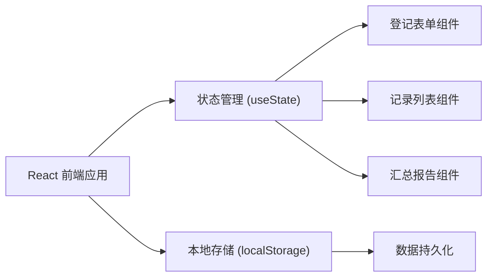
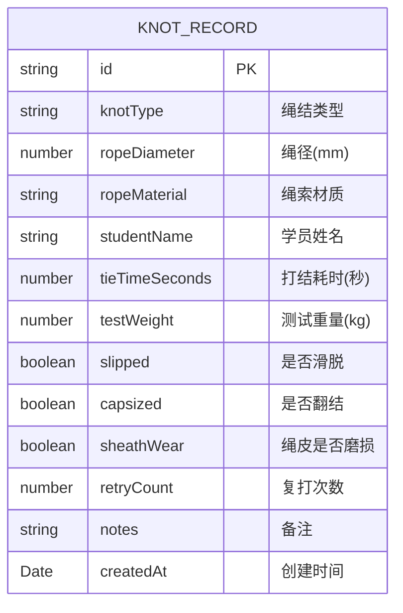

## 1. 架构设计



## 2. 技术说明

- **前端框架**: React@18 + TypeScript
- **构建工具**: Vite@5
- **样式方案**: Tailwind CSS@3
- **图标**: Lucide React
- **数据存储**: localStorage 本地持久化
- **初始化方式**: vite 官方模板

## 3. 路由定义

| 路由 | 用途 |
|------|------|
| / | 主页，包含登记表单、记录列表和汇总面板 |

## 4. 数据模型

### 4.1 数据结构定义



### 4.2 TypeScript 类型定义

```typescript
interface KnotRecord {
  id: string;
  knotType: string;
  ropeDiameter: number;
  ropeMaterial: string;
  studentName: string;
  tieTimeSeconds: number;
  testWeight: number;
  slipped: boolean;
  capsized: boolean;
  sheathWear: boolean;
  retryCount: number;
  notes: string;
  createdAt: string;
}

interface StudentSummary {
  studentName: string;
  totalRecords: number;
  knotStats: {
    knotType: string;
    totalTests: number;
    passCount: number;
    failCount: number;
    slipCount: number;
    capsizeCount: number;
    sheathWearCount: number;
    avgRetryCount: number;
    avgTieTime: number;
    maxTestWeight: number;
    readyForField: boolean;
    reasons: string[];
  }[];
}
```

### 4.3 判定规则

绳结可用于真实场景的判定条件（全部满足）：
1. 累计测试次数 >= 3 次
2. 最近 3 次测试无滑脱
3. 翻结率 < 30%
4. 绳皮磨损率 < 30%
5. 平均复打次数 <= 1 次

## 5. 组件划分

| 组件名 | 功能 |
|--------|------|
| App | 主容器，管理全局状态 |
| RecordForm | 登记表单组件 |
| RecordList | 记录列表组件 |
| SummaryPanel | 学员汇总面板 |
| StudentCard | 学员汇总卡片 |
| StatusBadge | 状态标签组件 |

## 6. 预设数据

- 绳结类型预设：八字结、布林结、双渔人结、普鲁士结、蝴蝶结、平结
- 绳索材质预设：尼龙、涤纶、迪尼玛、芳纶
- 预置学员与示例记录用于初始展示
