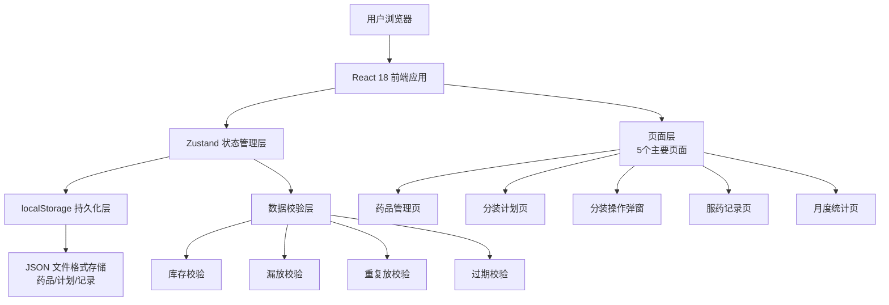
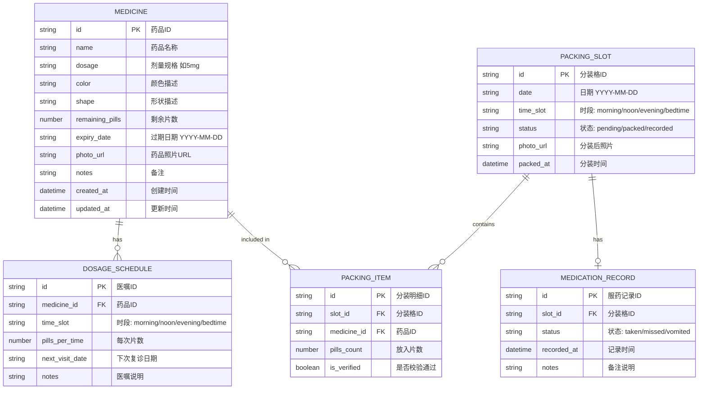

## 1. 架构设计

本系统为纯前端单页应用，使用浏览器 localStorage 进行数据持久化，无需后端服务，适合家属本地使用。



## 2. 技术描述

- **前端框架**：React@18 + TypeScript@5
- **构建工具**：Vite@5
- **样式方案**：Tailwind CSS@3
- **路由管理**：React Router DOM@6
- **状态管理**：Zustand@4（轻量级，适合本地应用）
- **图标库**：Lucide React
- **数据持久化**：浏览器 localStorage（JSON 序列化）
- **项目模板**：react-ts（纯前端，无需后端）

## 3. 路由定义

| Route | 页面名称 | 说明 |
|-------|----------|------|
| `/` | 首页/分装计划 | 默认页面，显示本周分装计划 |
| `/medicines` | 药品管理 | 药品CRUD操作 |
| `/medicines/new` | 新增药品 | 新增药品表单 |
| `/medicines/:id/edit` | 编辑药品 | 编辑已有药品 |
| `/packing/:date/:slot` | 分装操作 | 单格分装弹窗页面（日期+时段） |
| `/records` | 服药记录 | 服药状态查看与标记 |
| `/statistics` | 月度统计 | 统计报表与预警清单 |

## 4. 数据模型

### 4.1 数据模型定义（ER图）



### 4.2 TypeScript 类型定义

```typescript
export type TimeSlot = 'morning' | 'noon' | 'evening' | 'bedtime';

export type PackingStatus = 'pending' | 'packed' | 'recorded';

export type MedicationStatus = 'taken' | 'missed' | 'vomited';

export interface Medicine {
  id: string;
  name: string;
  dosage: string;
  color: string;
  shape: string;
  remainingPills: number;
  expiryDate: string;
  photoUrl: string;
  notes: string;
  createdAt: string;
  updatedAt: string;
}

export interface DosageSchedule {
  id: string;
  medicineId: string;
  timeSlot: TimeSlot;
  pillsPerTime: number;
  nextVisitDate?: string;
  notes?: string;
}

export interface PackingSlot {
  id: string;
  date: string;
  timeSlot: TimeSlot;
  status: PackingStatus;
  photoUrl?: string;
  packedAt?: string;
}

export interface PackingItem {
  id: string;
  slotId: string;
  medicineId: string;
  pillsCount: number;
  isVerified: boolean;
}

export interface MedicationRecord {
  id: string;
  slotId: string;
  status: MedicationStatus;
  recordedAt: string;
  notes?: string;
}

export interface ValidationError {
  type: 'missing' | 'insufficient' | 'duplicate' | 'expired';
  medicineId: string;
  medicineName: string;
  message: string;
}
```

### 4.3 初始 Mock 数据

系统启动时预置以下示例数据，方便用户直接体验：

```typescript
// 示例药品
const mockMedicines: Medicine[] = [
  {
    id: 'med-001',
    name: '苯磺酸氨氯地平片',
    dosage: '5mg',
    color: '白色',
    shape: '圆形',
    remainingPills: 45,
    expiryDate: '2026-12-31',
    photoUrl: '',
    notes: '降压药，每日早晨服用',
    createdAt: '2026-06-01T08:00:00Z',
    updatedAt: '2026-06-10T08:00:00Z'
  },
  {
    id: 'med-002',
    name: '盐酸二甲双胍缓释片',
    dosage: '0.5g',
    color: '浅粉色',
    shape: '椭圆形',
    remainingPills: 60,
    expiryDate: '2027-03-15',
    photoUrl: '',
    notes: '降糖药，早晚餐后服用',
    createdAt: '2026-06-01T08:05:00Z',
    updatedAt: '2026-06-10T08:05:00Z'
  },
  {
    id: 'med-003',
    name: '阿托伐他汀钙片',
    dosage: '20mg',
    color: '淡黄色',
    shape: '圆形',
    remainingPills: 30,
    expiryDate: '2026-11-20',
    photoUrl: '',
    notes: '降脂药，睡前服用',
    createdAt: '2026-06-01T08:10:00Z',
    updatedAt: '2026-06-10T08:10:00Z'
  },
  {
    id: 'med-004',
    name: '阿司匹林肠溶片',
    dosage: '100mg',
    color: '白色',
    shape: '圆形肠溶片',
    remainingPills: 5,
    expiryDate: '2026-08-30',
    photoUrl: '',
    notes: '抗凝药，每日早晨',
    createdAt: '2026-06-01T08:15:00Z',
    updatedAt: '2026-06-10T08:15:00Z'
  },
  {
    id: 'med-005',
    name: '维生素D滴剂',
    dosage: '400IU',
    color: '透明黄色',
    shape: '滴丸',
    remainingPills: 100,
    expiryDate: '2028-01-01',
    photoUrl: '',
    notes: '保健补充，中午服用',
    createdAt: '2026-06-01T08:20:00Z',
    updatedAt: '2026-06-10T08:20:00Z'
  }
];

// 示例医嘱计划
const mockSchedules: DosageSchedule[] = [
  { id: 'sch-001', medicineId: 'med-001', timeSlot: 'morning', pillsPerTime: 1, nextVisitDate: '2026-07-15' },
  { id: 'sch-002', medicineId: 'med-004', timeSlot: 'morning', pillsPerTime: 1, nextVisitDate: '2026-07-15' },
  { id: 'sch-003', medicineId: 'med-005', timeSlot: 'noon', pillsPerTime: 2 },
  { id: 'sch-004', medicineId: 'med-002', timeSlot: 'morning', pillsPerTime: 1, nextVisitDate: '2026-07-20' },
  { id: 'sch-005', medicineId: 'med-002', timeSlot: 'evening', pillsPerTime: 1, nextVisitDate: '2026-07-20' },
  { id: 'sch-006', medicineId: 'med-003', timeSlot: 'bedtime', pillsPerTime: 1, nextVisitDate: '2026-07-10' }
];
```

## 5. 核心模块划分

### 5.1 Store 模块（Zustand）
- `medicineStore`：药品 CRUD、库存增减
- `scheduleStore`：医嘱计划管理
- `packingStore`：分装格管理、分装操作、校验逻辑
- `recordStore`：服药记录管理
- `statisticsStore`：统计计算、预警生成

### 5.2 组件模块
- `Layout/`：布局组件（顶部导航、侧边栏）
- `Medicine/`：药品卡片、药品表单
- `Packing/`：分装计划卡片、分装弹窗、校验错误提示
- `Record/`：服药状态按钮、服药记录列表
- `Statistics/`：统计卡片、预警列表、柱状图
- `Common/`：通用组件（按钮、弹窗、日期选择器）

### 5.3 工具函数
- `dateUtils.ts`：日期计算（本周起止、格式化）
- `validationUtils.ts`：分装校验逻辑（漏放/库存/重复）
- `storageUtils.ts`：localStorage 封装
- `statisticsUtils.ts`：统计指标计算
