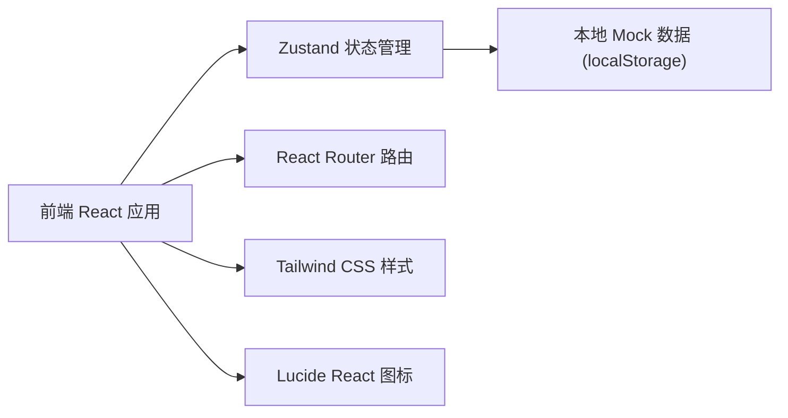
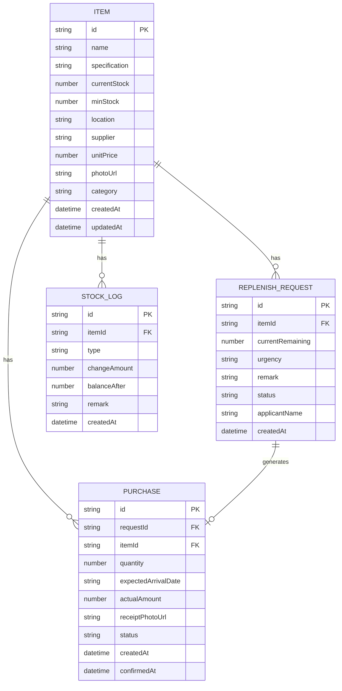

## 1. 架构设计



纯前端应用架构，使用 localStorage 做数据持久化，无需后端服务。

## 2. 技术说明

- **前端框架**：React 18 + TypeScript
- **构建工具**：Vite 5
- **样式方案**：Tailwind CSS 3
- **状态管理**：Zustand 4
- **路由方案**：React Router DOM 6
- **图标库**：Lucide React
- **数据存储**：localStorage（模拟后端）
- **初始化工具**：vite-init

## 3. 路由定义

| 路由 | 页面 | 说明 |
|------|------|------|
| / | 首页看板 Dashboard | 库存总览、红区预警、待到货 |
| /items | 物品档案 ItemList | 物品列表、搜索筛选 |
| /items/new | 新增物品 ItemForm | 新建物品档案 |
| /items/:id | 物品详情 ItemDetail | 物品信息与历史记录 |
| /requests | 补货申请 RequestList | 申请列表与筛选 |
| /requests/new | 新建申请 RequestForm | 提交补货申请 |
| /purchases | 采购处理 PurchaseList | 待处理列表与采购记录 |
| /stats | 统计分析 Statistics | 消耗排行与花费统计 |

## 4. 数据模型

### 4.1 数据模型定义 (ER 图)



### 4.2 类型定义 (TypeScript)

```typescript
// 物品档案
interface Item {
  id: string;
  name: string;
  specification: string;
  currentStock: number;
  minStock: number;
  location: string;
  supplier: string;
  unitPrice: number;
  photoUrl: string;
  category: string;
  createdAt: string;
  updatedAt: string;
}

// 补货申请
type UrgencyLevel = 'low' | 'normal' | 'high' | 'urgent';
type RequestStatus = 'pending' | 'processing' | 'completed' | 'cancelled';

interface ReplenishRequest {
  id: string;
  itemId: string;
  currentRemaining: number;
  urgency: UrgencyLevel;
  remark: string;
  status: RequestStatus;
  applicantName: string;
  createdAt: string;
}

// 采购记录
type PurchaseStatus = 'ordered' | 'arrived' | 'cancelled';

interface Purchase {
  id: string;
  requestId: string | null;
  itemId: string;
  quantity: number;
  expectedArrivalDate: string;
  actualAmount: number;
  receiptPhotoUrl: string;
  status: PurchaseStatus;
  createdAt: string;
  confirmedAt: string | null;
}

// 库存变动日志
type StockLogType = 'purchase' | 'consume' | 'adjust';

interface StockLog {
  id: string;
  itemId: string;
  type: StockLogType;
  changeAmount: number;
  balanceAfter: number;
  remark: string;
  createdAt: string;
}
```

## 5. 项目目录结构

```
src/
├── components/          # 通用组件
│   ├── Layout/          # 布局组件（Sidebar、Header）
│   ├── ItemCard.tsx     # 物品卡片
│   ├── StatusBadge.tsx  # 状态标签
│   ├── Modal.tsx        # 弹窗组件
│   └── EmptyState.tsx   # 空状态
├── pages/               # 页面组件
│   ├── Dashboard.tsx    # 首页看板
│   ├── ItemList.tsx     # 物品列表
│   ├── ItemForm.tsx     # 物品表单
│   ├── ItemDetail.tsx   # 物品详情
│   ├── RequestList.tsx  # 申请列表
│   ├── RequestForm.tsx  # 申请表单
│   ├── PurchaseList.tsx # 采购列表
│   └── Statistics.tsx   # 统计分析
├── store/               # Zustand 状态管理
│   └── useStore.ts
├── types/               # TypeScript 类型定义
│   └── index.ts
├── utils/               # 工具函数
│   ├── id.ts            # ID 生成
│   ├── date.ts          # 日期处理
│   └── storage.ts       # localStorage 封装
├── data/                # Mock 数据
│   └── mockData.ts
├── App.tsx
├── main.tsx
└── index.css
```
