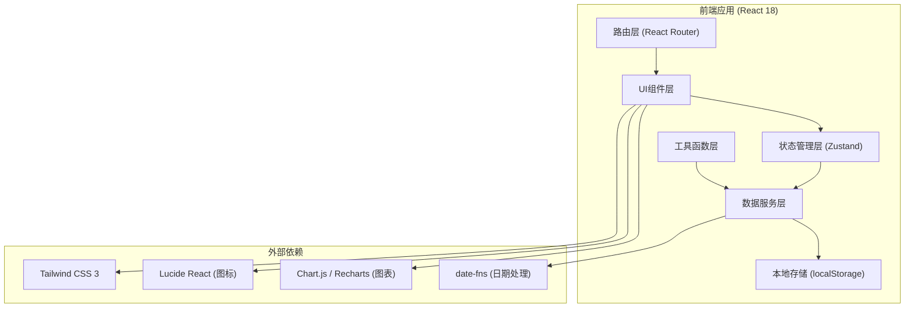
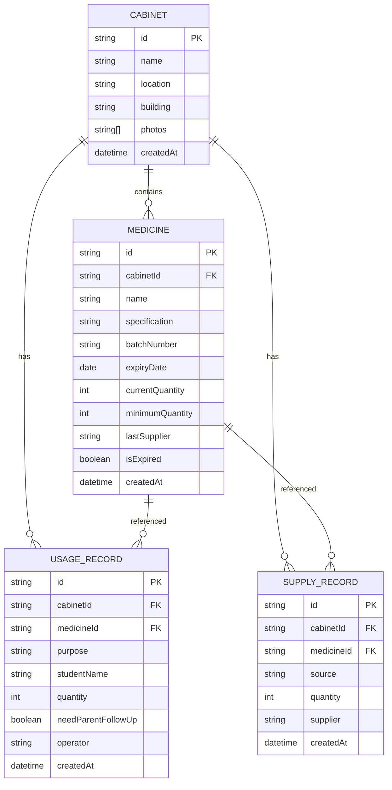

# 技术架构文档 - 学校医务室药箱管理系统

## 1. 架构设计



## 2. 技术描述

- **前端框架**：React 18 + TypeScript + Vite 5
- **样式方案**：Tailwind CSS 3，自定义医疗主题配置
- **状态管理**：Zustand 4，轻量级状态管理，支持持久化
- **路由管理**：React Router v6
- **图标库**：Lucide React，线性风格图标
- **图表库**：Recharts，用于统计分析图表
- **日期处理**：date-fns，轻量级日期工具库
- **数据存储**：localStorage 本地存储 + 内置Mock数据
- **初始化工具**：vite-init

## 3. 目录结构

```
src/
├── components/          # 公共组件
│   ├── Layout/         # 布局组件
│   ├── MedicineCard/   # 药品卡片组件
│   ├── CabinetCard/    # 药箱卡片组件
│   ├── StatusBadge/    # 状态徽章组件
│   ├── Modal/          # 模态框组件
│   └── Chart/          # 图表组件
├── pages/              # 页面组件
│   ├── Dashboard/      # 首页/总览
│   ├── CabinetDetail/  # 药箱详情页
│   ├── Statistics/     # 统计分析页
│   └── PurchaseList/   # 采购清单页
├── store/              # Zustand状态管理
│   ├── useCabinetStore.ts
│   ├── useMedicineStore.ts
│   └── useRecordStore.ts
├── types/              # TypeScript类型定义
│   └── index.ts
├── utils/              # 工具函数
│   ├── dateUtils.ts
│   ├── statusUtils.ts
│   └── mockData.ts
├── hooks/              # 自定义Hooks
│   ├── useExpiryCheck.ts
│   └── useStockAlert.ts
├── App.tsx
├── main.tsx
└── index.css
```

## 4. 路由定义

| 路由 | 页面 | 用途 |
|------|------|------|
| `/` | Dashboard | 首页药箱总览、状态概览、采购清单 |
| `/cabinet/:id` | CabinetDetail | 药箱详情页，药品列表、领用补给操作 |
| `/statistics` | Statistics | 统计分析页，缺药箱/快过期/外伤高发 |
| `/purchase` | PurchaseList | 采购清单页面 |

## 5. 数据模型

### 5.1 ER图



### 5.2 TypeScript类型定义

```typescript
// 药箱
interface Cabinet {
  id: string;
  name: string;
  location: string;
  building: 'sports' | 'lab' | 'dormitory';
  photos: string[];
  createdAt: string;
}

// 药品
interface Medicine {
  id: string;
  cabinetId: string;
  name: string;
  specification: string;
  batchNumber: string;
  expiryDate: string;
  currentQuantity: number;
  minimumQuantity: number;
  lastSupplier: string;
  isExpired: boolean;
  createdAt: string;
}

// 领用记录
interface UsageRecord {
  id: string;
  cabinetId: string;
  medicineId: string;
  purpose: string;
  studentName?: string;
  quantity: number;
  needParentFollowUp: boolean;
  operator: string;
  createdAt: string;
}

// 补给记录
interface SupplyRecord {
  id: string;
  cabinetId: string;
  medicineId: string;
  source: string;
  quantity: number;
  supplier: string;
  createdAt: string;
}

// 药品状态
type MedicineStatus = 'sufficient' | 'low' | 'insufficient' | 'expired';

// 统计数据
interface StatisticsData {
  building: string;
  lowStockCount: number;
  expiredCount: number;
  expiringSoonCount: number;
  weeklyUsage: { location: string; count: number }[];
}
```

### 5.3 初始Mock数据

预置三个药箱及常用药品数据：
- **运动场药箱**：创可贴、碘伏、云南白药、绷带、清凉油
- **实验楼药箱**：创可贴、碘伏、烫伤膏、护目镜、纱布
- **宿舍楼药箱**：创可贴、碘伏、感冒药、肠胃药、退烧药

预置最近两周的领用和补给记录，用于统计分析展示。

## 6. 核心功能实现逻辑

### 6.1 过期检查机制

- 自定义Hook `useExpiryCheck` 在应用启动和每次访问药箱时检查有效期
- 过期日期 < 当前日期 → 标记 `isExpired = true`，药品状态置为 `expired`
- 过期药品在列表中显示红色斜纹背景，操作按钮禁用
- 30天内即将过期 → 显示橙色警告标识

### 6.2 库存预警机制

- `currentQuantity <= minimumQuantity` → 状态 `insufficient`（不足），加入采购清单
- `currentQuantity <= minimumQuantity * 1.5` → 状态 `low`（偏低）
- 采购清单自动汇总所有 `insufficient` 状态的药品，按楼栋分组

### 6.3 领用流程

1. 用户选择药品，填写领用表单（用途、学生姓名、数量、回访需求）
2. 扣减库存：`currentQuantity -= quantity`
3. 写入领用记录
4. 重新计算库存状态
5. 若库存不足，自动加入采购清单

### 6.4 补给流程

1. 用户选择药品，填写补给表单（来源、数量、补给人）
2. 增加库存：`currentQuantity += quantity`
3. 更新 `lastSupplier` 字段
4. 写入补给记录
5. 重新计算库存状态

### 6.5 统计分析逻辑

**按楼栋统计**：
- 遍历所有药箱，按 `building` 字段分组
- 统计每组中库存不足药品数量、过期药品数量、即将过期药品数量

**外伤高发位置**：
- 查询最近7天的领用记录
- 按药箱位置分组统计领用次数
- 筛选用途包含"外伤"、"擦伤"、"扭伤"等关键词的记录
- 生成热力图数据

## 7. 状态管理设计

### Zustand Store 划分

```typescript
// 药箱Store
const useCabinetStore = create((set) => ({
  cabinets: [],
  currentCabinet: null,
  fetchCabinets: () => {},
  getCabinetById: (id) => {},
}));

// 药品Store
const useMedicineStore = create((set) => ({
  medicines: [],
  fetchMedicines: () => {},
  getMedicinesByCabinet: (cabinetId) => {},
  updateQuantity: (id, delta) => {},
  checkExpiry: () => {},
  getPurchaseList: () => {},
}));

// 记录Store
const useRecordStore = create((set) => ({
  usageRecords: [],
  supplyRecords: [],
  addUsageRecord: (record) => {},
  addSupplyRecord: (record) => {},
  getWeeklyUsage: () => {},
  getStatistics: () => {},
}));
```

## 8. 性能优化

1. **数据持久化**：使用 `zustand-persist` 中间件将状态持久化到 localStorage
2. **按需加载**：药箱详情页的数据按需加载，避免首屏加载过多数据
3. **组件 memo 优化**：药品列表项使用 `React.memo` 避免不必要重渲染
4. **计算缓存**：使用 `useMemo` 缓存统计数据和过滤结果
5. **虚拟滚动**：药品列表超过50项时启用虚拟滚动

## 9. 开发规范

- 使用 TypeScript 严格模式
- 组件使用函数式组件 + Hooks
- 使用 ESLint + Prettier 统一代码风格
- 遵循 React 最佳实践，避免常见陷阱
- 关键逻辑添加单元测试
