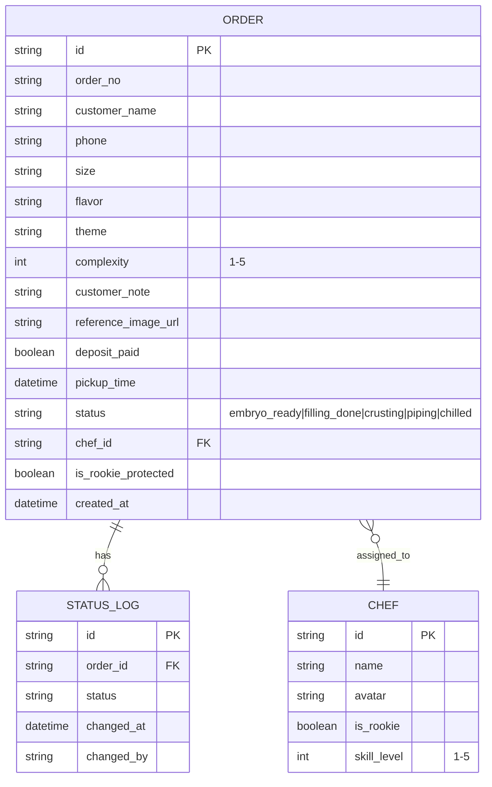

## 1. 架构设计

```mermaid
flowchart TB
    subgraph "前端展示层"
        A["排单白板页面"]
        B["老板统计面板"]
    end
    subgraph "状态管理层"
        C["React useState/useReducer"]
        D["Mock 数据服务"]
    end
    subgraph "组件层"
        E["OrderCard 订单卡片"]
        F["StatusTimeline 状态流转条"]
        G["ChefCapacity 裱花师产能"]
        H["CongestionHeatmap 拥堵热力图"]
        I["RiskOrderList 风险订单"]
    end
    A --> E
    A --> F
    B --> G
    B --> H
    B --> I
    E --> C
    F --> C
    C --> D
```



## 2. 技术选型说明

- **前端框架**：React 18 + TypeScript
- **构建工具**：Vite 5
- **样式方案**：TailwindCSS 3 + CSS 自定义属性（主题变量）
- **图标方案**：Lucide React 图标库 + 原生 Emoji
- **字体方案**：Google Fonts (Noto Serif SC + Noto Sans SC)
- **数据层**：本地 Mock 数据 + localStorage 持久化（无后端）
- **动画方案**：CSS Keyframes + TailwindCSS 动画工具类

## 3. 路由定义

| 路由 | 页面用途 |
|------|----------|
| / | 排单白板主页（含底部老板统计面板） |

单页应用，无需额外路由。

## 4. 数据模型

### 4.1 核心实体定义



### 4.2 订单状态枚举

```typescript
enum OrderStatus {
  EMBRYO_READY = 'embryo_ready',    // 胚子已备
  FILLING_DONE = 'filling_done',    // 夹心完成
  CRUSTING = 'crusting',            // 抹面中
  PIPING = 'piping',                // 裱花中
  CHILLED = 'chilled',              // 冷藏待取
}
```

### 4.3 Mock 数据结构

```typescript
interface MockData {
  chefs: Chef[];
  orders: Order[];
  currentDate: string;
}
```

## 5. 目录结构

```
src/
├── components/
│   ├── Header.tsx              # 顶部导航
│   ├── OrderCard.tsx           # 订单卡片
│   ├── StatusTimeline.tsx      # 状态流转条
│   ├── ChefSelector.tsx        # 裱花师选择器（含新人保护）
│   ├── ReferenceImage.tsx      # 参考图展示
│   └── BossPanel/
│       ├── index.tsx           # 老板面板容器
│       ├── ChefCapacity.tsx    # 裱花师产能卡片
│       ├── CongestionHeatmap.tsx # 拥堵时段热力图
│       └── RiskOrderList.tsx   # 风险订单列表
├── data/
│   └── mockData.ts             # Mock 数据
├── hooks/
│   ├── useOrders.ts            # 订单状态管理 Hook
│   └── useTimeUtils.ts         # 时间计算工具 Hook
├── types/
│   └── index.ts                # TypeScript 类型定义
├── utils/
│   └── orderUtils.ts           # 订单工具函数（预警判断等）
├── App.tsx
├── main.tsx
└── index.css
```
