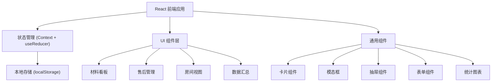
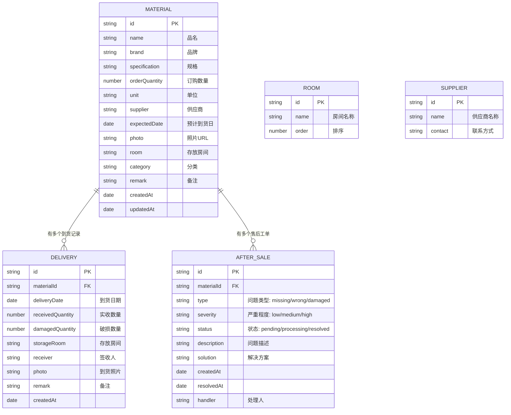

## 1. 架构设计



## 2. 技术描述

- **前端框架**：React 18 + TypeScript
- **构建工具**：Vite 5
- **样式方案**：TailwindCSS 3
- **状态管理**：React Context + useReducer（轻量级，适合本地应用）
- **数据持久化**：localStorage（数据存在浏览器本地）
- **图标库**：Lucide React（轻量线性图标）
- **后端**：无（纯前端本地应用）
- **数据库**：无（使用 localStorage 模拟）

## 3. 路由定义

| 路由 | 页面 | 用途 |
|------|------|------|
| / | 材料看板 | 材料卡片列表、筛选、新增/编辑 |
| /after-sales | 售后管理 | 售后工单列表、状态跟踪 |
| /rooms | 房间视图 | 按房间分组、齐套进度 |
| /summary | 数据汇总 | 统计数据、供应商排名 |

## 4. 数据模型

### 4.1 数据模型定义



### 4.2 核心数据结构（TypeScript 类型）

```typescript
// 材料
interface Material {
  id: string;
  name: string;
  brand: string;
  specification: string;
  orderQuantity: number;
  unit: string;
  supplier: string;
  expectedDate: string;
  photo: string;
  room: string;
  category: string;
  remark: string;
  createdAt: string;
  updatedAt: string;
}

// 到货记录
interface Delivery {
  id: string;
  materialId: string;
  deliveryDate: string;
  receivedQuantity: number;
  damagedQuantity: number;
  storageRoom: string;
  receiver: string;
  photo: string;
  remark: string;
  createdAt: string;
}

// 售后工单
interface AfterSale {
  id: string;
  materialId: string;
  type: 'missing' | 'wrong' | 'damaged';
  severity: 'low' | 'medium' | 'high';
  status: 'pending' | 'processing' | 'resolved';
  description: string;
  solution: string;
  createdAt: string;
  resolvedAt: string | null;
  handler: string;
}

// 应用状态
interface AppState {
  materials: Material[];
  deliveries: Delivery[];
  afterSales: AfterSale[];
  rooms: string[];
  suppliers: string[];
}
```

### 4.3 存储结构

数据以 JSON 格式存储在 localStorage 中，Key 为 `material-tracker-data`。

## 5. 组件结构

```
src/
├── components/
│   ├── layout/
│   │   ├── Header.tsx       # 顶部导航
│   │   └── Layout.tsx       # 布局容器
│   ├── material/
│   │   ├── MaterialCard.tsx      # 材料卡片
│   │   ├── MaterialForm.tsx      # 材料表单
│   │   ├── MaterialDetail.tsx    # 材料详情抽屉
│   │   └── MaterialGrid.tsx      # 材料网格
│   ├── delivery/
│   │   ├── DeliveryForm.tsx      # 到货登记表单
│   │   └── DeliveryList.tsx      # 到货记录列表
│   ├── aftersale/
│   │   ├── AfterSaleCard.tsx     # 售后卡片
│   │   ├── AfterSaleForm.tsx     # 售后表单
│   │   └── AfterSaleList.tsx     # 售后列表
│   ├── room/
│   │   ├── RoomCard.tsx          # 房间卡片
│   │   └── RoomGrid.tsx          # 房间网格
│   ├── summary/
│   │   ├── StatCard.tsx          # 统计卡片
│   │   ├── SupplierRank.tsx      # 供应商排名
│   │   └── AfterSaleSummary.tsx  # 售后概览
│   └── common/
│       ├── Modal.tsx             # 模态框
│       ├── Drawer.tsx            # 抽屉
│       ├── Button.tsx            # 按钮
│       ├── Input.tsx             # 输入框
│       ├── Select.tsx            # 选择器
│       └── Badge.tsx             # 标签
├── context/
│   └── AppContext.tsx       # 全局状态
├── hooks/
│   └── useLocalStorage.ts   # 本地存储 Hook
├── pages/
│   ├── MaterialBoard.tsx    # 材料看板
│   ├── AfterSales.tsx       # 售后管理
│   ├── RoomView.tsx         # 房间视图
│   └── Summary.tsx          # 数据汇总
├── types/
│   └── index.ts             # 类型定义
├── utils/
│   ├── mockData.ts          # 模拟数据
│   └── helpers.ts           # 工具函数
├── App.tsx
├── main.tsx
└── index.css
```

## 6. 功能实现要点

### 6.1 材料管理
- 材料 CRUD 操作
- 照片上传（Base64 存储）
- 按分类/供应商/房间筛选
- 搜索功能

### 6.2 到货登记
- 支持多次分批到货
- 自动计算累计到货数量
- 破损数量统计
- 自动关联售后（破损时提示创建售后）

### 6.3 售后管理
- 三种问题类型：缺件、错发、破损
- 三级严重程度
- 状态流转：待处理 → 处理中 → 已解决
- 关联材料信息

### 6.4 房间视图
- 按房间分组显示材料
- 齐套进度计算（已到货数量/订购数量）
- 颜色标识：绿色齐套、黄色部分到货、红色未到货

### 6.5 数据汇总
- 总材料数、已到货数、待到货数
- 延期供应商排名（按延期天数）
- 破损率统计
- 售后状态分类统计
