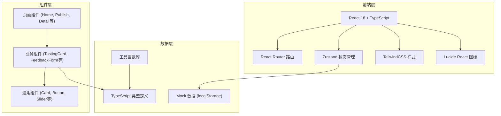
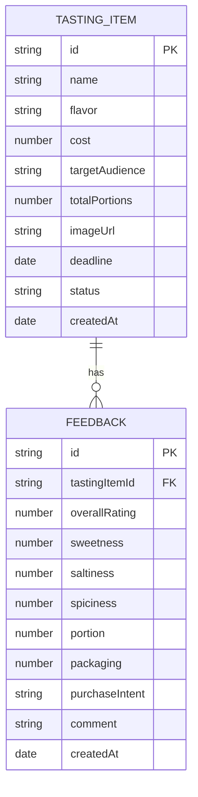

## 1. 架构设计



## 2. 技术描述

- **前端框架**：React 18 + TypeScript
- **构建工具**：Vite 5
- **路由管理**：react-router-dom 6
- **状态管理**：zustand
- **样式方案**：TailwindCSS 3
- **图标库**：lucide-react
- **数据存储**：localStorage + Mock 数据
- **图表**：原生 SVG/CSS 实现（轻量级）

## 3. 路由定义

| 路由 | 页面 | 说明 |
|------|------|------|
| `/` | 首页 | 试吃品分组展示 |
| `/publish` | 发布页 | 创建/编辑试吃品 |
| `/tasting/:id` | 详情页 | 试吃品详情和反馈列表 |
| `/feedback/:id` | 反馈页 | 顾客提交反馈 |
| `/stats` | 统计页 | 数据分析和口味建议 |

## 4. 数据模型

### 4.1 数据模型定义



### 4.2 TypeScript 类型定义

```typescript
type TastingStatus = 'collecting' | 'popular' | 'controversial' | 'ready';

type PurchaseIntent = 'yes' | 'no' | 'maybe';

interface TastingItem {
  id: string;
  name: string;
  flavor: string;
  cost: number;
  targetAudience: string;
  totalPortions: number;
  imageUrl: string;
  deadline: string;
  status: TastingStatus;
  createdAt: string;
}

interface Feedback {
  id: string;
  tastingItemId: string;
  overallRating: number; // 1-5
  sweetness: number; // 1-5
  saltiness: number; // 1-5
  spiciness: number; // 1-5
  portion: number; // 1-5
  packaging: number; // 1-5
  purchaseIntent: PurchaseIntent;
  comment: string;
  createdAt: string;
}
```

## 5. 项目结构

```
src/
├── components/
│   ├── ui/           # 通用UI组件
│   │   ├── Button.tsx
│   │   ├── Card.tsx
│   │   ├── RatingSlider.tsx
│   │   ├── StarRating.tsx
│   │   ├── Tag.tsx
│   │   └── Input.tsx
│   ├── TastingCard.tsx
│   ├── FeedbackForm.tsx
│   ├── FeedbackList.tsx
│   ├── KeywordCloud.tsx
│   ├── StatusTabs.tsx
│   └── Navbar.tsx
├── pages/
│   ├── Home.tsx
│   ├── Publish.tsx
│   ├── TastingDetail.tsx
│   ├── Feedback.tsx
│   └── Stats.tsx
├── store/
│   └── useTastingStore.ts
├── types/
│   └── index.ts
├── utils/
│   ├── keywords.ts
│   ├── statistics.ts
│   └── mockData.ts
├── App.tsx
├── main.tsx
└── index.css
```

## 6. 核心功能实现要点

### 6.1 状态管理 (Zustand)
- 存储试吃品列表和反馈列表
- 提供增删改查方法
- 持久化到 localStorage

### 6.2 关键词提取
- 简单词频统计
- 过滤常用停用词
- 按出现频率排序展示

### 6.3 评分分组逻辑
- 收集中：反馈数 < 10 且未截止
- 好评高：平均评分 >= 4.2 且反馈数 >= 10
- 争议大：评分标准差 >= 1.2 且反馈数 >= 10
- 准备上架：店员手动标记

### 6.4 统计分析
- 平均评分计算
- 购买意愿比例
- 各维度平均分
- 综合评分排序
