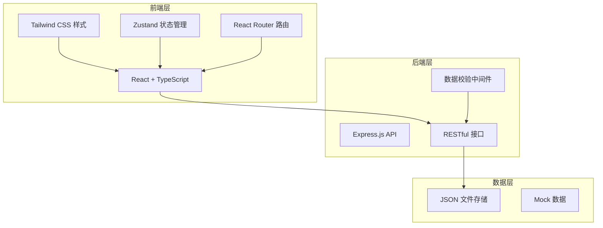
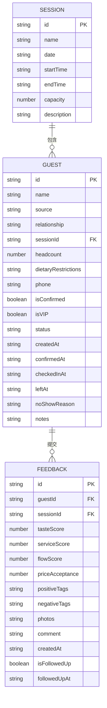

## 1. 架构设计

本系统采用前后端分离架构，前端使用 React 构建用户界面，后端使用 Express 提供 API 服务，数据存储使用轻量级方案。



## 2. 技术说明

- **前端框架**: React 18 + TypeScript
- **构建工具**: Vite
- **样式方案**: Tailwind CSS 3
- **状态管理**: Zustand
- **路由管理**: React Router DOM
- **UI 组件**: 自定义组件 + Lucide React 图标
- **图表库**: Recharts（数据可视化）
- **后端框架**: Express 4 + TypeScript
- **数据存储**: JSON 文件（轻量级，便于本地演示）
- **日期处理**: date-fns

## 3. 路由定义

| 路由路径 | 页面名称 | 用途说明 |
|----------|----------|----------|
| `/dashboard` | 老板看板 | 数据统计概览、场次分析、高频词展示 |
| `/guests` | 名单管理 | 邀约名单列表、增删改查、筛选搜索 |
| `/checkin` | 签到管理 | 当天场次签到、签到统计 |
| `/feedback` | 反馈收集 | 反馈表单、反馈列表、照片上传 |
| `/reminders` | 提醒中心 | 未确认、爽约、回访提醒管理 |

## 4. API 接口定义

### 4.1 邀约名单相关

```typescript
// 邀约人数据类型
interface Guest {
  id: string;
  name: string;
  source: string;        // 来源：微信、朋友介绍、老顾客等
  relationship: string;  // 关系：朋友、亲戚、同事、客户等
  sessionId: string;     // 邀约场次ID
  headcount: number;     // 人数
  dietaryRestrictions: string; // 忌口
  phone: string;         // 联系方式
  isConfirmed: boolean;  // 是否已确认
  isVIP: boolean;        // 是否重点客户
  status: 'invited' | 'confirmed' | 'checked_in' | 'no_show' | 'left';
  createdAt: string;
  confirmedAt?: string;
  checkedInAt?: string;
  leftAt?: string;
  noShowReason?: string;
  notes?: string;
}

// 场次数据类型
interface Session {
  id: string;
  name: string;
  date: string;
  startTime: string;
  endTime: string;
  capacity: number;
  description?: string;
}
```

### 4.2 反馈相关

```typescript
interface Feedback {
  id: string;
  guestId: string;
  sessionId: string;
  tasteScore: number;       // 口味评分 1-5
  serviceScore: number;     // 服务评分 1-5
  flowScore: number;        // 动线评分 1-5
  priceAcceptance: number;  // 价格接受度 1-5
  positiveTags: string[];   // 满意点标签
  negativeTags: string[];   // 问题点标签
  photos: string[];         // 照片URL列表
  comment: string;          // 文字反馈
  createdAt: string;
  isFollowedUp: boolean;    // 是否已回访
  followedUpAt?: string;
}
```

### 4.3 接口列表

| 方法 | 路径 | 描述 |
|------|------|------|
| GET | `/api/sessions` | 获取所有场次 |
| POST | `/api/sessions` | 创建新场次 |
| PUT | `/api/sessions/:id` | 更新场次 |
| DELETE | `/api/sessions/:id` | 删除场次 |
| GET | `/api/guests` | 获取邀约名单（支持筛选） |
| GET | `/api/guests/:id` | 获取单个邀约人详情 |
| POST | `/api/guests` | 添加邀约人 |
| PUT | `/api/guests/:id` | 更新邀约人信息 |
| DELETE | `/api/guests/:id` | 删除邀约人 |
| PATCH | `/api/guests/:id/confirm` | 确认参加 |
| PATCH | `/api/guests/:id/checkin` | 签到 |
| PATCH | `/api/guests/:id/checkout` | 签退 |
| PATCH | `/api/guests/:id/no-show` | 标记爽约 |
| GET | `/api/feedback` | 获取反馈列表 |
| POST | `/api/feedback` | 提交反馈 |
| GET | `/api/stats/overview` | 获取看板概览数据 |
| GET | `/api/stats/session/:sessionId` | 获取单场次统计 |
| GET | `/api/stats/keywords` | 获取高频词统计 |
| GET | `/api/reminders` | 获取提醒列表 |
| PATCH | `/api/reminders/:id/dismiss` | 标记提醒已处理 |

## 5. 数据模型

### 5.1 ER图



### 5.2 数据存储结构

使用 JSON 文件存储，数据文件存放于 `api/data/` 目录下：

- `sessions.json` - 场次数据
- `guests.json` - 邀约人数据
- `feedback.json` - 反馈数据

## 6. 项目结构

```
.
├── src/                          # 前端源码
│   ├── components/               # 公共组件
│   │   ├── Layout/              # 布局组件
│   │   ├── Card/                # 卡片组件
│   │   ├── Modal/               # 弹窗组件
│   │   ├── Form/                # 表单组件
│   │   └── Chart/               # 图表组件
│   ├── pages/                    # 页面组件
│   │   ├── Dashboard/           # 老板看板
│   │   ├── GuestList/           # 名单管理
│   │   ├── CheckIn/             # 签到管理
│   │   ├── Feedback/            # 反馈收集
│   │   └── Reminders/           # 提醒中心
│   ├── store/                    # Zustand 状态管理
│   │   ├── useGuestStore.ts
│   │   ├── useSessionStore.ts
│   │   └── useFeedbackStore.ts
│   ├── utils/                    # 工具函数
│   │   ├── api.ts               # API 封装
│   │   ├── format.ts            # 格式化工具
│   │   └── constants.ts         # 常量定义
│   ├── types/                    # TypeScript 类型定义
│   ├── App.tsx                  # 根组件
│   ├── main.tsx                 # 入口文件
│   └── index.css                # 全局样式
├── api/                          # 后端源码
│   ├── routes/                   # 路由
│   ├── data/                     # JSON 数据文件
│   ├── utils/                    # 工具函数
│   └── index.ts                 # 入口文件
├── shared/                       # 共享类型定义
├── vite.config.ts
├── tailwind.config.js
├── tsconfig.json
└── package.json
```
