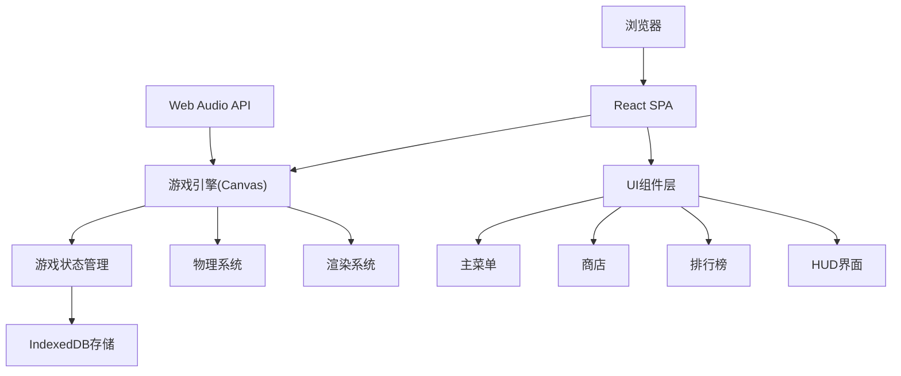

## 1. 架构设计



## 2. 技术描述

- **前端框架**: React@18 + TypeScript
- **构建工具**: Vite@5
- **样式方案**: TailwindCSS@3
- **游戏渲染**: HTML5 Canvas 2D
- **状态管理**: React useState/useReducer (轻量级游戏状态)
- **数据存储**: IndexedDB (localForage封装)
- **音频**: Web Audio API
- **动画**: requestAnimationFrame游戏循环 + CSS动画

## 3. 项目结构

```
src/
├── components/          # React组件
│   ├── MainMenu.tsx     # 主菜单
│   ├── GameCanvas.tsx   # 游戏画布
│   ├── HUD.tsx          # 游戏HUD
│   ├── GameOver.tsx     # 结算弹窗
│   ├── Shop.tsx         # 商店
│   ├── Leaderboard.tsx  # 排行榜
│   └── Settings.tsx     # 设置
├── game/                # 游戏核心逻辑
│   ├── Engine.ts        # 游戏引擎
│   ├── Player.ts        # 玩家类
│   ├── Obstacles.ts     # 障碍物系统
│   ├── Coins.ts         # 金币系统
│   ├── Themes.ts        # 主题地图
│   ├── Physics.ts       # 物理系统
│   └── Renderer.ts      # 渲染器
├── store/               # 数据存储
│   ├── indexedDB.ts     # IndexedDB封装
│   └── gameStore.ts     # 游戏数据管理
├── hooks/               # 自定义Hooks
│   ├── useGameLoop.ts   # 游戏循环Hook
│   └── useAudio.ts      # 音频Hook
├── types/               # 类型定义
│   └── game.ts          # 游戏相关类型
├── utils/               # 工具函数
│   └── helpers.ts       # 辅助函数
├── App.tsx              # 主应用
└── main.tsx             # 入口文件
```

## 4. 核心数据类型定义

```typescript
// 游戏状态
type GameState = 'menu' | 'playing' | 'paused' | 'gameover';

// 主题类型
type ThemeType = 'volcano' | 'snow' | 'space';

// 玩家状态
type PlayerState = 'running' | 'jumping' | 'sliding';

// 障碍物类型
type ObstacleType = 'pit' | 'high' | 'platform' | 'blade';

// 玩家数据
interface Player {
  x: number;
  y: number;
  width: number;
  height: number;
  velocityY: number;
  state: PlayerState;
  skin: string;
}

// 障碍物
interface Obstacle {
  id: number;
  type: ObstacleType;
  x: number;
  y: number;
  width: number;
  height: number;
  velocityX?: number;
  rotation?: number;
}

// 金币
interface Coin {
  id: number;
  x: number;
  y: number;
  collected: boolean;
  animationFrame: number;
}

// 皮肤
interface Skin {
  id: string;
  name: string;
  price: number;
  colors: {
    body: string;
    accent: string;
  };
  owned: boolean;
  equipped: boolean;
}

// 游戏记录
interface GameRecord {
  id: number;
  distance: number;
  coins: number;
  theme: ThemeType;
  timestamp: number;
}

// 游戏配置
interface GameConfig {
  gravity: number;
  jumpForce: number;
  baseSpeed: number;
  speedIncrement: number;
  groundY: number;
}
```

## 5. 核心游戏循环

1. **输入处理**: 键盘/触屏事件监听
2. **物理更新**: 重力、速度、位置计算
3. **碰撞检测**: 玩家与障碍物、玩家与金币
4. **生成逻辑**: 障碍物和金币的随机生成
5. **渲染绘制**: Canvas绘制所有游戏元素
6. **状态同步**: 更新React状态显示HUD

## 6. IndexedDB 数据模型

### 6.1 存储对象
- **skins**: 皮肤数据（拥有状态、装备状态）
- **records**: 游戏记录（距离、金币、时间）
- **settings**: 用户设置（音量、当前主题）
- **totalCoins**: 累计金币总数

### 6.2 索引
- records: by_distance, by_coins, by_timestamp
