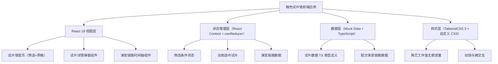
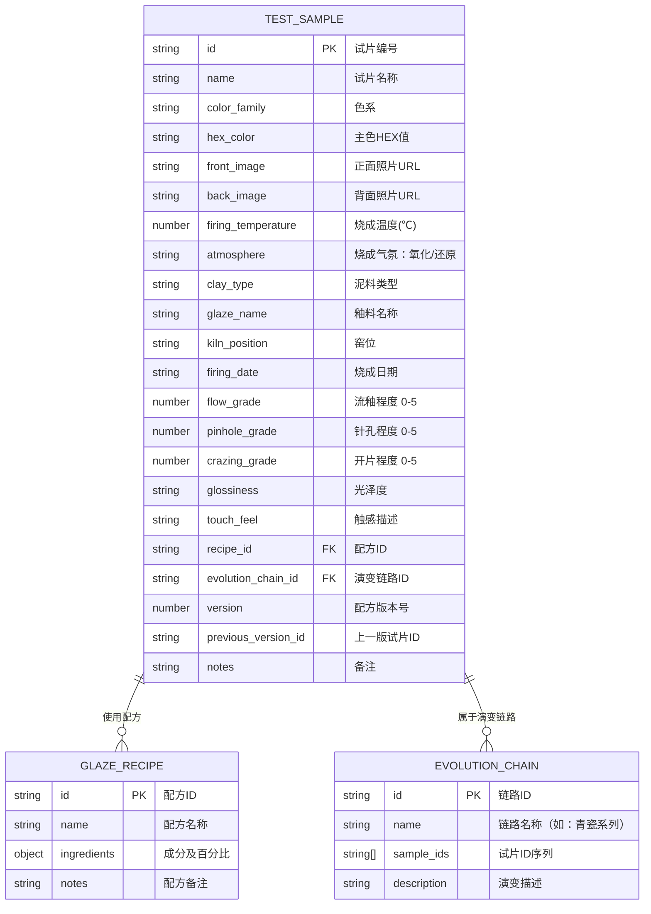

## 1. 架构设计



## 2. 技术描述

- **前端**：React@18 + TypeScript@5 + TailwindCSS@3 + Vite@5
- **初始化工具**：Vite（react-ts 模板）
- **后端**：无（纯前端应用，使用本地 Mock 数据）
- **数据存储**：TypeScript 类型定义的静态 Mock 数据
- **动画库**：Framer Motion（用于卡片动效、弹窗过渡、时间轴动画）
- **图标库**：Lucide React

## 3. 路由定义

| Route | 用途 |
|-------|------|
| / | 试片墙首页（所有功能集中于单页应用，通过弹窗和滚动区域切换视图） |

## 4. 数据模型

### 4.1 数据模型定义



### 4.2 TypeScript 类型定义

```typescript
// 试片表面效果等级（0-5，0=无，5=极严重）
type Grade = 0 | 1 | 2 | 3 | 4 | 5;

// 烧成气氛
type Atmosphere = '氧化' | '还原';

// 色系分类
type ColorFamily = '青瓷系' | '酱釉系' | '蓝釉系' | '白釉系' | '黑釉系' | '花釉系' | '结晶釉系';

// 光泽度
type Glossiness = '哑光' | '半哑光' | '半光泽' | '高光';

// 配方成分
interface RecipeIngredient {
  name: string;
  percentage: number;
}

// 釉料配方
interface GlazeRecipe {
  id: string;
  name: string;
  ingredients: RecipeIngredient[];
  notes?: string;
}

// 试片数据
interface TestSample {
  id: string;
  name: string;
  code: string;
  colorFamily: ColorFamily;
  hexColor: string;
  frontImage: string;
  backImage: string;
  firingTemperature: number;
  atmosphere: Atmosphere;
  clayType: string;
  glazeName: string;
  kilnPosition: string;
  firingDate: string;
  flowGrade: Grade;
  pinholeGrade: Grade;
  crazingGrade: Grade;
  glossiness: Glossiness;
  touchFeel: string;
  recipe: GlazeRecipe;
  evolutionChainId: string;
  version: number;
  previousVersionId?: string;
  nextVersionId?: string;
  notes?: string;
  suitableFor: string[];
}

// 颜色演变链路
interface EvolutionChain {
  id: string;
  name: string;
  description: string;
  sampleIds: string[];
}

// 筛选条件
interface FilterState {
  colorFamily: ColorFamily | '全部';
  temperatureRange: [number, number] | null;
  clayType: string | '全部';
  atmosphere: Atmosphere | '全部';
  kilnPosition: string | '全部';
  searchKeyword: string;
}
```
