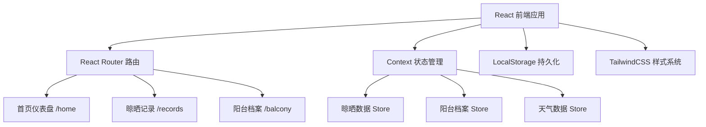
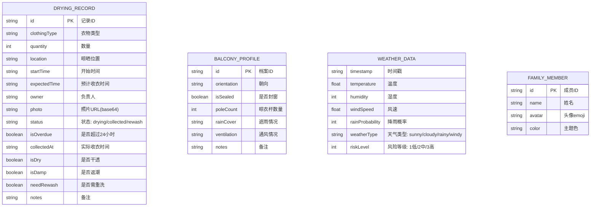

## 1. 架构设计
本项目为纯前端单页应用，使用 LocalStorage 进行数据持久化，天气数据采用模拟数据（无外部API依赖），整体架构简单高效。



## 2. 技术描述
- **前端框架**：React@18 + TypeScript
- **构建工具**：Vite@5
- **样式方案**：TailwindCSS@3
- **路由管理**：React Router DOM@6
- **图标库**：Lucide React
- **状态管理**：React Context + useReducer
- **数据持久化**：LocalStorage（封装自定义Hook）
- **图表方案**：纯CSS实现条形图/进度图，无需额外图表库
- **日期处理**：原生 Date API + 工具函数

## 3. 路由定义
| 路由 | 页面 | 主要用途 |
|------|------|----------|
| `/` 或 `/home` | 首页仪表盘 | 天气风险、当前晾晒、待收衣提醒、成员分工 |
| `/records` | 晾晒记录页 | 新增晾晒、晾晒列表、历史记录、收衣登记 |
| `/balcony` | 阳台档案页 | 查看和编辑阳台基础档案信息 |

## 4. 数据模型

### 4.1 数据模型定义


### 4.2 模拟初始数据
- 预置3-4名家庭成员（爸爸、妈妈、小明、小红）
- 预置3-5条晾晒记录（部分晾晒中，部分历史）
- 预置一份默认阳台档案
- 预置模拟天气数据（含高风险场景用于演示）

## 5. 核心工具函数
| 函数名 | 用途 |
|--------|------|
| `calculateTimeDiff` | 计算晾晒时长，判断是否超24小时 |
| `generateWeatherRisk` | 根据温湿度风速计算风险等级 |
| `formatRelativeTime` | 格式化相对时间（如"2小时前"） |
| `useLocalStorage` | 自定义Hook，读写LocalStorage |
| `getRiskLevelColor` | 根据风险等级返回对应颜色 |
| `getMemberStats` | 统计成员晾晒/收衣次数 |

## 6. 项目目录结构
```
src/
├── components/          # 可复用组件
│   ├── Layout/          # 布局组件（导航、页脚）
│   ├── WeatherCard/     # 天气卡片组件
│   ├── DryingCard/      # 晾晒卡片组件
│   ├── MemberStats/     # 成员统计组件
│   ├── DryingForm/      # 新增晾晒表单
│   ├── CollectModal/    # 收衣登记弹窗
│   └── BalconyCard/     # 阳台档案卡片
├── pages/               # 页面组件
│   ├── Home.tsx         # 首页仪表盘
│   ├── Records.tsx      # 晾晒记录页
│   └── Balcony.tsx      # 阳台档案页
├── context/             # Context 状态管理
│   ├── DryingContext.tsx
│   ├── BalconyContext.tsx
│   └── WeatherContext.tsx
├── hooks/               # 自定义 Hooks
│   └── useLocalStorage.ts
├── utils/               # 工具函数
│   ├── time.ts
│   ├── weather.ts
│   └── stats.ts
├── types/               # TypeScript 类型定义
│   └── index.ts
├── data/                # 初始 Mock 数据
│   └── mockData.ts
├── App.tsx
├── main.tsx
└── index.css
```
