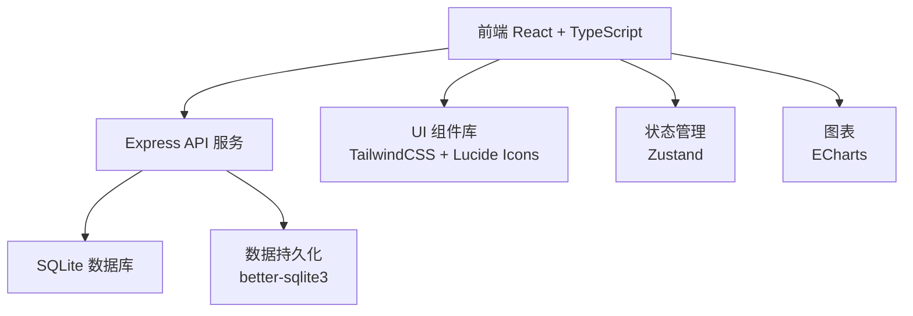
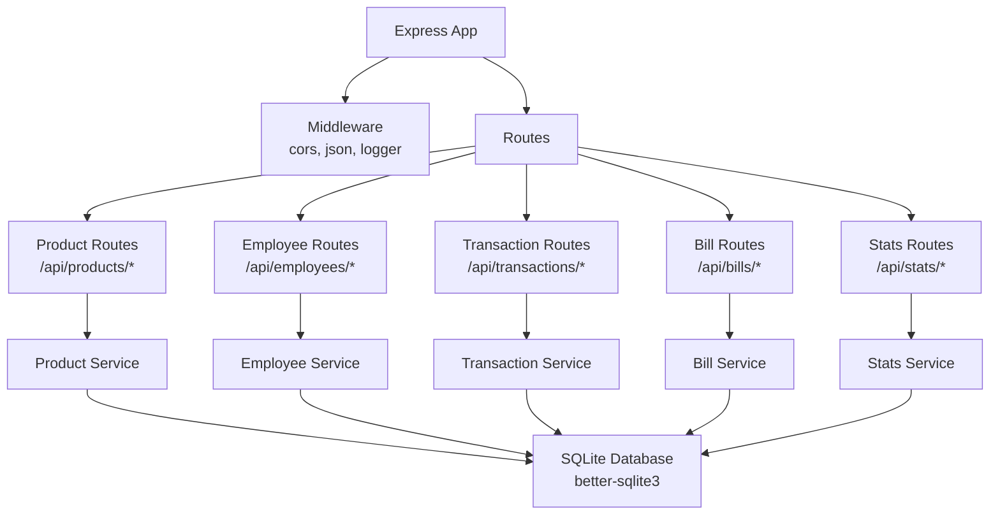
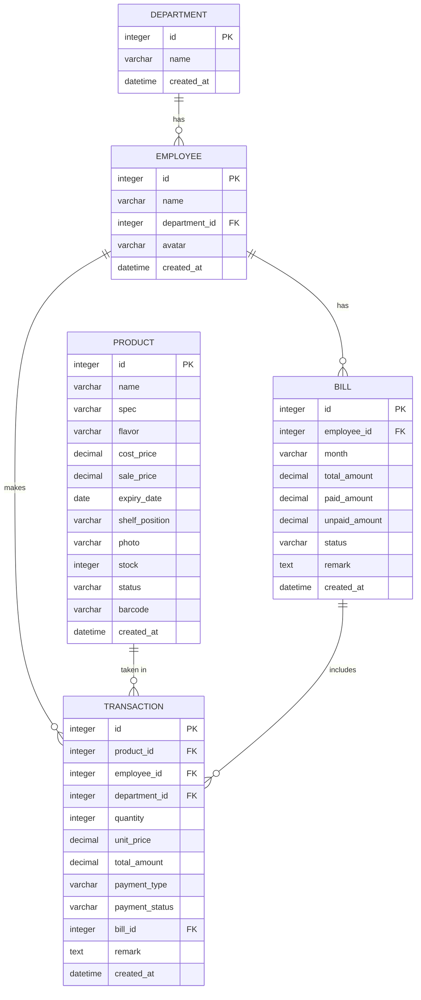

## 1. 架构设计



## 2. 技术描述

- **前端**：React@18 + TypeScript + Vite + TailwindCSS@3 + Zustand + ECharts + lucide-react
- **后端**：Express@4 + TypeScript
- **数据库**：SQLite（轻量级，适合办公室场景，无需额外部署）
- **初始化工具**：vite-init（react-express-ts 模板）
- **Mock 数据**：内置初始化数据，包含商品、员工、部门、取货记录等示例数据

## 3. 路由定义

| 路由路径 | 页面名称 | 说明 |
|----------|----------|------|
| / | 取货结算页 | 首页，扫码/搜索商品，记录取货 |
| /products | 商品管理页 | 商品CRUD，库存管理，上下架 |
| /bills | 账单管理页 | 月度账单，付款状态管理 |
| /stats | 统计分析页 | 热销、部门消费、毛利、欠款排行 |
| /alerts | 预警中心 | 低库存、临期、过期商品提醒 |

## 4. API 定义

### 4.1 商品 API

| 方法 | 路径 | 说明 | 请求体 | 响应 |
|------|------|------|--------|------|
| GET | /api/products | 获取商品列表 | - | Product[] |
| GET | /api/products/:id | 获取商品详情 | - | Product |
| POST | /api/products | 创建商品 | ProductCreate | Product |
| PUT | /api/products/:id | 更新商品 | ProductUpdate | Product |
| DELETE | /api/products/:id | 删除商品 | - | { success: boolean } |
| GET | /api/products/search?q= | 搜索商品 | - | Product[] |
| GET | /api/products/alerts | 获取预警商品 | - | { lowStock: Product[], expiring: Product[], expired: Product[] } |
| POST | /api/products/:id/restock | 补货 | { quantity: number } | Product |

### 4.2 员工 API

| 方法 | 路径 | 说明 | 请求体 | 响应 |
|------|------|------|--------|------|
| GET | /api/employees | 获取员工列表 | - | Employee[] |
| GET | /api/employees/:id | 获取员工详情 | - | Employee |
| POST | /api/employees | 创建员工 | EmployeeCreate | Employee |
| PUT | /api/employees/:id | 更新员工 | EmployeeUpdate | Employee |
| DELETE | /api/employees/:id | 删除员工 | - | { success: boolean } |

### 4.3 取货记录 API

| 方法 | 路径 | 说明 | 请求体 | 响应 |
|------|------|------|--------|------|
| GET | /api/transactions | 获取取货记录 | ?employeeId=&month= | Transaction[] |
| POST | /api/transactions | 创建取货记录 | TransactionCreate | Transaction |
| DELETE | /api/transactions/:id | 撤销取货 | - | { success: boolean } |

### 4.4 账单 API

| 方法 | 路径 | 说明 | 请求体 | 响应 |
|------|------|------|--------|------|
| GET | /api/bills | 获取账单列表 | ?month=&employeeId= | Bill[] |
| GET | /api/bills/:id | 获取账单详情 | - | BillDetail |
| PUT | /api/bills/:id/status | 更新账单状态 | { status: 'paid'|'pending'|'waived', remark?: string } | Bill |
| POST | /api/bills/generate | 生成月度账单 | { month: string } | Bill[] |

### 4.5 统计 API

| 方法 | 路径 | 说明 | 请求体 | 响应 |
|------|------|------|--------|------|
| GET | /api/stats/hot-products | 热销商品 | ?limit=10 | HotProduct[] |
| GET | /api/stats/dept-consumption | 部门消费 | ?month= | DeptConsumption[] |
| GET | /api/stats/profit | 毛利分析 | ?month= | ProfitStats |
| GET | /api/stats/debt-ranking | 欠款排行 | - | DebtRanking[] |
| GET | /api/stats/restock-suggestions | 补货建议 | - | RestockSuggestion[] |

### 4.6 TypeScript 类型定义

```typescript
// shared/types.ts

export interface Product {
  id: number;
  name: string;
  spec: string;
  flavor: string;
  costPrice: number;
  salePrice: number;
  expiryDate: string;
  shelfPosition: string;
  photo: string;
  stock: number;
  status: 'active' | 'offline' | 'expired' | 'damaged';
  barcode: string;
  createdAt: string;
}

export interface ProductCreate {
  name: string;
  spec: string;
  flavor: string;
  costPrice: number;
  salePrice: number;
  expiryDate: string;
  shelfPosition: string;
  photo: string;
  stock: number;
  barcode: string;
}

export interface Department {
  id: number;
  name: string;
}

export interface Employee {
  id: number;
  name: string;
  departmentId: number;
  department?: Department;
  avatar?: string;
}

export interface Transaction {
  id: number;
  productId: number;
  product?: Product;
  employeeId: number;
  employee?: Employee;
  departmentId: number;
  quantity: number;
  unitPrice: number;
  totalAmount: number;
  paymentType: 'monthly' | 'instant';
  paymentStatus: 'paid' | 'pending' | 'waived';
  createdAt: string;
  remark?: string;
}

export interface TransactionCreate {
  items: { productId: number; quantity: number }[];
  employeeId: number;
  departmentId: number;
  paymentType: 'monthly' | 'instant';
}

export interface Bill {
  id: number;
  employeeId: number;
  employee?: Employee;
  month: string;
  totalAmount: number;
  paidAmount: number;
  unpaidAmount: number;
  status: 'paid' | 'pending' | 'partial' | 'waived';
  transactions?: Transaction[];
  remark?: string;
  createdAt: string;
}

export interface BillDetail extends Bill {
  transactions: Transaction[];
}

export interface HotProduct {
  productId: number;
  productName: string;
  totalQuantity: number;
  totalAmount: number;
}

export interface DeptConsumption {
  departmentId: number;
  departmentName: string;
  totalAmount: number;
  transactionCount: number;
}

export interface ProfitStats {
  totalRevenue: number;
  totalCost: number;
  totalProfit: number;
  profitMargin: number;
  monthlyData: { month: string; revenue: number; cost: number; profit: number }[];
}

export interface DebtRanking {
  employeeId: number;
  employeeName: string;
  departmentName: string;
  totalDebt: number;
  billCount: number;
}

export interface RestockSuggestion {
  productId: number;
  productName: string;
  currentStock: number;
  avgMonthlySales: number;
  suggestedQuantity: number;
}
```

## 5. 服务器架构图



## 6. 数据模型

### 6.1 ER 图



### 6.2 DDL 语句

```sql
-- 部门表
CREATE TABLE IF NOT EXISTS departments (
  id INTEGER PRIMARY KEY AUTOINCREMENT,
  name VARCHAR(50) NOT NULL,
  created_at DATETIME DEFAULT CURRENT_TIMESTAMP
);

-- 员工表
CREATE TABLE IF NOT EXISTS employees (
  id INTEGER PRIMARY KEY AUTOINCREMENT,
  name VARCHAR(50) NOT NULL,
  department_id INTEGER NOT NULL,
  avatar VARCHAR(255),
  created_at DATETIME DEFAULT CURRENT_TIMESTAMP,
  FOREIGN KEY (department_id) REFERENCES departments(id)
);

-- 商品表
CREATE TABLE IF NOT EXISTS products (
  id INTEGER PRIMARY KEY AUTOINCREMENT,
  name VARCHAR(100) NOT NULL,
  spec VARCHAR(50),
  flavor VARCHAR(50),
  cost_price DECIMAL(10,2) NOT NULL,
  sale_price DECIMAL(10,2) NOT NULL,
  expiry_date DATE,
  shelf_position VARCHAR(50),
  photo VARCHAR(255),
  stock INTEGER DEFAULT 0,
  status VARCHAR(20) DEFAULT 'active',
  barcode VARCHAR(50),
  created_at DATETIME DEFAULT CURRENT_TIMESTAMP
);

CREATE INDEX IF NOT EXISTS idx_products_barcode ON products(barcode);
CREATE INDEX IF NOT EXISTS idx_products_status ON products(status);
CREATE INDEX IF NOT EXISTS idx_products_expiry ON products(expiry_date);

-- 取货记录表
CREATE TABLE IF NOT EXISTS transactions (
  id INTEGER PRIMARY KEY AUTOINCREMENT,
  product_id INTEGER NOT NULL,
  employee_id INTEGER NOT NULL,
  department_id INTEGER NOT NULL,
  quantity INTEGER NOT NULL,
  unit_price DECIMAL(10,2) NOT NULL,
  total_amount DECIMAL(10,2) NOT NULL,
  payment_type VARCHAR(20) NOT NULL DEFAULT 'monthly',
  payment_status VARCHAR(20) NOT NULL DEFAULT 'pending',
  bill_id INTEGER,
  remark TEXT,
  created_at DATETIME DEFAULT CURRENT_TIMESTAMP,
  FOREIGN KEY (product_id) REFERENCES products(id),
  FOREIGN KEY (employee_id) REFERENCES employees(id),
  FOREIGN KEY (department_id) REFERENCES departments(id),
  FOREIGN KEY (bill_id) REFERENCES bills(id)
);

CREATE INDEX IF NOT EXISTS idx_transactions_employee ON transactions(employee_id);
CREATE INDEX IF NOT EXISTS idx_transactions_product ON transactions(product_id);
CREATE INDEX IF NOT EXISTS idx_transactions_created ON transactions(created_at);
CREATE INDEX IF NOT EXISTS idx_transactions_bill ON transactions(bill_id);

-- 账单表
CREATE TABLE IF NOT EXISTS bills (
  id INTEGER PRIMARY KEY AUTOINCREMENT,
  employee_id INTEGER NOT NULL,
  month VARCHAR(7) NOT NULL,
  total_amount DECIMAL(10,2) NOT NULL DEFAULT 0,
  paid_amount DECIMAL(10,2) NOT NULL DEFAULT 0,
  unpaid_amount DECIMAL(10,2) NOT NULL DEFAULT 0,
  status VARCHAR(20) NOT NULL DEFAULT 'pending',
  remark TEXT,
  created_at DATETIME DEFAULT CURRENT_TIMESTAMP,
  FOREIGN KEY (employee_id) REFERENCES employees(id)
);

CREATE UNIQUE INDEX IF NOT EXISTS idx_bills_employee_month ON bills(employee_id, month);
CREATE INDEX IF NOT EXISTS idx_bills_status ON bills(status);
```

### 6.3 初始化数据

```sql
-- 部门初始数据
INSERT INTO departments (name) VALUES 
('技术部'), ('产品部'), ('设计部'), ('市场部'), ('行政部');

-- 员工初始数据
INSERT INTO employees (name, department_id) VALUES 
('张三', 1), ('李四', 1), ('王五', 2), ('赵六', 2), 
('钱七', 3), ('孙八', 4), ('周九', 5), ('吴十', 1);

-- 商品初始数据
INSERT INTO products (name, spec, flavor, cost_price, sale_price, expiry_date, shelf_position, photo, stock, barcode) VALUES 
('乐事薯片', '75g', '原味', 5.5, 8.0, '2026-12-31', 'A1-01', '/images/chips1.jpg', 20, '6924743915701'),
('乐事薯片', '75g', '番茄味', 5.5, 8.0, '2026-11-15', 'A1-02', '/images/chips2.jpg', 15, '6924743915702'),
('乐事薯片', '75g', '黄瓜味', 5.5, 8.0, '2026-10-20', 'A1-03', '/images/chips3.jpg', 3, '6924743915703'),
('奥利奥饼干', '116g', '原味', 6.0, 9.9, '2027-01-10', 'A2-01', '/images/oreo1.jpg', 25, '6901668002471'),
('奥利奥饼干', '116g', '巧克力味', 6.0, 9.9, '2026-09-05', 'A2-02', '/images/oreo2.jpg', 8, '6901668002472'),
('怡宝矿泉水', '555ml', '原味', 1.0, 2.0, '2027-06-01', 'B1-01', '/images/water.jpg', 50, '6901285991219'),
('旺仔牛奶', '245ml', '原味', 3.5, 5.0, '2026-08-15', 'B1-02', '/images/wangzai.jpg', 4, '6920459950581'),
('士力架', '51g', '花生夹心', 3.0, 5.5, '2026-07-01', 'A3-01', '/images/snickers.jpg', 2, '6923018811515'),
('可口可乐', '330ml', '原味', 1.8, 3.5, '2026-12-01', 'B2-01', '/images/coke.jpg', 30, '5000112637939'),
('三只松鼠坚果', '175g', '每日坚果', 15.0, 22.0, '2026-11-20', 'A4-01', '/images/nuts.jpg', 12, '6956511234567');
```
