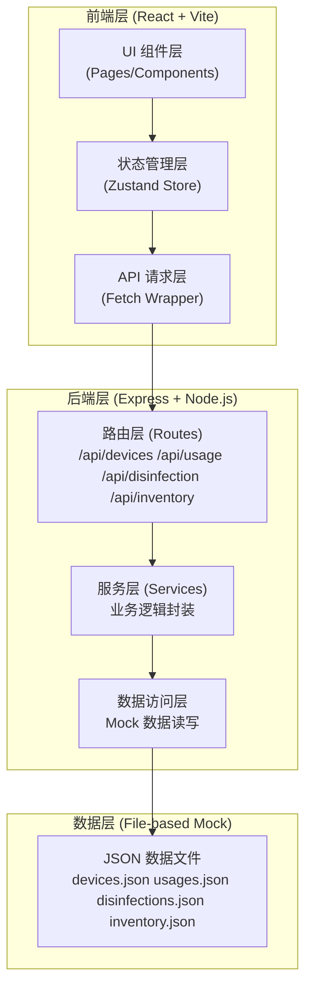
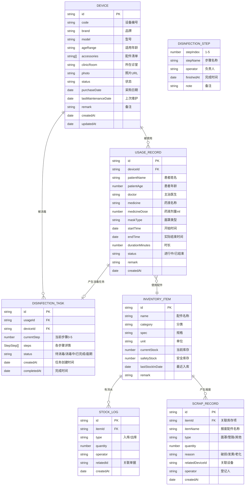

## 1. 架构设计



## 2. 技术描述

- **前端框架**：React@18 + TypeScript@5
- **构建工具**：Vite@5
- **CSS 框架**：TailwindCSS@3
- **状态管理**：Zustand@4
- **路由管理**：React Router DOM@6
- **图标库**：lucide-react@0.344
- **图表库**：recharts@2（轻量级 React 图表）
- **初始化工具**：vite-init 脚手架
- **后端框架**：Express@4（同构 TypeScript）
- **数据存储**：本地 JSON 文件 Mock（无需数据库）
- **包管理器**：pnpm（优先）/ npm

## 3. 路由定义

| 路由 (前端) | 页面组件 | 功能说明 |
|-------------|----------|----------|
| `/dashboard` | DashboardPage | 数据看板首页，所有统计概览 |
| `/devices` | DeviceListPage | 设备档案列表 |
| `/devices/new` | DeviceFormPage | 新增设备 |
| `/devices/:id` | DeviceDetailPage | 设备详情页 |
| `/devices/:id/edit` | DeviceFormPage | 编辑设备 |
| `/usage` | UsageListPage | 使用记录列表 |
| `/usage/new` | UsageFormPage | 新建使用记录 |
| `/usage/:id` | UsageDetailPage | 使用记录详情 |
| `/disinfection` | DisinfectionQueuePage | 消毒队列（待消毒） |
| `/disinfection/:id` | DisinfectionProcessPage | 消毒步骤执行 |
| `/disinfection/records` | DisinfectionRecordsPage | 消毒历史记录 |
| `/inventory` | InventoryPage | 配件库存管理 |
| `/inventory/scrap` | ScrapRecordPage | 报废登记与记录 |

## 4. API 定义（后端）

### 4.1 通用响应格式

```typescript
interface ApiResponse<T> {
  success: boolean;
  data: T;
  message?: string;
  total?: number;
}
```

### 4.2 设备管理接口

| Method | Path | 说明 | 请求体 / 参数 |
|--------|------|------|--------------|
| GET | `/api/devices` | 设备列表 | Query: status, clinicRoom, keyword, page, pageSize |
| GET | `/api/devices/:id` | 设备详情 | - |
| POST | `/api/devices` | 新增设备 | DeviceCreateDto |
| PUT | `/api/devices/:id` | 更新设备 | DeviceUpdateDto |
| PATCH | `/api/devices/:id/status` | 更新设备状态 | { status: DeviceStatus } |
| DELETE | `/api/devices/:id` | 删除（报废）设备 | - |

### 4.3 使用记录接口

| Method | Path | 说明 | 请求体 / 参数 |
|--------|------|------|--------------|
| GET | `/api/usages` | 使用记录列表 | Query: deviceId, date, doctor, patient, page, pageSize |
| GET | `/api/usages/:id` | 使用详情 | - |
| POST | `/api/usages` | 新建使用记录 | UsageCreateDto |
| PATCH | `/api/usages/:id/end` | 结束使用 | { actualEndTime: string } |

### 4.4 消毒管理接口

| Method | Path | 说明 | 请求体 / 参数 |
|--------|------|------|--------------|
| GET | `/api/disinfection/queue` | 待消毒队列 | - |
| GET | `/api/disinfection/records` | 消毒记录 | Query: deviceId, date, staff, page, pageSize |
| GET | `/api/disinfection/:id` | 消毒任务详情 | - |
| POST | `/api/disinfection/start` | 开始消毒任务 | { usageId: string } |
| PATCH | `/api/disinfection/:id/step` | 更新消毒步骤 | { step: number, staff: string, note?: string } |
| POST | `/api/disinfection/:id/complete` | 完成全部消毒 | - |

### 4.5 库存管理接口

| Method | Path | 说明 | 请求体 / 参数 |
|--------|------|------|--------------|
| GET | `/api/inventory` | 库存列表 | - |
| POST | `/api/inventory/:id/stock-in` | 入库 | { quantity: number, operator: string, batch?: string } |
| POST | `/api/inventory/:id/stock-out` | 出库 | { quantity: number, operator: string, usageId?: string } |
| GET | `/api/scrap` | 报废记录列表 | Query: type, date, page, pageSize |
| POST | `/api/scrap` | 新增报废记录 | ScrapCreateDto |

## 5. 数据模型

### 5.1 ER 图



### 5.2 状态枚举定义

```typescript
enum DeviceStatus {
  AVAILABLE = 'available',        // 可用
  IN_USE = 'in_use',              // 使用中
  PENDING_DISINFECTION = 'pending_dis', // 待消毒
  DISINFECTING = 'disinfecting',  // 消毒中
  SCRAPPED = 'scrapped'           // 已报废
}

enum DisinfectionStepName {
  CLEANING = 'cleaning',          // 清洗
  SOAKING = 'soaking',            // 浸泡消毒
  RINSING = 'rinsing',            // 冲洗
  DRYING = 'drying',              // 晾干
  STORING = 'storing'             // 收纳
}

enum MaskType {
  ADULT = 'adult',                // 成人面罩
  CHILD = 'child',                // 儿童面罩
  INFANT = 'infant'               // 婴幼儿面罩
}
```

### 5.3 Mock 初始数据

预置以下模拟数据用于演示：
- 8台雾化设备，覆盖4个诊室
- 15条使用记录（含进行中、已结束）
- 12条消毒任务（含待消毒、消毒中、已完成、逾期）
- 10项库存（含面罩、管路、药液等）
- 5条报废记录
- 逾期阈值：设备使用结束后超过2小时未开始消毒标记为逾期
