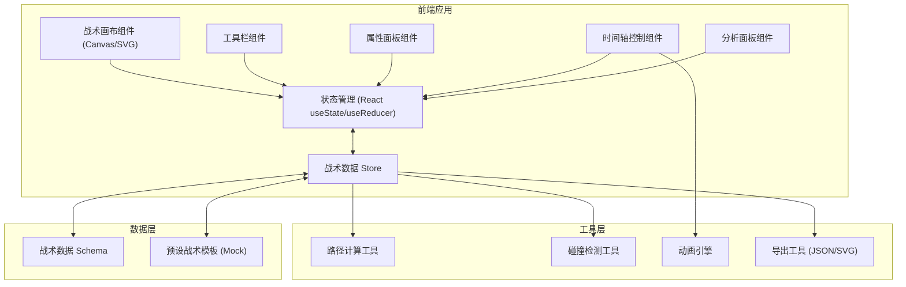
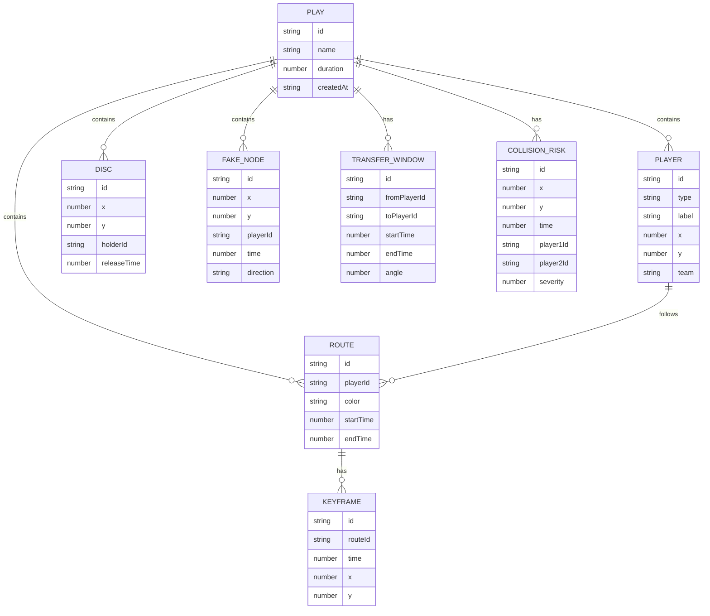

## 1. 架构设计



## 2. 技术描述

- **前端框架**：React@18 + TypeScript + Vite
- **样式方案**：TailwindCSS@3
- **画布渲染**：原生 SVG + React 组件（轻量、可交互、易导出）
- **动画引擎**：requestAnimationFrame + 自定义插值计算
- **状态管理**：React useReducer + Context（轻量状态机）
- **图标**：Lucide React
- **字体**：Google Fonts (Rajdhani + Roboto Mono)
- **后端**：无后端，纯前端应用
- **数据持久化**：localStorage 存储战术方案

## 3. 路由定义

| 路由 | 用途 |
|-------|---------|
| / | 战术跑位板主页面 |

## 4. 数据模型

### 4.1 数据模型定义



### 4.2 TypeScript 类型定义

```typescript
interface Point {
  x: number;
  y: number;
}

type PlayerType = 'offense' | 'defense';

interface Player {
  id: string;
  type: PlayerType;
  label: string;
  startPosition: Point;
}

interface Disc {
  id: string;
  position: Point;
  holderId: string | null;
  releaseTime: number;
}

interface Keyframe {
  id: string;
  time: number;
  position: Point;
}

interface Route {
  id: string;
  playerId: string;
  keyframes: Keyframe[];
  color: string;
}

interface FakeNode {
  id: string;
  playerId: string;
  position: Point;
  time: number;
  direction: 'left' | 'right' | 'in' | 'out';
}

interface TransferWindow {
  id: string;
  fromId: string;
  toId: string;
  startTime: number;
  endTime: number;
  quality: 'good' | 'great' | 'excellent';
}

interface CollisionRisk {
  id: string;
  position: Point;
  time: number;
  playerIds: [string, string];
  severity: 'low' | 'medium' | 'high';
}

interface Play {
  id: string;
  name: string;
  duration: number;
  players: Player[];
  disc: Disc;
  routes: Route[];
  fakeNodes: FakeNode[];
  transferWindows: TransferWindow[];
  collisionRisks: CollisionRisk[];
}

type Tool = 'select' | 'offense' | 'defense' | 'disc' | 'route' | 'fake';

interface EditorState {
  currentTool: Tool;
  selectedId: string | null;
  isPlaying: boolean;
  currentTime: number;
  playbackSpeed: number;
  play: Play;
}
```

## 5. 组件结构

```
src/
├── components/
│   ├── Canvas/
│   │   ├── Field.tsx          # 飞盘场地背景
│   │   ├── Player.tsx         # 队员元素
│   │   ├── Disc.tsx           # 飞盘元素
│   │   ├── RoutePath.tsx      # 跑位路线
│   │   ├── FakeNode.tsx       # 假动作节点
│   │   ├── TransferWindow.tsx # 传盘窗口
│   │   ├── CollisionMarker.tsx# 撞线标记
│   │   └── TacticsCanvas.tsx  # 主画布容器
│   ├── Toolbar/
│   │   ├── ToolButton.tsx
│   │   └── Toolbar.tsx
│   ├── PropertiesPanel/
│   │   ├── PlayerProperties.tsx
│   │   └── PropertiesPanel.tsx
│   ├── Timeline/
│   │   ├── PlayControls.tsx
│   │   ├── KeyframeMarker.tsx
│   │   └── Timeline.tsx
│   └── AnalysisPanel/
│       ├── StatCard.tsx
│       └── AnalysisPanel.tsx
├── hooks/
│   ├── usePlayback.ts         # 播放控制 hook
│   ├── useTacticsStore.ts     # 战术数据管理
│   └── useCanvasInteraction.ts # 画布交互
├── utils/
│   ├── pathCalculations.ts    # 路径插值计算
│   ├── collisionDetection.ts  # 碰撞检测
│   ├── analysis.ts            # 战术分析算法
│   └── export.ts              # 导出工具
├── data/
│   └── mockTactics.ts         # 预设战术模板
├── types/
│   └── index.ts               # 类型定义
├── App.tsx
└── main.tsx
```

## 6. 核心算法

### 6.1 路径插值
- 使用三次贝塞尔曲线或线性插值计算队员在任意时刻的位置
- 基于关键帧时间戳进行分段插值

### 6.2 传盘窗口计算
- 检测接盘手与防守队员的距离
- 评估接盘手是否处于空位
- 计算传盘角度和距离

### 6.3 空档形成时间
- 统计进攻队员周围一定半径内无防守队员的持续时间
- 标记空档出现和消失的时间点

### 6.4 撞线检测
- 计算不同队员运动轨迹的交叉点
- 评估到达交叉点的时间差
- 时间差小于阈值则标记为撞线风险
