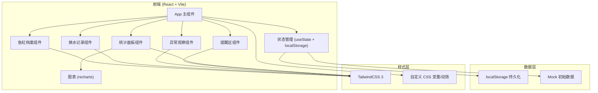
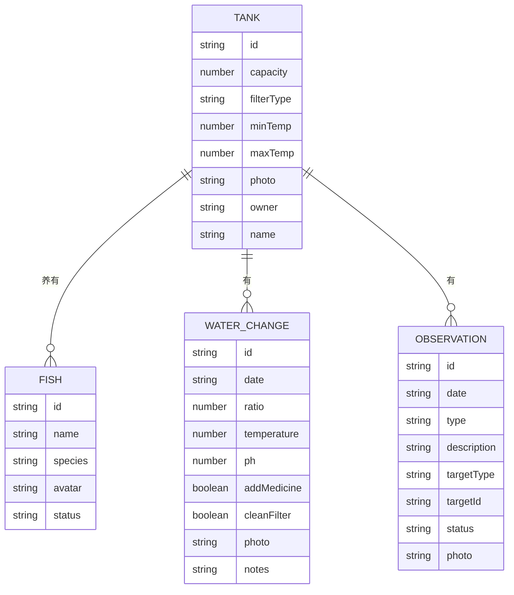

# 鱼缸护理页面技术架构文档

## 1. 架构设计


## 2. 技术描述
- **前端框架**：React@18 + TypeScript
- **构建工具**：Vite@5
- **样式方案**：TailwindCSS@3
- **图表库**：recharts@2
- **图标库**：lucide-react
- **状态管理**：React useState + useReducer，数据持久化到 localStorage
- **后端**：无后端，纯前端应用 + localStorage
- **数据来源**：内置 Mock 数据

## 3. 页面路由
| 路由 | 用途 |
|------|------|
| / | 主页面（单页应用，所有模块在同一页面） |

## 4. 数据模型

### 4.1 数据模型定义


### 4.2 数据类型定义 (TypeScript)

```typescript
// 鱼缸档案
interface Tank {
  id: string;
  name: string;
  capacity: number;        // 升
  filterType: string;      // 过滤类型
  minTemp: number;         // 最低水温
  maxTemp: number;         // 最高水温
  photo: string;           // 设备照片
  owner: string;           // 负责人
  lastWaterChange: string; // 上次换水日期
  waterChangeInterval: number; // 换水间隔天数
}

// 鱼只
interface Fish {
  id: string;
  name: string;
  species: string;  // 品种
  avatar: string;   // emoji 或图片
  addedDate: string;
  status: 'healthy' | 'sick' | 'quarantine';
}

// 换水记录
interface WaterChangeRecord {
  id: string;
  date: string;
  ratio: number;           // 换水比例 %
  temperature: number;     // 水温
  ph: number;              // PH值
  addMedicine: boolean;    // 是否加药
  medicineName?: string;   // 药品名称
  cleanFilter: boolean;    // 是否清洗滤棉
  photo?: string;          // 现场照片
  notes?: string;          // 备注
}

// 异常观察
interface Observation {
  id: string;
  date: string;
  type: 'white_spot' | 'bottom_sitting' | 'filter_noise' | 'other';
  typeLabel: string;
  description: string;
  targetType: 'fish' | 'equipment' | 'water';
  targetId?: string;       // 关联的鱼或设备ID
  targetName: string;      // 关联对象名称
  status: 'pending' | 'recovering' | 'resolved';
  photo?: string;
}

// 提醒
interface Reminder {
  id: string;
  type: 'water_change_overdue' | 'temp_abnormal' | 'consecutive_issues';
  title: string;
  description: string;
  level: 'warning' | 'danger';
  days?: number;
}
```

## 5. 模块划分

```
src/
├── components/
│   ├── TankProfile.tsx      # 鱼缸档案
│   ├── WaterChangeList.tsx  # 换水记录列表
│   ├── WaterChangeForm.tsx  # 新增换水记录表单
│   ├── ObservationList.tsx  # 异常观察列表
│   ├── ObservationForm.tsx  # 新增异常观察表单
│   ├── ReminderPanel.tsx    # 提醒区
│   └── StatsPanel.tsx       # 统计面板
├── data/
│   └── mockData.ts          # Mock 数据
├── hooks/
│   └── useLocalStorage.ts   # localStorage 自定义 Hook
├── types/
│   └── index.ts             # TypeScript 类型定义
├── utils/
│   └── stats.ts             # 统计计算工具
├── App.tsx
├── main.tsx
└── index.css
```

## 6. 关键实现点

1. **提醒逻辑**：
   - 超期未换水：当前日期 - 上次换水日期 > 换水间隔
   - 温度异常：最新水温超出鱼缸温度范围
   - 连续异常：最近7天内有3条及以上未解决的异常观察

2. **统计计算**：
   - 每月换水次数：按月份分组统计
   - 水质波动：PH值标准差、温度波动范围
   - 最常出问题的鱼：按鱼统计异常观察数量排序

3. **数据持久化**：
   - 使用 localStorage 存储所有数据
   - 首次加载若无数据则使用 Mock 数据初始化
