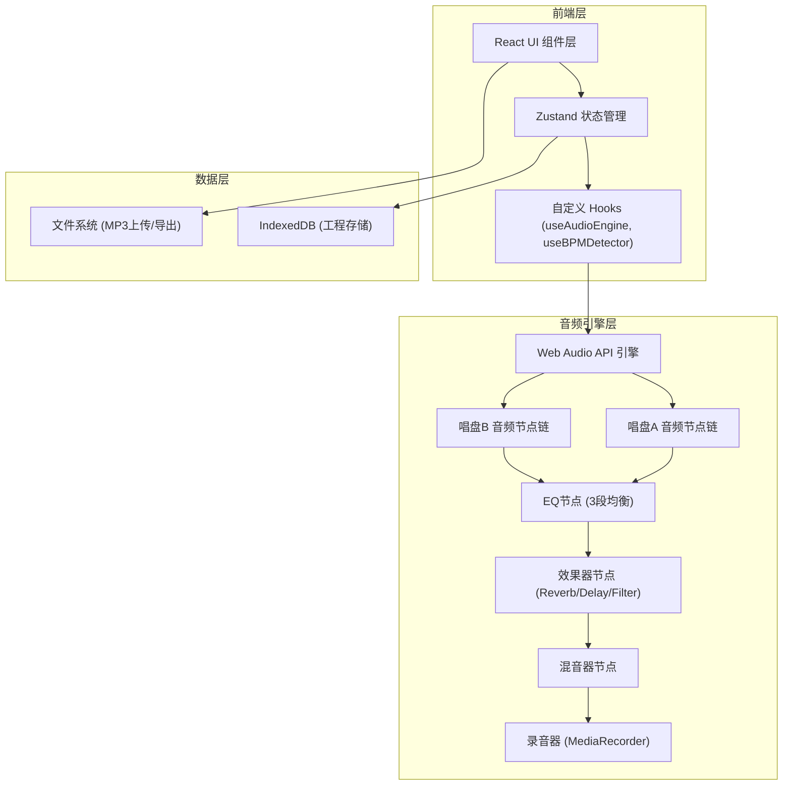

## 1. 架构设计



## 2. 技术描述

- **前端框架**: React@18 + TypeScript
- **构建工具**: Vite@5
- **样式方案**: TailwindCSS@3
- **状态管理**: Zustand
- **图标库**: Lucide React
- **音频核心**: Web Audio API (原生)
- **BPM检测**: 自定义Web Audio API实现（自相关算法）
- **录音导出**: MediaRecorder API + lamejs (MP3编码)
- **数据存储**: IndexedDB (idb库封装)
- **后端**: 无（纯前端应用）

## 3. 项目结构

```
src/
├── components/
│   ├── Deck.tsx              # 唱盘组件
│   ├── Mixer.tsx             # 混音台组件
│   ├── Crossfader.tsx        # 交叉推子组件
│   ├── VolumeFader.tsx       # 音量推子组件
│   ├── EQKnob.tsx            # EQ旋钮组件
│   ├── EffectsPanel.tsx      # 效果器面板
│   ├── LoopControls.tsx      # 循环控制
│   ├── CueButtons.tsx        # Cue点按钮
│   ├── Waveform.tsx          # 波形显示
│   ├── BPMDisplay.tsx        # BPM显示器
│   ├── PitchSlider.tsx       # Pitch滑块
│   ├── RecordButton.tsx      # 录音按钮
│   └── ProjectManager.tsx    # 工程管理器
├── hooks/
│   ├── useAudioEngine.ts     # 音频引擎Hook
│   ├── useBPMDetector.ts     # BPM检测Hook
│   ├── useDeck.ts            # 单唱盘控制Hook
│   └── useIndexedDB.ts       # IndexedDB Hook
├── store/
│   └── useDJStore.ts         # Zustand状态管理
├── utils/
│   ├── audioEngine.ts        # Web Audio API 封装
│   ├── bpmDetector.ts        # BPM检测算法
│   ├── effects.ts            # 效果器节点创建
│   ├── mp3Encoder.ts         # MP3编码工具
│   └── storage.ts            # IndexedDB操作
├── types/
│   └── index.ts              # 类型定义
├── App.tsx
├── main.tsx
└── index.css
```

## 4. 核心类型定义

```typescript
// 唱盘状态
interface DeckState {
  id: 'A' | 'B';
  audioBuffer: AudioBuffer | null;
  fileName: string;
  isPlaying: boolean;
  currentTime: number;
  duration: number;
  volume: number;
  bpm: number;
  detectedBPM: number;
  pitch: number;
  cuePoints: number[];
  loopEnabled: boolean;
  loopStart: number;
  loopEnd: number;
  loopBeats: 1 | 2 | 4 | 8;
  eq: { low: number; mid: number; high: number };
  effects: {
    reverb: number;
    delay: number;
    filter: number;
    filterType: 'lowpass' | 'highpass';
  };
}

// 混音器状态
interface MixerState {
  crossfader: number;
  masterVolume: number;
  isRecording: boolean;
  recordedBlob: Blob | null;
}

// 工程数据
interface DJProject {
  id: string;
  name: string;
  createdAt: number;
  updatedAt: number;
  deckA: {
    fileName: string;
    audioData: ArrayBuffer;
    cuePoints: number[];
    bpm: number;
  };
  deckB: {
    fileName: string;
    audioData: ArrayBuffer;
    cuePoints: number[];
    bpm: number;
  };
}
```

## 5. 音频信号链

```
唱盘A: Source → Gain(音量) → EQ(3段) → Effects(Reverb/Delay/Filter) → Gain(交叉推子A) → 
唱盘B: Source → Gain(音量) → EQ(3段) → Effects(Reverb/Delay/Filter) → Gain(交叉推子B) → 
    → Master Gain → Analyser(波形/电平) → Destination(扬声器) + MediaRecorder(录音)
```
