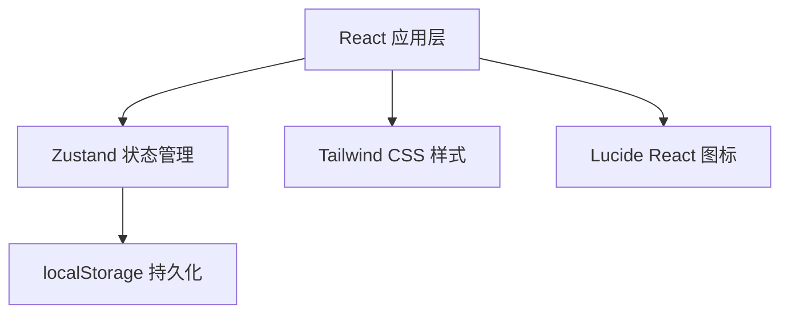
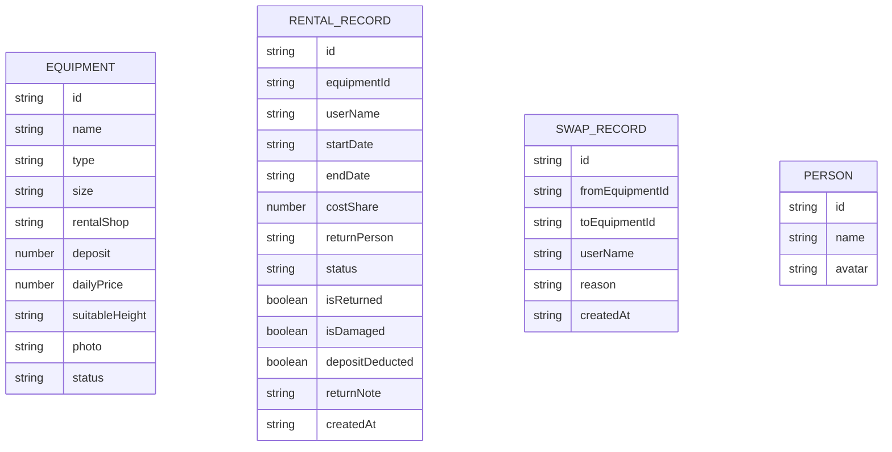

## 1. 架构设计

纯前端单页应用，使用 React + TypeScript + Vite 构建，状态管理使用 Zustand，数据持久化使用 localStorage。无后端服务，所有数据存储在浏览器本地。



## 2. 技术描述

- **前端框架**：React@18 + TypeScript
- **构建工具**：Vite@5
- **样式方案**：Tailwind CSS@3
- **状态管理**：Zustand
- **路由**：React Router DOM@6
- **图标库**：Lucide React
- **数据存储**：localStorage（本地存储，无后端）
- **初始化工具**：vite-init

## 3. 路由定义

| 路由 | 页面 | 用途 |
|------|------|------|
| / | 装备列表页 | 展示所有装备卡片，支持筛选和认领操作 |
| /return | 归还管理页 | 待归还装备列表，执行归还操作 |
| /stats | 费用统计页 | 人员费用统计、未归还清单、扣押金记录 |

## 4. 数据模型

### 4.1 数据模型定义



### 4.2 类型定义

```typescript
// 装备类型
type EquipmentType = 'snowboard' | 'ski' | 'helmet' | 'goggles' | 'gloves' | 'boots' | 'jacket' | 'pants';

// 装备状态
type EquipmentStatus = 'available' | 'rented' | 'returned';

// 装备
interface Equipment {
  id: string;
  name: string;
  type: EquipmentType;
  size: string;
  rentalShop: string;
  deposit: number;
  dailyPrice: number;
  suitableHeight: string;
  photo: string;
  status: EquipmentStatus;
}

// 租赁记录
interface RentalRecord {
  id: string;
  equipmentId: string;
  userName: string;
  startDate: string;
  endDate: string;
  costShare: number; // 费用分摊比例 0-100
  returnPerson: string;
  status: 'active' | 'returned';
  isReturned: boolean;
  isDamaged: boolean;
  depositDeducted: boolean;
  depositDeductionAmount?: number;
  returnNote?: string;
  createdAt: string;
  returnedAt?: string;
}

// 换装备记录
interface SwapRecord {
  id: string;
  fromEquipmentId: string;
  toEquipmentId: string;
  userName: string;
  reason: string;
  createdAt: string;
}

// 人员
interface Person {
  id: string;
  name: string;
  avatar?: string;
}

// 费用统计
interface PersonCost {
  personName: string;
  totalRent: number;
  totalDeposit: number;
  depositDeducted: number;
  netPayable: number;
  equipments: string[];
}
```

## 5. 项目结构

```
src/
├── components/          # 组件
│   ├── EquipmentCard.tsx      # 装备卡片
│   ├── RentalModal.tsx        # 认领弹窗
│   ├── ReturnModal.tsx        # 归还弹窗
│   ├── NavBar.tsx             # 导航栏
│   ├── FilterBar.tsx          # 筛选栏
│   └── StatCard.tsx           # 统计卡片
├── pages/               # 页面
│   ├── EquipmentList.tsx      # 装备列表页
│   ├── ReturnManage.tsx       # 归还管理页
│   └── Statistics.tsx         # 费用统计页
├── store/               # 状态管理
│   └── useStore.ts            # Zustand store
├── types/               # 类型定义
│   └── index.ts               # 所有类型
├── utils/               # 工具函数
│   ├── costCalculator.ts      # 费用计算
│   └── mockData.ts            # Mock 数据
├── App.tsx              # 根组件
├── main.tsx             # 入口
└── index.css            # 全局样式
```
