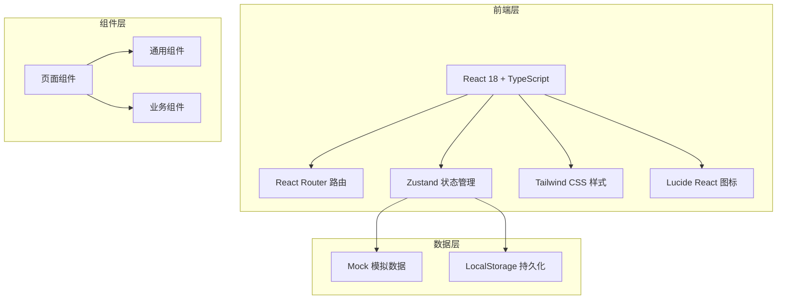
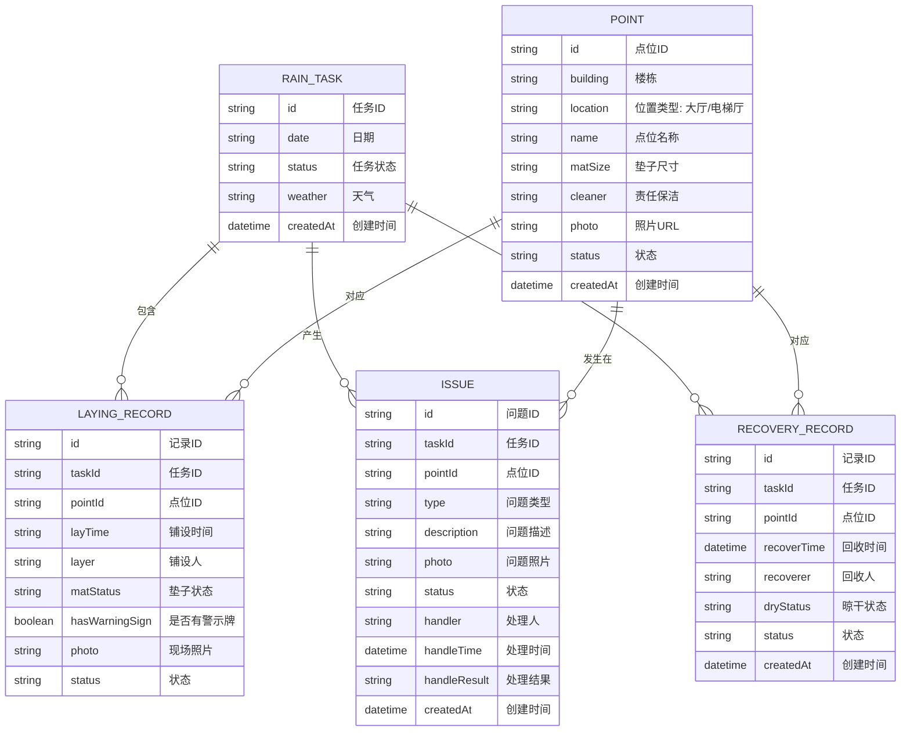

# 防滑垫铺设看板系统 - 技术架构文档

## 1. 架构设计



## 2. 技术描述

- **前端框架**：React@18 + TypeScript + Vite
- **路由管理**：react-router-dom@6
- **状态管理**：zustand
- **样式方案**：tailwindcss@3
- **图标库**：lucide-react
- **构建工具**：Vite
- **包管理器**：npm
- **数据方案**：Mock 数据 + LocalStorage 持久化

## 3. 路由定义

| 路由 | 页面 | 说明 |
|------|------|------|
| / | 总览看板 | 数据概览、快捷操作、问题分布 |
| /points | 点位档案 | 点位列表、新增、编辑、详情 |
| /tasks | 雨天任务 | 铺设任务看板、铺设记录、问题标记 |
| /issues | 问题处理 | 问题列表、问题处理 |
| /recovery | 回收管理 | 回收列表、回收记录、晾干状态 |
| /statistics | 数据统计 | 完成率、区域分析、响应时间 |

## 4. 数据模型

### 4.1 数据模型定义



### 4.2 数据类型定义

```typescript
// 点位类型
interface Point {
  id: string;
  building: string;
  location: string;
  name: string;
  matSize: string;
  cleaner: string;
  photo: string;
  status: 'active' | 'inactive';
  createdAt: string;
}

// 雨天任务
interface RainTask {
  id: string;
  date: string;
  status: 'pending' | 'in_progress' | 'completed' | 'recovered';
  weather: string;
  createdAt: string;
}

// 铺设记录
interface LayingRecord {
  id: string;
  taskId: string;
  pointId: string;
  layTime: string;
  layer: string;
  matStatus: 'good' | 'curled' | 'wet' | 'dirty';
  hasWarningSign: boolean;
  photo: string;
  status: 'pending' | 'laid' | 'checked';
}

// 问题记录
interface Issue {
  id: string;
  taskId: string;
  pointId: string;
  type: 'curled' | 'water' | 'dirty';
  description: string;
  photo: string;
  status: 'pending' | 'processing' | 'resolved';
  handler?: string;
  handleTime?: string;
  handleResult?: string;
  createdAt: string;
}

// 回收记录
interface RecoveryRecord {
  id: string;
  taskId: string;
  pointId: string;
  recoverTime: string;
  recoverer: string;
  dryStatus: 'pending' | 'drying' | 'dry' | 'stored';
  status: 'pending' | 'recovered';
  createdAt: string;
}
```

## 5. 目录结构

```
src/
├── components/          # 通用组件
│   ├── Layout/          # 布局组件
│   ├── Card/            # 卡片组件
│   ├── StatusBadge/       # 状态标签
│   └── Modal/           # 弹窗组件
├── pages/               # 页面组件
│   ├── Dashboard/       # 总览看板
│   ├── Points/          # 点位档案
│   ├── Tasks/           # 雨天任务
│   ├── Issues/          # 问题处理
│   ├── Recovery/       # 回收管理
│   └── Statistics/      # 数据统计
├── store/               # 状态管理
│   └── useStore.ts
├── types/               # 类型定义
│   └── index.ts
├── data/                # Mock数据
│   └── mockData.ts
├── utils/               # 工具函数
│   └── index.ts
├── App.tsx
├── main.tsx
└── index.css
```

## 6. 状态管理设计

使用 Zustand 管理全局状态：

```typescript
// 主要状态切片：
- points: 点位列表
- tasks: 雨天任务列表
- currentTask: 当前任务
- issues: 问题列表
- recoveryRecords: 回收记录
- 相关的 CRUD 操作方法
```
