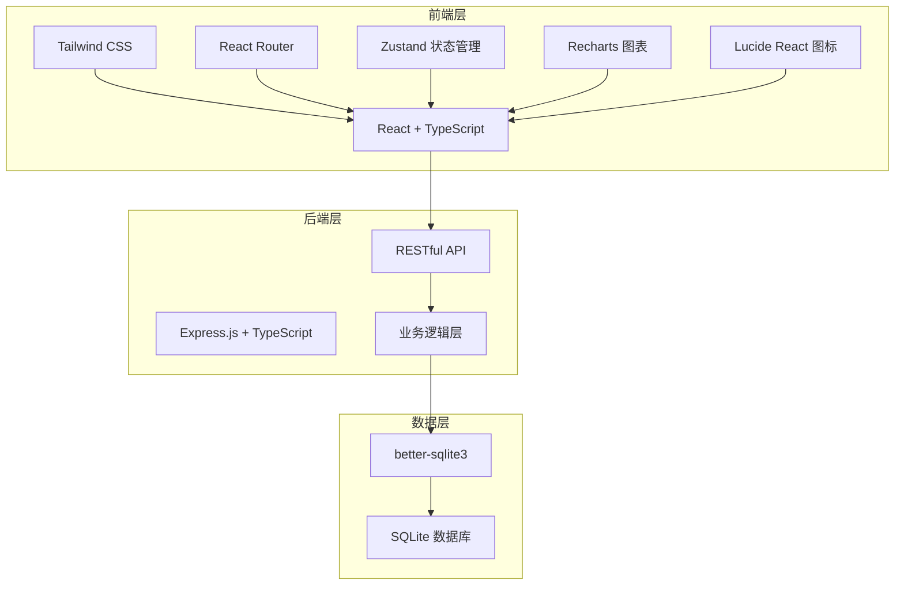
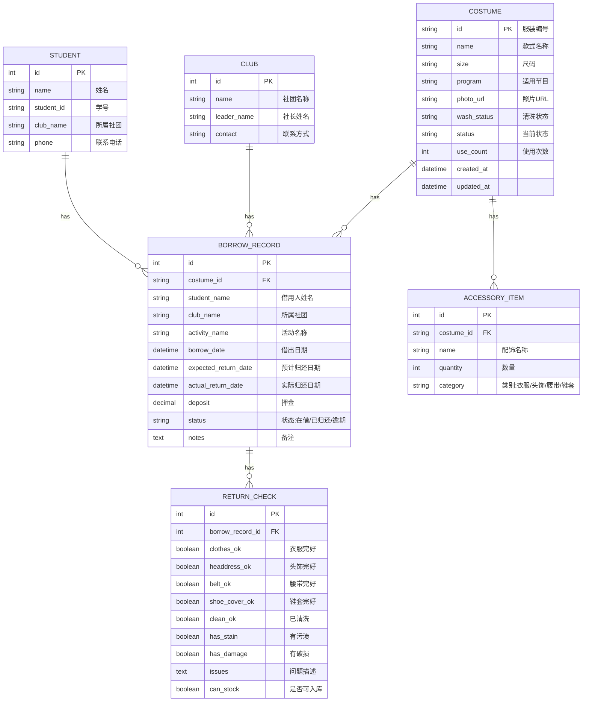

## 1. 架构设计



## 2. 技术选型说明

- **前端框架**：React@18 + TypeScript + Vite
- **样式方案**：Tailwind CSS@3
- **路由管理**：React Router DOM
- **状态管理**：Zustand - 轻量级状态管理
- **UI 图标**：lucide-react
- **数据可视化**：Recharts
- **后端框架**：Express@4 + TypeScript
- **数据库**：SQLite (better-sqlite3) - 轻量、部署简单、适合中小型社团使用
- **初始化工具**：vite-init

## 3. 路由定义

### 3.1 前端路由

| 路由路径 | 页面名称 | 说明 |
|----------|----------|------|
| / | 首页仪表盘 | 数据概览、快捷操作 |
| /costumes | 服装档案列表 | 服装搜索、筛选、列表展示 |
| /costumes/:id | 服装详情 | 单套服装详细信息和借用历史 |
| /costumes/new | 新增服装 | 服装档案录入表单 |
| /costumes/:id/edit | 编辑服装 | 修改服装信息 |
| /borrow | 借出登记 | 新借登记页面 |
| /borrow/records | 借出记录 | 在借和历史借用记录 |
| /return | 归还检查 | 归还逐项检查页面 |
| /statistics | 统计报表 | 使用统计、社团排行、待洗管理 |
| /notifications | 消息通知 | 逾期提醒、系统通知 |

### 3.2 后端 API 路由

| 方法 | 路径 | 功能 |
|------|------|------|
| GET | /api/costumes | 获取服装列表（支持筛选、分页） |
| GET | /api/costumes/:id | 获取单套服装详情 |
| POST | /api/costumes | 新增服装 |
| PUT | /api/costumes/:id | 更新服装信息 |
| DELETE | /api/costumes/:id | 删除服装 |
| GET | /api/borrows | 获取借出记录列表 |
| GET | /api/borrows/:id | 获取借出记录详情 |
| POST | /api/borrows | 创建借出记录 |
| PUT | /api/borrows/:id/return | 归还服装 |
| GET | /api/statistics/overview | 获取首页统计概览数据 |
| GET | /api/statistics/usage | 获取使用次数统计 |
| GET | /api/statistics/missing-rate | 获取缺件率统计 |
| GET | /api/statistics/clubs | 获取社团借用排行 |
| GET | /api/statistics/wash-list | 获取待洗列表 |
| PUT | /api/costumes/:id/wash | 标记服装已清洗 |
| GET | /api/notifications/overdue | 获取逾期提醒列表 |

## 4. 数据模型

### 4.1 ER 图



### 4.2 数据库表 DDL

```sql
-- 服装表
CREATE TABLE costumes (
    id TEXT PRIMARY KEY,
    name TEXT NOT NULL,
    size TEXT NOT NULL,
    program TEXT,
    photo_url TEXT,
    wash_status TEXT NOT NULL DEFAULT 'clean',
    status TEXT NOT NULL DEFAULT 'available',
    use_count INTEGER NOT NULL DEFAULT 0,
    notes TEXT,
    created_at TEXT NOT NULL DEFAULT CURRENT_TIMESTAMP,
    updated_at TEXT NOT NULL DEFAULT CURRENT_TIMESTAMP
);

-- 配饰表
CREATE TABLE accessory_items (
    id INTEGER PRIMARY KEY AUTOINCREMENT,
    costume_id TEXT NOT NULL,
    name TEXT NOT NULL,
    quantity INTEGER NOT NULL DEFAULT 1,
    category TEXT NOT NULL,
    FOREIGN KEY (costume_id) REFERENCES costumes(id) ON DELETE CASCADE
);

-- 社团表
CREATE TABLE clubs (
    id INTEGER PRIMARY KEY AUTOINCREMENT,
    name TEXT NOT NULL UNIQUE,
    leader_name TEXT,
    contact TEXT,
    created_at TEXT NOT NULL DEFAULT CURRENT_TIMESTAMP
);

-- 学生表
CREATE TABLE students (
    id INTEGER PRIMARY KEY AUTOINCREMENT,
    name TEXT NOT NULL,
    student_id TEXT UNIQUE,
    club_name TEXT,
    phone TEXT,
    created_at TEXT NOT NULL DEFAULT CURRENT_TIMESTAMP
);

-- 借出记录表
CREATE TABLE borrow_records (
    id INTEGER PRIMARY KEY AUTOINCREMENT,
    costume_id TEXT NOT NULL,
    student_name TEXT NOT NULL,
    club_name TEXT NOT NULL,
    activity_name TEXT,
    borrow_date TEXT NOT NULL,
    expected_return_date TEXT NOT NULL,
    actual_return_date TEXT,
    deposit REAL NOT NULL DEFAULT 0,
    status TEXT NOT NULL DEFAULT 'borrowed',
    notes TEXT,
    created_at TEXT NOT NULL DEFAULT CURRENT_TIMESTAMP,
    FOREIGN KEY (costume_id) REFERENCES costumes(id)
);

-- 归还检查表
CREATE TABLE return_checks (
    id INTEGER PRIMARY KEY AUTOINCREMENT,
    borrow_record_id INTEGER NOT NULL UNIQUE,
    clothes_ok INTEGER NOT NULL DEFAULT 0,
    headdress_ok INTEGER NOT NULL DEFAULT 0,
    belt_ok INTEGER NOT NULL DEFAULT 0,
    shoe_cover_ok INTEGER NOT NULL DEFAULT 0,
    clean_ok INTEGER NOT NULL DEFAULT 0,
    has_stain INTEGER NOT NULL DEFAULT 0,
    has_damage INTEGER NOT NULL DEFAULT 0,
    issues TEXT,
    can_stock INTEGER NOT NULL DEFAULT 0,
    created_at TEXT NOT NULL DEFAULT CURRENT_TIMESTAMP,
    FOREIGN KEY (borrow_record_id) REFERENCES borrow_records(id)
);

-- 索引
CREATE INDEX idx_costumes_status ON costumes(status);
CREATE INDEX idx_costumes_wash_status ON costumes(wash_status);
CREATE INDEX idx_borrow_records_status ON borrow_records(status);
CREATE INDEX idx_borrow_records_costume ON borrow_records(costume_id);
CREATE INDEX idx_borrow_records_club ON borrow_records(club_name);
CREATE INDEX idx_accessory_items_costume ON accessory_items(costume_id);
```

## 5. 项目目录结构

```
trae0601-3/
├── src/                          # 前端源码
│   ├── components/               # 公共组件
│   │   ├── layout/               # 布局组件
│   │   ├── ui/                   # UI基础组件
│   │   └── costume/              # 服装相关组件
│   ├── pages/                    # 页面组件
│   ├── hooks/                    # 自定义Hooks
│   ├── stores/                   # Zustand stores
│   ├── utils/                    # 工具函数
│   ├── types/                    # TypeScript类型定义
│   ├── services/                 # API服务
│   ├── App.tsx
│   └── main.tsx
├── api/                          # 后端源码
│   ├── routes/                   # 路由
│   ├── services/                 # 业务逻辑
│   ├── models/                   # 数据模型
│   ├── db/                       # 数据库相关
│   ├── middleware/               # 中间件
│   └── index.ts
├── shared/                       # 共享类型定义
│   └── types.ts
├── .trae/
│   └── documents/
├── package.json
├── tsconfig.json
├── vite.config.ts
└── tailwind.config.js
```

## 6. 核心业务规则

1. **服装状态流转**：available(可借) → borrowed(在借) → pending(待处理/归还检查中) → washing(待清洗) → available
2. **归还检查规则**：clean_ok 为 false 或任何配饰项有缺失，can_stock 为 false
3. **逾期判断**：actual_return_date 为 null 且 expected_return_date < 当前日期，标记为 overdue
4. **使用次数统计**：每次成功归还后，use_count + 1
5. **缺件率计算**：缺件归还次数 / 总归还次数 × 100%
