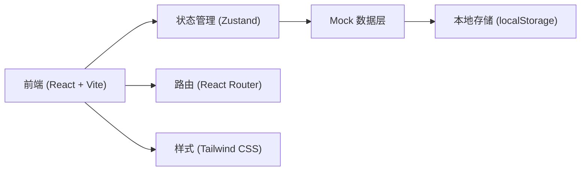
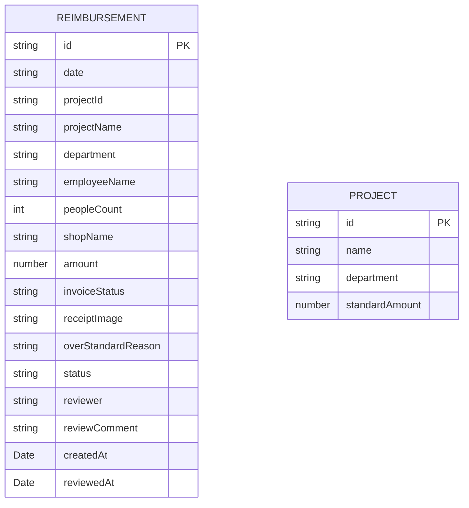

## 1. 架构设计



## 2. 技术描述

- **前端框架**：React 18 + TypeScript
- **构建工具**：Vite 5
- **状态管理**：Zustand
- **路由方案**：React Router DOM 6
- **样式方案**：Tailwind CSS 3
- **图表库**：Recharts
- **图标库**：Lucide React
- **数据持久化**：localStorage（Mock 演示用）
- **初始化模板**：vite-init react-ts

## 3. 路由定义

| 路由 | 页面 | 说明 |
|------|------|------|
| / | 报销提交页 | 员工提交加班餐报销申请 |
| /review | 审核管理页 | 管理员审核报销单 |
| /summary | 费用汇总页 | 多维度费用统计分析 |

## 4. 数据模型

### 4.1 数据模型定义



### 4.2 类型定义

```typescript
// 报销单状态
type ReimbursementStatus = 'pending' | 'approved' | 'rejected' | 'settled';

// 发票状态
type InvoiceStatus = 'provided' | 'missing' | 'partial';

interface Project {
  id: string;
  name: string;
  department: string;
  standardAmount: number; // 人均标准
}

interface Reimbursement {
  id: string;
  date: string;
  projectId: string;
  projectName: string;
  department: string;
  employeeName: string;
  peopleCount: number;
  shopName: string;
  amount: number;
  invoiceStatus: InvoiceStatus;
  receiptImage: string; // base64 或图片URL
  overStandardReason?: string;
  status: ReimbursementStatus;
  reviewer?: string;
  reviewComment?: string;
  createdAt: string;
  reviewedAt?: string;
}
```

## 5. 目录结构

```
src/
├── components/          # 公共组件
│   ├── Layout/         # 布局组件
│   ├── Navbar/         # 导航栏
│   ├── StatusTag/      # 状态标签
│   ├── AmountDisplay/  # 金额显示
│   └── Modal/          # 模态框
├── pages/              # 页面组件
│   ├── Submit/         # 报销提交页
│   ├── Review/         # 审核管理页
│   └── Summary/        # 费用汇总页
├── store/              # Zustand 状态管理
│   └── useReimbursementStore.ts
├── types/              # TypeScript 类型定义
│   └── index.ts
├── data/               # Mock 数据
│   └── mockData.ts
├── utils/              # 工具函数
│   ├── format.ts
│   └── date.ts
├── App.tsx
├── main.tsx
└── index.css
```

## 6. 核心功能模块

### 6.1 报销提交模块
- 表单验证：必填项校验、金额格式校验
- 超标检测：自动计算人均金额，与项目标准对比
- 图片上传：支持本地图片预览，base64 存储
- 状态流转：提交后状态变为 pending

### 6.2 审核管理模块
- 多维度筛选：按状态、项目、日期筛选
- 批量操作：按项目选中批量通过
- 详情查看：点击查看截图大图、超标原因
- 审核规则：缺发票不可结算、超标需确认原因

### 6.3 费用汇总模块
- 三种维度：按周、按部门、按项目
- 未结算金额：实时统计，常驻显示
- 图表展示：柱状图 + 数据表格
- 趋势分析：近 N 周/月费用走势
