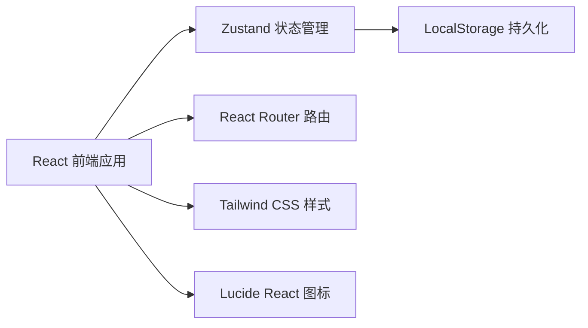
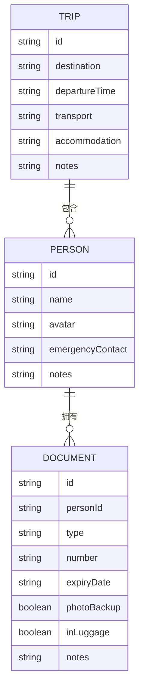

## 1. 架构设计



纯前端单页应用，无后端服务，数据存储在浏览器 LocalStorage 中。

## 2. 技术描述

- **前端框架**：React 18 + TypeScript
- **构建工具**：Vite
- **样式方案**：Tailwind CSS 3
- **状态管理**：Zustand
- **路由**：React Router DOM 6
- **图标库**：Lucide React
- **数据存储**：浏览器 LocalStorage
- **日期处理**：原生 Date API + 工具函数

## 3. 路由定义
| 路由 | 页面组件 | 说明 |
|------|---------|------|
| `/` | Dashboard | 首页总览，统计面板 + 证件清单 |
| `/trip` | TripEditor | 行程档案编辑 |
| `/person/:id` | PersonDetail | 人员详情及证件管理 |

## 4. 数据模型

### 4.1 数据结构定义



### 4.2 证件类型枚举
- 身份证
- 护照
- 港澳通行证
- 台湾通行证
- 签证
- 驾照
- 学生证
- 其他

### 4.3 状态计算规则
- **证件状态**：
  - 已过期：有效期 < 今天
  - 即将过期：有效期 - 今天 < 30天
  - 正常：有效期 - 今天 >= 30天
  
- **确认状态**：
  - 已确认：photoBackup = true 且 inLuggage = true
  - 待确认：photoBackup = false 或 inLuggage = false

- **完成率计算**：
  - 全队完成率 = 已确认证件数 / 总证件数
  - 个人完成率 = 个人已确认证件数 / 个人总证件数

## 5. 项目结构

```
src/
├── components/          # 可复用组件
│   ├── StatCard.tsx     # 统计卡片
│   ├── PersonCard.tsx   # 人员卡片
│   ├── DocumentRow.tsx  # 证件行
│   ├── DocumentForm.tsx # 证件表单
│   ├── ProgressRing.tsx # 圆环进度
│   └── Header.tsx       # 顶部导航
├── pages/               # 页面组件
│   ├── Dashboard.tsx    # 首页总览
│   ├── TripEditor.tsx   # 行程编辑
│   └── PersonDetail.tsx # 人员详情
├── store/               # 状态管理
│   └── useTripStore.ts  # Zustand store
├── types/               # TypeScript 类型
│   └── index.ts
├── utils/               # 工具函数
│   ├── dateUtils.ts     # 日期工具
│   └── storage.ts       # 存储工具
├── App.tsx
├── main.tsx
└── index.css
```

## 6. 功能实现要点

### 6.1 敏感信息隐藏
- 证件号码默认显示脱敏版本（如 110***********1234）
- 提供"显示/隐藏"全局切换开关
- 切换时有平滑过渡动画

### 6.2 过期提醒
- 已过期证件红色背景 + 红色文字 + 脉冲动画
- 30天内过期证件橙色警告标识
- 统计面板中列出所有有问题的证件

### 6.3 数据持久化
- Zustand + persist 中间件
- 存储 key: `trip-doc-checker-data`
- 初始化时提供示例数据方便演示

### 6.4 Mock 数据
- 默认包含 1 个示例行程
- 3-4 个参与人
- 每人 2-3 个证件
- 包含过期、即将过期、未确认等各种状态
