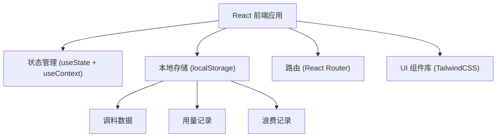
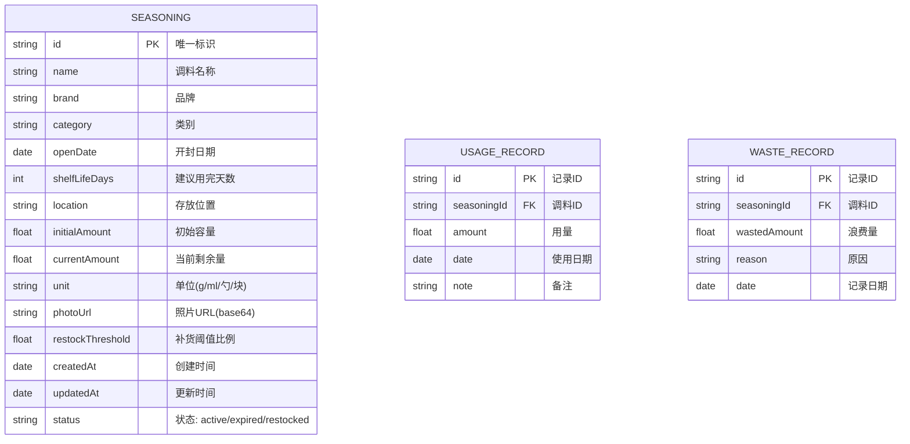
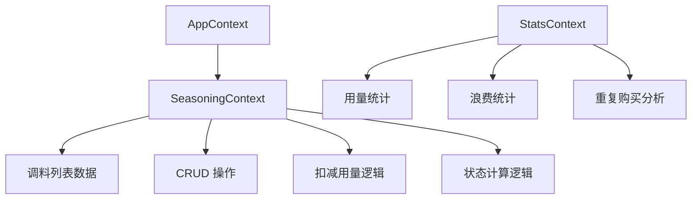

## 1. 架构设计



## 2. 技术描述
- **前端框架**：React@18 + TypeScript
- **构建工具**：Vite@5
- **样式方案**：TailwindCSS@3
- **路由管理**：React Router DOM@6
- **状态管理**：React Context + useReducer
- **数据存储**：localStorage（本地持久化）
- **图表**：Recharts（统计图表）
- **图标**：Lucide React

## 3. 路由定义
| 路由 | 页面 | 用途 |
|------|------|------|
| / | 调料看板 | 主页面，展示所有调料按状态分类 |
| /add | 调料登记 | 添加新调料的表单页面 |
| /restock | 补货区 | 展示需要补货的调料 |
| /stats | 统计面板 | 浪费分析和重复购买统计 |

## 4. 数据模型

### 4.1 数据模型定义



### 4.2 TypeScript 类型定义

```typescript
interface Seasoning {
  id: string;
  name: string;
  brand: string;
  category: string;
  openDate: string;
  shelfLifeDays: number;
  location: string;
  initialAmount: number;
  currentAmount: number;
  unit: string;
  photoUrl?: string;
  restockThreshold: number;
  createdAt: string;
  updatedAt: string;
  status: 'active' | 'expired' | 'restocked';
}

interface UsageRecord {
  id: string;
  seasoningId: string;
  amount: number;
  date: string;
  note?: string;
}

interface WasteRecord {
  id: string;
  seasoningId: string;
  wastedAmount: number;
  reason: string;
  date: string;
}

type SeasoningStatus = 'all' | 'fresh' | 'soon' | 'expired' | 'restock';
```

## 5. 状态管理架构



## 6. 目录结构

```
src/
├── components/
│   ├── common/          # 通用组件
│   │   ├── Button.tsx
│   │   ├── Card.tsx
│   │   └── Input.tsx
│   ├── seasoning/       # 调料相关组件
│   │   ├── SeasoningCard.tsx
│   │   ├── SeasoningForm.tsx
│   │   ├── SeasoningList.tsx
│   │   └── StatusFilter.tsx
│   └── stats/           # 统计相关组件
│       ├── WasteChart.tsx
│       ├── DuplicateList.tsx
│       └── StatsPanel.tsx
├── context/             # 状态管理
│   └── SeasoningContext.tsx
├── hooks/               # 自定义 Hooks
│   ├── useSeasonings.ts
│   └── useLocalStorage.ts
├── pages/               # 页面组件
│   ├── Dashboard.tsx
│   ├── AddSeasoning.tsx
│   ├── Restock.tsx
│   └── Stats.tsx
├── types/               # 类型定义
│   └── index.ts
├── utils/               # 工具函数
│   ├── dateUtils.ts
│   └── storage.ts
├── App.tsx
├── main.tsx
└── index.css
```

## 7. 核心功能实现思路

### 7.1 保质期计算
- 基于开封日期 + 建议用完天数计算到期日
- 剩余天数 = 到期日 - 今天
- 状态判断：剩余天数 ≤ 0 为过期，≤ 7 天为快到期，其余为正常

### 7.2 用量扣减
- 支持快速扣减（预设常用量）和自定义扣减
- 扣减后更新 currentAmount
- 当 currentAmount / initialAmount ≤ restockThreshold 时标记为需要补货
- 记录每次扣减到 UsageRecord

### 7.3 浪费统计
- 过期未用完的调料自动计入浪费
- 按 category 分组统计浪费数量
- 统计重复购买：同 name + brand 且存在多个 active 状态的调料

### 7.4 照片存储
- 使用 FileReader 将图片转为 base64 存储在 localStorage
- 支持压缩图片以控制存储大小
