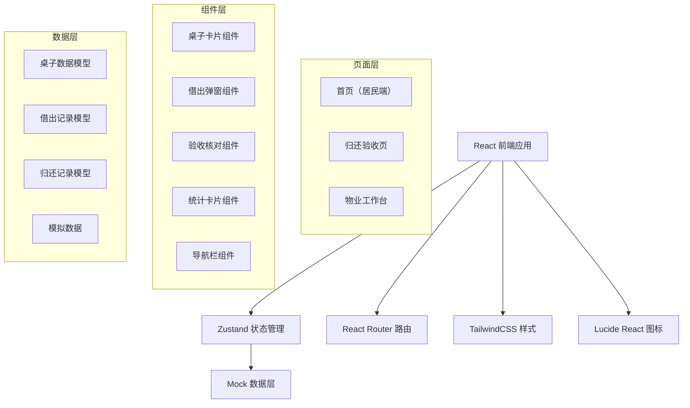
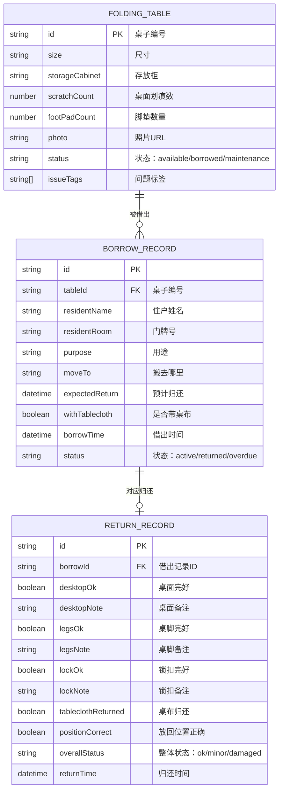

# 活动室折叠桌管理系统 技术架构

## 1. 架构设计



## 2. 技术描述

- **前端框架**：React 18 + TypeScript
- **构建工具**：Vite 5
- **样式方案**：TailwindCSS 3
- **状态管理**：Zustand
- **路由管理**：React Router DOM v6
- **图标库**：Lucide React
- **数据方案**：前端 Mock 数据 + localStorage 持久化

## 3. 路由定义

| 路由路径 | 页面名称 | 用途 |
|----------|----------|------|
| / | 首页 | 居民端：今日可用数量、桌子列表、借出登记 |
| /return/:id | 归还验收页 | 物业端：逐项核对归还物品 |
| /admin | 物业工作台 | 物业端：本周可用统计、逾期名单、待维修清单 |

## 4. 数据模型

### 4.1 数据模型定义



### 4.2 类型定义

```typescript
// 桌子状态
type TableStatus = 'available' | 'borrowed' | 'maintenance';

// 问题类型
type IssueType = 'overdue' | 'missing_parts' | 'desktop_damaged';

// 折叠桌
interface FoldingTable {
  id: string;
  size: string;
  storageCabinet: string;
  scratchCount: number;
  footPadCount: number;
  photo: string;
  status: TableStatus;
  issueTags: IssueType[];
}

// 借出记录
interface BorrowRecord {
  id: string;
  tableId: string;
  residentName: string;
  residentRoom: string;
  purpose: string;
  moveTo: string;
  expectedReturn: string;
  withTablecloth: boolean;
  borrowTime: string;
  status: 'active' | 'returned' | 'overdue';
}

// 归还记录
interface ReturnRecord {
  id: string;
  borrowId: string;
  desktopOk: boolean;
  desktopNote: string;
  legsOk: boolean;
  legsNote: string;
  lockOk: boolean;
  lockNote: string;
  tableclothReturned: boolean;
  positionCorrect: boolean;
  overallStatus: 'ok' | 'minor' | 'damaged';
  returnTime: string;
}
```

## 5. 项目结构

```
src/
├── components/          # 公共组件
│   ├── TableCard.tsx   # 桌子卡片
│   ├── BorrowModal.tsx # 借出弹窗
│   ├── NavBar.tsx      # 导航栏
│   ├── StatusBadge.tsx # 状态标签
│   └── StatCard.tsx    # 统计卡片
├── pages/              # 页面组件
│   ├── Home.tsx        # 首页（居民端）
│   ├── ReturnCheck.tsx # 归还验收页
│   └── Admin.tsx       # 物业工作台
├── store/              # 状态管理
│   └── useTableStore.ts
├── types/              # 类型定义
│   └── index.ts
├── data/               # 模拟数据
│   └── mockData.ts
├── utils/              # 工具函数
│   └── helpers.ts
├── App.tsx
├── main.tsx
└── index.css
```

## 6. 状态管理设计

Zustand Store 管理以下状态：
- `tables`: 折叠桌列表
- `borrowRecords`: 借出记录
- `returnRecords`: 归还记录
- `selectedTableId`: 当前选中的桌子
- `actions`:
  - `borrowTable(tableId, borrowInfo)`: 借出桌子
  - `returnTable(borrowId, returnInfo)`: 归还验收
  - `getAvailableCount()`: 获取今日可用数量
  - `getOverdueRecords()`: 获取逾期记录
  - `getMaintenanceTables()`: 获取待维修桌子
