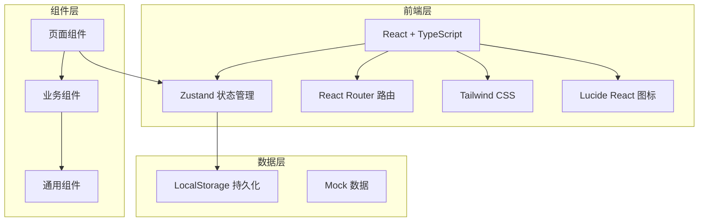
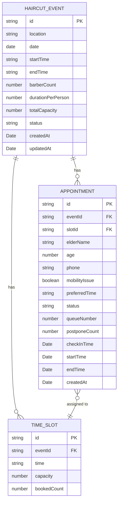

# 社区公益理发预约看板 - 技术架构文档

## 1. 架构设计



## 2. 技术描述

- **前端框架**：React@18 + TypeScript
- **构建工具**：Vite
- **样式方案**：Tailwind CSS@3
- **状态管理**：Zustand
- **路由管理**：React Router DOM
- **图标库**：Lucide React
- **数据持久化**：LocalStorage（前端模拟后端）
- **图表库**：Recharts（用于统计页图表展示）

> 项目采用纯前端架构，数据存储在浏览器 LocalStorage 中，使用 Mock 数据进行演示。后续可扩展为真实后端架构。

## 3. 路由定义

| 路由 | 页面 | 说明 |
|------|------|------|
| `/` | 首页看板 | 今日理发状态分组展示，现场叫号操作 |
| `/events` | 理发日列表 | 展示所有理发日，支持创建和管理 |
| `/events/new` | 创建理发日 | 新建理发日表单 |
| `/events/:id/edit` | 编辑理发日 | 编辑已有理发日信息 |
| `/events/:id/booking` | 预约页面 | 选择理发日后的预约表单 |
| `/appointments` | 我的预约 | 查看所有预约记录 |
| `/statistics` | 数据统计 | 服务数据统计和图表展示 |

## 4. 数据模型

### 4.1 数据模型定义



### 4.2 数据实体说明

**理发日 (HaircutEvent)**
- `id`: 唯一标识
- `location`: 服务地点
- `date`: 服务日期
- `startTime`/`endTime`: 服务开始/结束时间
- `barberCount`: 理发师人数
- `durationPerPerson`: 每人预计服务时长（分钟）
- `totalCapacity`: 可服务总名额
- `status`: 状态（upcoming/ongoing/completed/cancelled）

**预约 (Appointment)**
- `id`: 唯一标识
- `eventId`: 所属理发日ID
- `slotId`: 分配的时段ID
- `elderName`: 老人姓名
- `age`: 年龄
- `phone`: 联系电话
- `mobilityIssue`: 行动是否不便
- `preferredTime`: 偏好时间
- `status`: 预约状态（booked/checked-in/serving/completed/no-show/waitlist）
- `queueNumber`: 排队号码
- `postponeCount`: 过号顺延次数
- `checkInTime`: 签到时间
- `startTime`: 开始服务时间
- `endTime`: 服务结束时间

**时段 (TimeSlot)**
- `id`: 唯一标识
- `eventId`: 所属理发日ID
- `time`: 时段时间
- `capacity`: 该时段容量
- `bookedCount`: 已预约数量

### 4.3 状态流转说明

预约状态流转：
- `booked`（已预约）→ 签到 → `checked-in`（已签到）
- `checked-in` → 叫号 → `serving`（服务中）
- `serving` → 完成 → `completed`（已完成）
- `booked` → 未签到超过时段 → `no-show`（爽约）
- `serving` → 过号 → 顺延（postponeCount+1）→ 重新排队
- 顺延超过3次 → `no-show`（爽约）

## 5. 核心功能模块

### 5.1 状态管理 (Zustand Store)

| Store | 功能 |
|-------|------|
| useEventStore | 理发日的增删改查 |
| useAppointmentStore | 预约管理、签到、排号、状态流转 |
| useStatsStore | 统计数据计算 |

### 5.2 工具函数

| 函数 | 功能 |
|------|------|
| generateTimeSlots | 根据开始/结束时间和单人生成时段列表 |
| calculateQueueNumber | 计算排队号码 |
| getAppointmentsByStatus | 按状态分组预约列表 |
| computeStatistics | 计算统计数据 |

## 6. 项目结构

```
src/
├── components/          # 通用组件
│   ├── Button.tsx
│   ├── Card.tsx
│   ├── Input.tsx
│   ├── Modal.tsx
│   ├── StatusBadge.tsx
│   └── NavBar.tsx
├── pages/              # 页面组件
│   ├── Dashboard.tsx
│   ├── EventList.tsx
│   ├── EventForm.tsx
│   ├── Booking.tsx
│   ├── Appointments.tsx
│   └── Statistics.tsx
├── store/              # Zustand 状态管理
│   ├── eventStore.ts
│   └── appointmentStore.ts
├── types/              # TypeScript 类型定义
│   └── index.ts
├── utils/              # 工具函数
│   ├── time.ts
│   ├── queue.ts
│   └── storage.ts
├── data/               # Mock 数据
│   └── mockData.ts
├── App.tsx
├── main.tsx
└── index.css
```
