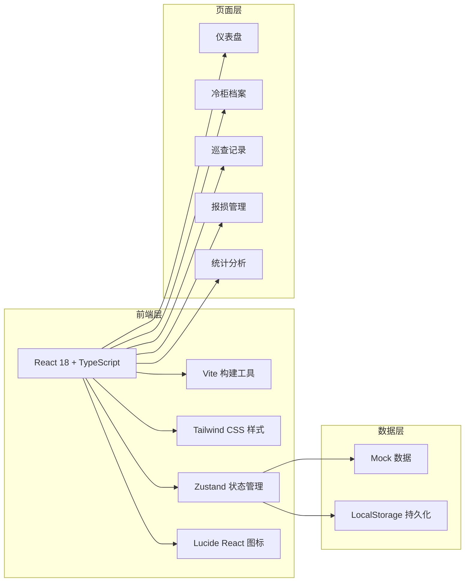
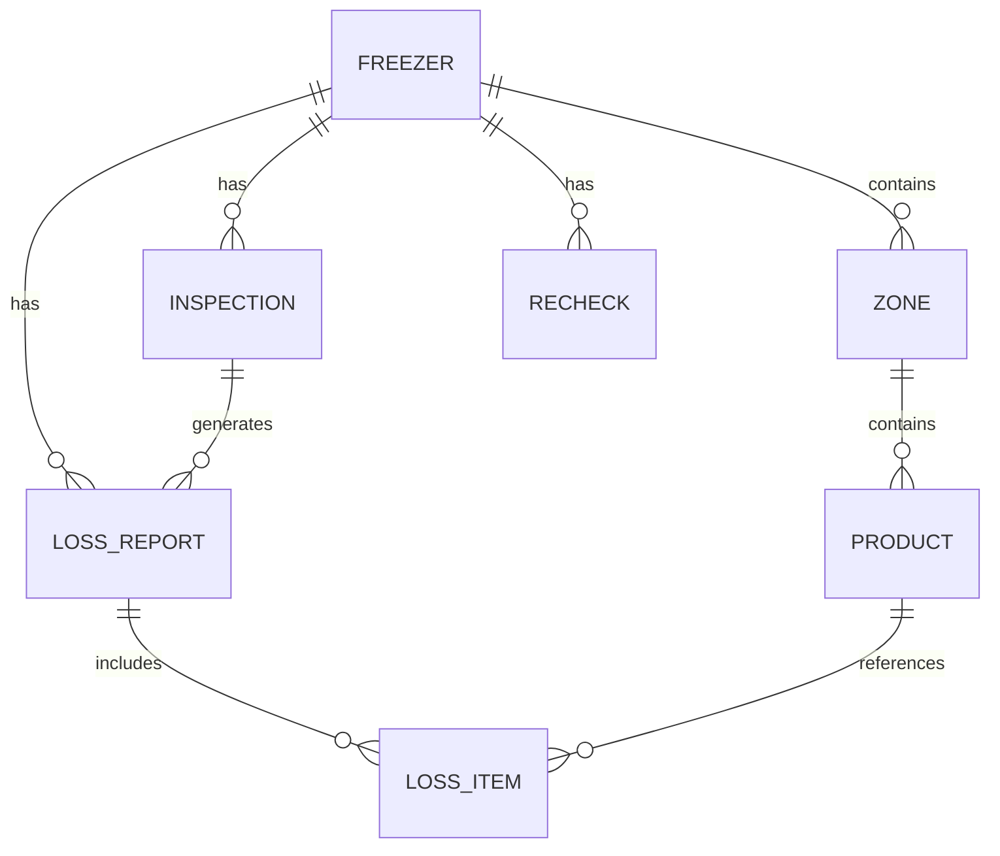

# 雪糕化冻报损系统 技术架构文档

## 1. 架构设计



## 2. 技术栈说明

- **前端框架**: React 18 + TypeScript
- **构建工具**: Vite 5.x
- **样式方案**: Tailwind CSS 3.x
- **状态管理**: Zustand
- **路由**: React Router DOM 6.x
- **图标库**: Lucide React
- **图表库**: Recharts
- **数据持久化**: LocalStorage (前端演示用)
- **后端**: Express 4.x (可选，提供 API 接口)
- **数据库**: SQLite (可选，数据存储)

## 3. 路由定义

| 路由路径 | 页面名称 | 说明 |
|----------|----------|------|
| / | 仪表盘首页 | 异常概览、统计卡片、最近记录 |
| /freezers | 冷柜档案 | 冷柜列表、搜索筛选 |
| /freezers/new | 新增冷柜 | 冷柜信息表单 |
| /freezers/:id | 冷柜详情 | 冷柜信息、商品分区、历史记录 |
| /freezers/:id/edit | 编辑冷柜 | 编辑冷柜信息 |
| /inspections | 巡查记录 | 巡查列表、时间线展示 |
| /inspections/new | 新增巡查 | 巡查记录表单 |
| /loss-reports | 报损管理 | 报损单列表、状态筛选 |
| /loss-reports/:id | 报损单详情 | 商品清单、审核操作 |
| /statistics | 统计分析 | 各类统计图表 |

## 4. 数据模型

### 4.1 ER 图



### 4.2 类型定义

```typescript
// 冷柜
interface Freezer {
  id: string;
  name: string;
  location: string;
  minTemp: number;
  maxTemp: number;
  manager: string;
  managerPhone: string;
  thermometerPhoto?: string;
  status: 'normal' | 'warning' | 'abnormal';
  zones: Zone[];
  createdAt: string;
  updatedAt: string;
}

// 商品分区
interface Zone {
  id: string;
  name: string;
  products: Product[];
}

// 商品
interface Product {
  id: string;
  brand: string;
  flavor: string;
  category: string;
  costPrice: number;
  retailPrice: number;
  stock: number;
}

// 巡查记录
interface Inspection {
  id: string;
  freezerId: string;
  temperature: number;
  doorSealStatus: 'good' | 'normal' | 'poor';
  frostStatus: 'none' | 'light' | 'medium' | 'heavy';
  softeningLevel: 'none' | 'mild' | 'moderate' | 'severe';
  photos: string[];
  inspector: string;
  shift: 'morning' | 'afternoon' | 'night';
  notes?: string;
  isAbnormal: boolean;
  createdAt: string;
}

// 报损单
interface LossReport {
  id: string;
  freezerId: string;
  inspectionId?: string;
  type: 'loss' | 'isolate';
  status: 'pending' | 'approved' | 'rejected';
  totalAmount: number;
  items: LossItem[];
  submitter: string;
  reviewer?: string;
  reviewTime?: string;
  reviewNotes?: string;
  createdAt: string;
}

// 报损商品明细
interface LossItem {
  id: string;
  productId?: string;
  brand: string;
  flavor: string;
  category: string;
  quantity: number;
  unitPrice: number;
  subtotal: number;
}

// 复查记录
interface Recheck {
  id: string;
  freezerId: string;
  inspectionId: string;
  recheckTime: string;
  rechecker: string;
  temperature: number;
  productStatus: 'good' | 'partial' | 'bad';
  notes?: string;
  isResolved: boolean;
}
```

## 5. 项目结构

```
src/
├── components/          # 公共组件
│   ├── Layout/         # 布局组件
│   ├── Card/           # 卡片组件
│   ├── StatusBadge/    # 状态标签
│   ├── Modal/          # 弹窗组件
│   └── Empty/          # 空状态组件
├── pages/              # 页面组件
│   ├── Dashboard/      # 仪表盘
│   ├── Freezers/       # 冷柜档案
│   ├── Inspections/    # 巡查记录
│   ├── LossReports/    # 报损管理
│   └── Statistics/     # 统计分析
├── store/              # Zustand 状态管理
│   ├── freezerStore.ts
│   ├── inspectionStore.ts
│   └── lossReportStore.ts
├── types/              # TypeScript 类型定义
│   └── index.ts
├── utils/              # 工具函数
│   ├── format.ts
│   └── mockData.ts
├── App.tsx
├── main.tsx
└── index.css

api/                    # 后端 API (可选)
├── routes/
├── models/
└── index.ts
```

## 6. 核心功能实现方案

### 6.1 温度超标判断
- 巡查时录入温度，与冷柜温度范围比较
- 超出范围自动标记为异常
- 根据超标程度和时长评估受影响商品

### 6.2 自动生成受影响商品
- 根据冷柜商品分区配置
- 按温度超标等级预估受影响比例
- 生成商品清单供店员确认调整

### 6.3 状态管理
- 使用 Zustand 管理全局状态
- 数据持久化到 LocalStorage
- 支持刷新页面后数据不丢失

### 6.4 统计分析
- 使用 Recharts 绘制图表
- 支持按时间维度筛选
- 数据实时计算更新
