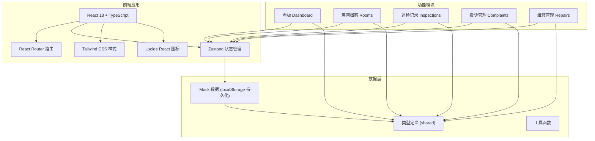
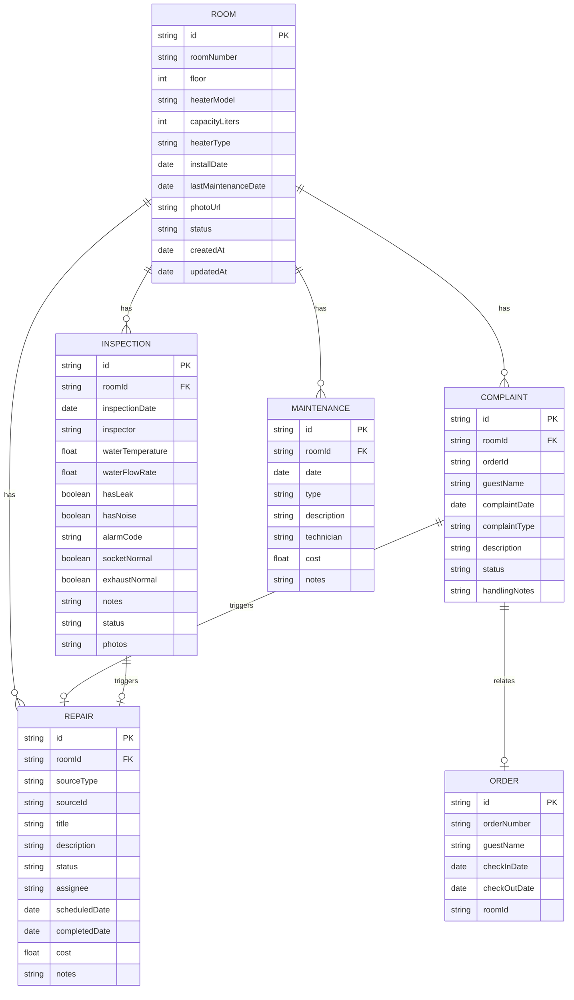

## 1. 架构设计



## 2. 技术描述

- **前端框架**：React 18 + TypeScript
- **构建工具**：Vite 5
- **路由管理**：react-router-dom@6
- **状态管理**：Zustand 4
- **样式方案**：Tailwind CSS 3
- **图标库**：lucide-react
- **数据持久化**：localStorage（演示用 Mock 数据）
- **初始化模板**：react-ts (Vite 官方模板)

## 3. 路由定义

| 路由路径 | 页面组件 | 功能描述 |
|----------|----------|----------|
| `/` | Dashboard | 看板首页，总览所有关键指标 |
| `/rooms` | RoomList | 房间档案列表 |
| `/rooms/:id` | RoomDetail | 房间档案详情 |
| `/rooms/new` | RoomForm | 新增房间档案 |
| `/rooms/:id/edit` | RoomForm | 编辑房间档案 |
| `/inspections` | InspectionList | 巡检记录列表 |
| `/inspections/new` | InspectionForm | 新建巡检记录 |
| `/inspections/:id` | InspectionDetail | 巡检记录详情 |
| `/complaints` | ComplaintList | 投诉列表 |
| `/complaints/new` | ComplaintForm | 新建投诉 |
| `/complaints/:id` | ComplaintDetail | 投诉详情 |
| `/repairs` | RepairList | 维修任务列表 |
| `/repairs/:id` | RepairDetail | 维修任务详情 |

## 4. 数据模型

### 4.1 ER 图



### 4.2 类型定义

```typescript
// 房间/热水器档案
interface Room {
  id: string;
  roomNumber: string;
  floor: number;
  heaterModel: string;
  capacityLiters: number;
  heaterType: 'gas' | 'electric';
  installDate: string;
  lastMaintenanceDate: string;
  photoUrl: string;
  status: 'active' | 'maintenance' | 'disabled';
  createdAt: string;
  updatedAt: string;
}

// 巡检记录
interface Inspection {
  id: string;
  roomId: string;
  inspectionDate: string;
  inspector: string;
  waterTemperature: number;
  waterFlowRate: number;
  hasLeak: boolean;
  hasNoise: boolean;
  alarmCode: string;
  socketNormal: boolean;
  exhaustNormal: boolean;
  notes: string;
  status: 'normal' | 'warning' | 'critical';
  photos: string[];
}

// 投诉记录
interface Complaint {
  id: string;
  roomId: string;
  orderId: string;
  orderNumber: string;
  guestName: string;
  complaintDate: string;
  complaintType: 'not_hot' | 'unstable' | 'tripping' | 'other';
  description: string;
  status: 'pending' | 'processing' | 'resolved' | 'closed';
  handlingNotes: string;
}

// 维修任务
interface Repair {
  id: string;
  roomId: string;
  sourceType: 'inspection' | 'complaint' | 'routine';
  sourceId: string;
  title: string;
  description: string;
  status: 'pending' | 'assigned' | 'in_progress' | 'completed' | 'cancelled';
  assignee: string;
  scheduledDate: string;
  completedDate: string | null;
  cost: number;
  notes: string;
}

// 保养记录
interface Maintenance {
  id: string;
  roomId: string;
  date: string;
  type: string;
  description: string;
  technician: string;
  cost: number;
  notes: string;
}

// 入住订单
interface Order {
  id: string;
  orderNumber: string;
  guestName: string;
  checkInDate: string;
  checkOutDate: string;
  roomId: string;
}
```

## 5. 项目结构

```
src/
├── components/          # 公共组件
│   ├── Layout/         # 布局组件
│   ├── StatsCard/      # 统计卡片
│   ├── StatusBadge/    # 状态标签
│   └── ...
├── pages/              # 页面组件
│   ├── Dashboard/      # 看板页
│   ├── Rooms/          # 房间档案
│   ├── Inspections/    # 巡检管理
│   ├── Complaints/     # 投诉管理
│   └── Repairs/        # 维修管理
├── store/              # Zustand 状态
│   ├── useRoomStore.ts
│   ├── useInspectionStore.ts
│   ├── useComplaintStore.ts
│   └── useRepairStore.ts
├── types/              # TypeScript 类型
│   └── index.ts
├── utils/              # 工具函数
│   ├── date.ts
│   ├── status.ts
│   └── mockData.ts
├── App.tsx
├── main.tsx
└── index.css
```

## 6. 核心业务规则

1. **巡检异常判定**：
   - 水温 < 40°C 或 > 55°C → 异常
   - 漏水/异响/报警码 → 严重异常
   - 插座/排气异常 → 严重异常
   - 出水量 < 6L/min → 警告

2. **自动暂停上架**：
   - 巡检结果为严重异常 → 自动暂停上架
   - 生成维修任务后 → 自动暂停上架
   - 维修完成且验证正常 → 自动恢复上架

3. **设备寿命预警**：
   - 燃气热水器：使用年限 > 8年 → 红色预警
   - 电热水器：使用年限 > 10年 → 红色预警
   - 使用年限 > 6年（燃气）/ 8年（电热） → 黄色提醒

4. **旺季必查清单**：
   - 安装超过5年的设备
   - 近3个月有过维修记录的设备
   - 近30天有投诉的房间
   - 高楼层（>10楼）设备
