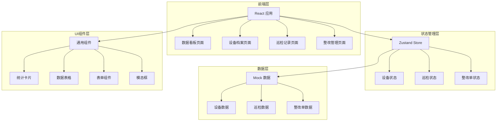
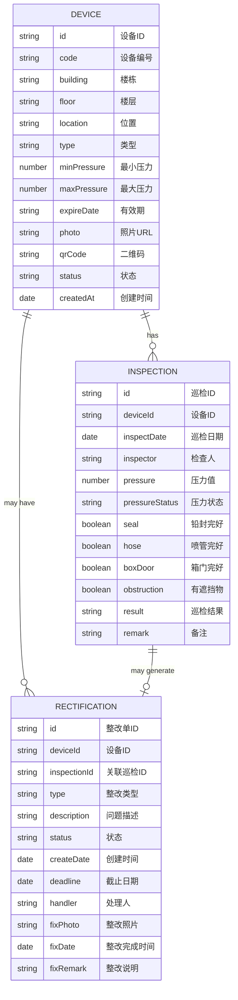

## 1. 架构设计



## 2. 技术描述

- **前端框架**：React@18 + TypeScript
- **构建工具**：Vite
- **样式方案**：Tailwind CSS@3
- **状态管理**：Zustand
- **路由管理**：React Router DOM
- **图标库**：Lucide React
- **数据方案**：前端 Mock 数据（无后端）

## 3. 路由定义

| 路由路径 | 页面名称 | 说明 |
|----------|----------|------|
| /dashboard | 数据看板 | 系统首页，展示统计数据和概览 |
| /devices | 设备档案 | 设备列表和管理 |
| /devices/:id | 设备详情 | 单台设备详细信息 |
| /inspections | 巡检记录 | 巡检记录列表 |
| /inspections/new | 新建巡检 | 新增巡检记录 |
| /rectifications | 整改管理 | 整改单列表和管理 |
| /rectifications/:id | 整改详情 | 整改单详情和处理 |

## 4. 数据模型

### 4.1 数据模型定义



### 4.2 类型定义

```typescript
// 设备类型
type DeviceType = '干粉灭火器' | '二氧化碳灭火器' | '泡沫灭火器' | '水基灭火器';

interface Device {
  id: string;
  code: string;
  building: string;
  floor: string;
  location: string;
  type: DeviceType;
  minPressure: number;
  maxPressure: number;
  expireDate: string;
  photo: string;
  status: 'normal' | 'warning' | 'danger';
  createdAt: string;
}

// 巡检记录
type PressureStatus = 'normal' | 'low' | 'high';
type InspectionResult = 'normal' | 'abnormal';

interface Inspection {
  id: string;
  deviceId: string;
  inspectDate: string;
  inspector: string;
  pressure: number;
  pressureStatus: PressureStatus;
  seal: boolean;
  hose: boolean;
  boxDoor: boolean;
  obstruction: boolean;
  result: InspectionResult;
  remark: string;
}

// 整改单
type RectificationType = 'pressure' | 'expired' | 'obstruction' | 'other';
type RectificationStatus = 'pending' | 'processing' | 'closed';

interface Rectification {
  id: string;
  deviceId: string;
  inspectionId: string;
  type: RectificationType;
  description: string;
  status: RectificationStatus;
  createDate: string;
  deadline: string;
  handler: string;
  fixPhoto?: string;
  fixDate?: string;
  fixRemark?: string;
}

// 看板统计
interface DashboardStats {
  totalDevices: number;
  passRate: number;
  expiringSoon: number;
  pendingRectifications: number;
  buildingStats: BuildingStat[];
  repeatAnomalies: AnomalyPoint[];
  uncheckedThisMonth: Device[];
}

interface BuildingStat {
  building: string;
  total: number;
  inspected: number;
  passRate: number;
}

interface AnomalyPoint {
  deviceId: string;
  deviceCode: string;
  location: string;
  anomalyCount: number;
  lastAnomalyDate: string;
}
```

## 5. 项目结构

```
src/
├── components/          # 通用组件
│   ├── Layout/         # 布局组件
│   │   ├── Header.tsx
│   │   ├── Sidebar.tsx
│   │   └── index.tsx
│   ├── StatCard.tsx    # 统计卡片
│   ├── DataTable.tsx   # 数据表格
│   └── StatusBadge.tsx # 状态标签
├── pages/              # 页面组件
│   ├── Dashboard/      # 数据看板
│   ├── Devices/        # 设备档案
│   ├── Inspections/    # 巡检记录
│   └── Rectifications/ # 整改管理
├── store/              # 状态管理
│   ├── deviceStore.ts
│   ├── inspectionStore.ts
│   └── rectificationStore.ts
├── data/               # Mock数据
│   ├── devices.ts
│   ├── inspections.ts
│   └── rectifications.ts
├── types/              # 类型定义
│   └── index.ts
├── utils/              # 工具函数
│   ├── date.ts
│   └── calculation.ts
├── App.tsx
├── main.tsx
└── index.css
```
